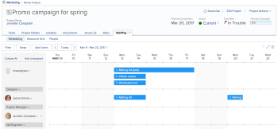

# Remove users from projects

You can remove users from a project when they are no longer involved in completing work on the project. Removing users from projects has implications on task and issue assignments, as well as on project roles.

The users associated with a project are listed in the Staffing tab of a project. They represent the Project Team.&nbsp;For more information about the Project Team, see [Project Team overview](../../../manage-work/projects/planning-a-project/project-team-overview.md).

You can assign work to the users on the project in the Staffing tab of a project.

<!--
For more information about scheduling resources for a project, see
<a href="../../../manage-work/projects/manage-projects/work-in-legacy-team-builder.md" class="MCXref xref">Work in the Legacy Team Builder</a> in
<a href="../../../manage-work/projects/manage-projects/work-in-legacy-team-builder.md" class="MCXref xref">Work in the Legacy Team Builder</a>.
-->

## Access requirements

You must have the following access to perform the steps in this article:

<table cellspacing="0"> 
 <col> 
 <col> 
 <tbody> 
  <tr> 
   <td role="rowheader">Adobe Workfront plan*</td> 
   <td> 
Any
 </td> 
  </tr> 
  <tr> 
   <td role="rowheader">Adobe Workfront license*</td> 
   <td> 
Plan 
 </td> 
  </tr> 
  <tr> 
   <td role="rowheader">Access level configurations*</td> 
   <td> 
Edit access to Projects
 
Note: If you still don't have access, ask your Workfront administrator if they set additional restrictions in your access level. For information on how a Workfront administrator can modify your access level, see <a href="../../../administration-and-setup/add-users/configure-and-grant-access/create-modify-access-levels.md" class="MCXref xref">Create or modify custom access levels</a>.
 </td> 
  </tr> 
  <tr> 
   <td role="rowheader">Object permissions</td> 
   <td> 
Manage permissions on the project
 
For information on requesting additional access, see <a href="../../../workfront-basics/grant-and-request-access-to-objects/request-access.md" class="MCXref xref">Request access to objects in Adobe Workfront</a>.
 </td> 
  </tr> 
 </tbody> 
</table>

&#42;To find out what plan, license type, or access you have, contact your Workfront administrator.

## How removing a user affects existing tasks, issues, and projects&nbsp;

When a user is removed from a project, any tasks or issues assigned to them might be affected, depending on whether the task or issue was in an Active or Complete state when the user was removed:

* **If the item is in an Active state when the user is removed:** The item is re-assigned to a Job Role if a Job Role was already assigned. If the item&nbsp;did not have a Job Role assigned, you must manually re-assign the item. An item in an Active state is any item that has not completed yet.
* **If the item is in a Complete state when the user is removed:** The name of the removed user remains on&nbsp;the item.
* If the user removed is also the creator of a project, the project is not removed from their **Projects I'm On** tab in the Projects area. The project is removed from the lists for all other users that filter for that project by the Entered By field.

  For more information about the relationship between the **Staffing** tab and the **Projects I'm On** tab, see&nbsp; [Project Team overview](../../../manage-work/projects/planning-a-project/project-team-overview.md).

## Remove users from a project and Project Team

When you remove a user from the project, the user is also removed from the project team. Likewise, when you remove a user from the project team, the user is also removed from the project.

You can remove users from a project from the People subtabof the project.

* Remove users from a project from the People subtab

  <!--
  <a href="#removing-users-in-the-scheduling-tab" class="MCXref xref">Remove users from a project from the Team Scheduling subtab</a>
  -->

Remove users from a project from the People subtab

1. Go to the project where you want to remove the users.
1. Staffing.
1. More
1. 
1. 
1. Click **People** ,&nbsp;then select the users you want to remove.   

1. Click **Remove**.
1. Click&nbsp;**Yes, Remove Selected Users** to confirm removal.

<!--
<h3>Remove users from a project from the Team Scheduling subtab</h3>

Users can be removed from the project team in the Scheduling tab only when no tasks or issues are assigned to the user.

To remove users from a project in the Scheduling subtab:

<ol>
<li value="1">Go to the project where you want to remove&nbsp;users from&nbsp;the project team, then click the <strong>Staffing</strong> tab. (The Staffing tab might be located under the <strong>More</strong> menu.)  </li>
<li value="2">Click the (x) icon next to the user who you want to remove from the project team, then click&nbsp;<strong>Remove</strong>.   </li>
</ol>
-->

