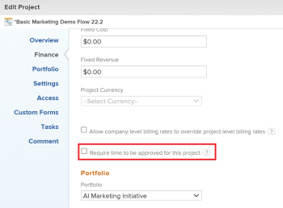

# Require time to be approved for a project

>[!IMPORTANT]
>
>You're currently viewing the Adobe Workfront Classic version of this document. Adobe Workfront Classic is no longer supported. All Adobe Workfront Classic functionality, along with this documentation, will be removed in July 2022. Please transition to the the new Adobe Workfront experienceas soon as possible, and switch to the new Adobe Workfront experience version of this document.

<!--

(NOTE: THIS IS LINKED TO THE UI IN A TOOLTIP IN THE EDIT PROJECT MODAL) 

-->

You can configure the project to require that the hours logged against the project are approved by the Project Owner. When configured in this way, hours must be first approved by the Project Owner before they can be eligible to be used on a billing record.   
For more information about billing records, see the article [Create billing records](../../../manage-work/projects/project-finances/create-billing-records.md).

>[!NOTE]
>
>Enabling this option does not remove a timesheet approver's ability to approve time on the timesheet. If the Project Owner doesn't approve or reject time, a timesheet approver can&nbsp;still approve the time on a timesheet. &nbsp;

## Access requirements

You must have the following access to perform the steps in this article:

<table cellspacing="0"> 
 <col> 
 <col> 
 <tbody> 
  <tr> 
   <td role="rowheader">Adobe Workfront plan*</td> 
   <td> 
Any
 </td> 
  </tr> 
  <tr> 
   <td role="rowheader">Adobe Workfront license*</td> 
   <td> 
Review or higher
 </td> 
  </tr> 
  <tr> 
   <td role="rowheader">Access level configurations*</td> 
   <td> 
Edit access to Projects or higher
 
Note: If you still don't have access, ask your Workfront administrator if they set additional restrictions in your access level. For information on how a Workfront administrator can change your access level, see <a href="../../../administration-and-setup/add-users/configure-and-grant-access/create-modify-access-levels.md" class="MCXref xref">Create or modify custom access levels</a>.
 </td> 
  </tr> 
  <tr> 
   <td role="rowheader">Object permissions</td> 
   <td> 
View permissions to the project or higher
 
For information on requesting additional access, see <a href="../../../workfront-basics/grant-and-request-access-to-objects/request-access.md" class="MCXref xref">Request access to objects </a>.
 </td> 
  </tr> 
  <tr> 
   <td role="rowheader">Additional access</td> 
   <td> 
You must meet at least one of the following conditions to approve time on a project:
 
    <ul> 
     <li>You are the Project Owner with the access and permissions specified above. In this case, you can do the following if one of the conditions below exists: 
      <ul>
       <li>If you have Manage permissions on the project, you can approve or reject hours logged on the project by any other user.</li>
       <li> If you have Contribute or View access to the project you will be able to approve or reject only the hours logged by you or any other user that reports you. </li>
      </ul></li> 
     <li>You have a Plan license with administrative access to Timesheets &amp; Hours.&nbsp;In this case:
      <ul>
       <li>You can approve or reject any hours on the projects you have at least permissions to View. </li>
      </ul></li> 
    </ul> </td> 
  </tr> 
 </tbody> 
</table>

&#42;To find out what plan, license type, or access you have, contact your Workfront administrator.

## Require time to be approved for a project

To require project manager approval for hours on the project:

1. Go to the project where you want to require approval for hours.
1. Click **Edit Project**.   
   The Edit Project dialog box displays.

1. In the **Finance** section, select **Require time to be approved for this project**.

   

1. Click **Save****Changes**.  
   Now when&nbsp;time is logged and approved, those hours become locked and cannot be altered by the user who entered them on the project or the timesheet. Only a Workfront administrator can adjust the time recorded.

## Approve and reject time on a&nbsp;project

As a project manager, you can approve or reject hours that are logged for tasks, issues, or the project.

Approving the hours at the project level does not have any impact on the timesheet of any of the users who logged the hours. For example, the hours in the project may be approved by the project manager, but the timesheet is still yet to be approved by the manager of the user or the timesheet approver.&nbsp;

If you set up a project to require approval on the hours logged, the project manager must approve the hours in order for them to be available to be included in a billing record for the project. For more information about creating billing records, see the article [Create billing records](../../../manage-work/projects/project-finances/create-billing-records.md).

To approve or reject hours on a project:

1. Go to the project.
1. Click the **Hours** tab.   
   Depending on the changes made to your layout template by the Workfront administrator, the **Hours** tab might be under the **More** tab.

1. The hours logged for issues, tasks, and the project display and should have a status of **Submitted**.  
   Click the box to the left of the hour entries to select the hours you want to approve.

1. Click **Approve**.  
   The status of the hours changes to **Approved**.  
   If you later reject the approved hours, the status of the hours changes to **Not Approved**.  
   When you include the approved hours in a billing record, the status of the hours changes to **Billed and Approved**. Hours added to a billing record cannot be deleted. For more information about creating billing records, see the article [Create billing records](../../../manage-work/projects/project-finances/create-billing-records.md)

1. (Optional) Click **Reject** to reject the time entries on the project.  
   The status of the hours changes to **Rejected**.

