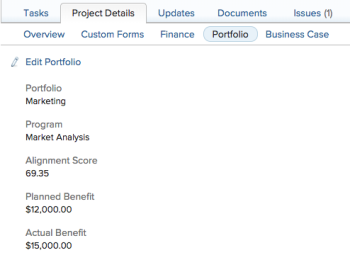

# Overview of the Portfolio subtab of a Project

&nbsp;

>[!IMPORTANT]
>
>Adobe Workfront Classic is no longer supported. All Adobe Workfront Classic functionality, along with this documentation, will be removed in July 2022. Please transition to the new Workfront experience as soon as possible.

You can locate the Portfolio&nbsp;subtab on the Project Details tab of a project. The information on this tab comes from the Portfolio&nbsp;and the&nbsp;Business&nbsp;Case.&nbsp;With the exception of the Alignment Score, you can update all fields on the Portfolio&nbsp;and Business&nbsp;Case subtabs.

To view the Portfolio subtab, you need View permissions to the project. To edit the Portfolio subtab, you need Manage permissions to the project.

Fields on the Portfolio subtab include:

* **Portfolio:**Identifies which portfolio is associated with the project. &nbsp;
* **Program:** Identifies which program is associated&nbsp;with the project. This field appears only when the portfolio has programs.
* **Alignment Score:** The score based on the values input to the&nbsp;scorecard in the Business&nbsp;Case. This field does not appear while in edit mode.  
  For more information on this field, see [Apply a scorecard to a project and generate an Alignment Score](../../../manage-work/projects/define-a-business-case/apply-scorecard-to-project-to-generate-alignment-score.md).

* **Planned Benefit:** The planned financial benefit gained upon completion of the project.&nbsp;
* **Actual Benefit:**The actual financial benefit gained upon completion of the project.&nbsp;

  

