# Work in the Legacy Team Builder

>[!NOTE]
>
>The information in this article refers to functionality that is currently deprecated and will be removed in the future.

The Legacy Team Builder provides an interface for creating and managing a project&nbsp;team. By default, the new scheduling area is displayed rather than the team builder. You can disable the new scheduling area for your team and access the legacy Team Builder, as described in [Access the Team Builder](#accessing-the-team-builder).

## Overview of the Team Builder

* [Overview of the Team Builder interface](#understanding-the-team-builder-interface) 
* [Overview of the Team Builder icons](#understanding-team-builder-icons) 
* [Overview of the Preferences icon](#understanding-the-preferences-icon)

### Overview of the Team Builder interface

As a project manager, you can use the Team Builder to assign users to your project. The Team Builder is divided into four major areas:

* User information in the upper-left panel
* User work schedule in the upper-right panel
* Task information in the lower-left panel
* Task schedule in the lower-right panel  
  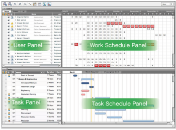

### Overview of the Team Builder icons

<table cellspacing="15"> 
 <col> 
 <col> 
 <col> 
 <thead> 
  <tr> 
   <th> 
Icon 
 </th> 
   <th> 
Name 
 </th> 
   <th> 
Function 
 </th> 
  </tr> 
 </thead> 
 <tbody> 
  <tr> 
   <td scope="col">&nbsp;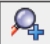</td> 
   <td scope="col"> 
Zoom In
 </td> 
   <td scope="col"> 
Changes the grid display by zooming in one level
 </td> 
  </tr> 
  <tr> 
   <td scope="col">&nbsp;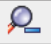</td> 
   <td scope="col"> 
Zoom Out
 </td> 
   <td scope="col"> 
Changes the grid display by zooming out one level
 </td> 
  </tr> 
  <tr> 
   <td scope="col">&nbsp;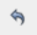</td> 
   <td scope="col"> 
Undo
 </td> 
   <td scope="col"> 
Undoes the previous action that was performed.
 </td> 
  </tr> 
  <tr> 
   <td scope="col">&nbsp;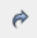</td> 
   <td scope="col"> 
Redo
 </td> 
   <td scope="col"> 
Redoes the previous action that was removed.
 </td> 
  </tr> 
  <tr> 
   <td scope="col">&nbsp;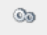&nbsp;</td> 
   <td scope="col"> 
Preferences
 </td> 
   <td scope="col"> 
Opens the Preferences menu. For more information, see <a href="#understanding-the-preferences-icon" class="MCXref xref">Overview of the Preferences icon</a>
 </td> 
  </tr> 
  <tr> 
   <td>&nbsp;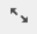</td> 
   <td> 
Full Screen
 </td> 
   <td> 
Expands the Team Builder to occupy the full width and height of the browser window.
 </td> 
  </tr> 
  <tr> 
   <td>&nbsp;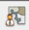</td> 
   <td> 
Edit Project User Roles
 </td> 
   <td> 
Provides an interface to edit project user roles. All the roles associated with the user in the user profile are listed here.&nbsp;Only the roles selected are associated with that specific user for a specific project.  
 </td> 
  </tr> 
  <tr> 
   <td>&nbsp;</td> 
   <td> 
Legend
 </td> 
   <td> 
Opens a description of the different colors and their meanings
 </td> 
  </tr> 
  <tr> 
   <td>&nbsp;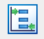</td> 
   <td> 
Clear Leveling
 </td> 
   <td> 
Removes leveling.
 </td> 
  </tr> 
  <tr> 
   <td>&nbsp;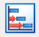</td> 
   <td> 
Level Now
 </td> 
   <td> 
Adjusts users schedule to fit all their assignments with a realistic schedule.
 </td> 
  </tr> 
 </tbody> 
</table>

### Overview of the Preferences icon

The Preferences icon in the Team Builder allows you to customize your view and makes it easier to assign tasks to users. Within preferences, you can set the fields in the User and Task panels, the information displayed in the Gantt chart and identify the matching features.

When customizing your Team Builder view using Preferences, consider updating the following tabs:&nbsp;

`User Fields:` Controls the information you see in the User panel. This tab allows you to select the fields of information that are displayed about team members and the order the columns appear in. Add a field from the Unused list to the Used list to display it. To reorder the columns, drag and drop the labels into order.  
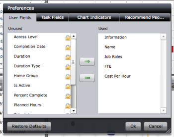

`Task Fields` `:` Controls the information you see in the Task panel. This tab allows you to select the field of information that are displayed about tasks and the order the columns appear in. Add a field from the Unused list to the Used list to display it. To reorder the columns, drag and drop the labels into order.  
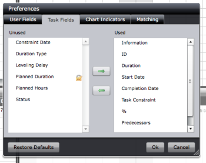

`Chart Indicators:` Identifies the information displayed in the Gantt chart that is located in the Task panel.  
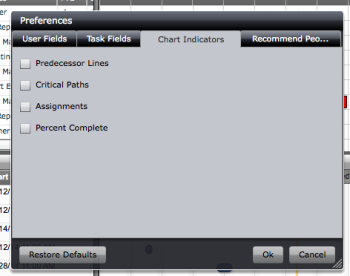

`Matching:` Activates the matching feature in Team Builder. When the matching feature is activated, team members who meet the conditions selected are highlighted when a task is selected. Also, when you select a user, the tasks the user can be assigned to are highlighted.

You can match users with a task based on the following criteria:

* `Match on Team Role`: If the task is assigned to a role associated with the user on this project, the task and the user are highlighted in green. To find out the roles associated with a user on a specific project, see the Edit Project User Role icon in the Team Builder.&nbsp;
* `Match on User Role`: If the task is assigned to any role associated with the user in the user profile, the task and the user are highlighted in green.
* `Match on Planned Hours`: If a user is available to work the days and the amount of planned hours associated with the task, the task and the user are highlighted in green.&nbsp;

We recommend that use Match on Planned Hours and Match on User Role. However, depending on the needs of your organization, a different option might be preferable.  
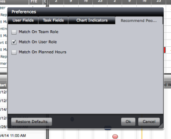

## Access the Team Builder

1. Click `Projects` in the Global&nbsp;Navigation Bar.
1. Click the  `Staffing` tab which might be located under the  `More` tab.

1. The `Scheduling` sub-tab is the default sub-tab for the `Staffing` tab of a project.  
   The project team scheduler displays on the `Scheduling` sub-tab by default.  
   For more information about the project team scheduler, see [Get started with Resource Scheduling](../../../resource-mgmt/resource-scheduling/get-started-resource-scheduling.md).

1. Click the `Team Scheduling Settings` icon in the upper-right corner of the project team scheduler.  
   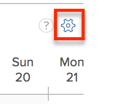

1. Disable the `Use New Scheduling Area`&nbsp;option.  
   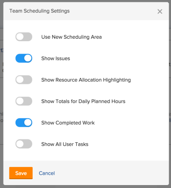

1. Click `Save.  
   `The `Team Builder` displays to replace the project team scheduler.

## Add users to a Project Team

Users are automatically added to the project team when they are assigned a role on the project. For more information on automatically adding users, see [Project Team overview](../../../manage-work/projects/planning-a-project/project-team-overview.md).&nbsp;

You can manually add users to the project team by using the Team Builder.

To add users to the project team in the Team Builder:

1. Go to the Team Builder as described in [Access the Team Builder](#accessing-the-team-builder).
1. Click the  `All` tab in the  `Users` panel to display all the active users in the system  
   Or  
   Click the  `Group` tab in the  `Users` panel to display all the users in the group associated with the project.  
   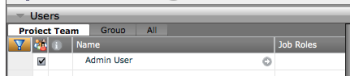

1. Select the name of the person you want to add to the team. This adds them to the  `Project Team` sub-tab.
1. Click  `Save.`

## Assign users to a Task

You can add users to a task at the task level or in the Team Builder. For more information about adding users at the task level, see the section "Manually assign unassigned tasks or issues to users" in the article [Manually assign unassigned tasks and issues in the Scheduling areas](../../../resource-mgmt/resource-scheduling/manually-assign-items-scheduling-areas.md).

Before assigning users to a task using the Team Builder, ensure that matching is enabled. For more information about matching, see [Overview of the Preferences icon](#understanding-the-preferences-icon).

To assign users to a task:

1. Go to the Team Builder as described in [Access the Team Builder](#accessing-the-team-builder).
1. In the Tasks panel, select a task or issue. Users who are able to perform the task are highlighted in green in the upper-left panel.  
   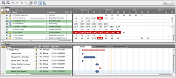

1. Drag the task to the user to assign it to the user.  
   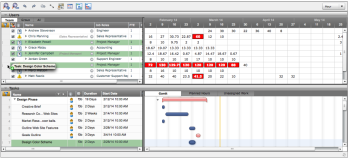

1. Click  `Save.`

## Remove users from a Project Team using the Team Builder

1. Go to the Team Builder as described in [Access the Team Builder](#accessing-the-team-builder).
1. In the  `User` panel, deselect the user that you want to remove. 
1. Click  `Save.`  
   The user is removed from the project team.

