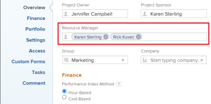
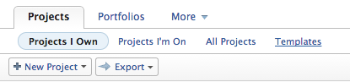
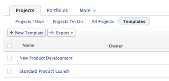

# Designate Resource Managers for a project or template

You can designate up to 30 users as Resource Managers for an individual project or template. Designating Resource Managers for a project is a prerequisite for using the Scheduling tools in&nbsp;Adobe Workfront.

>[!NOTE]
>
>We are no longer developing the Resource Scheduling tools and they will soon be removed from Adobe Workfront. We recommend that you use the Workload Balancer for scheduling your resources. 
>
>For information about scheduling resources using the new Workload Balancer, see the section [The Workload Balancer](../../../resource-mgmt/workload-balancer/workload-balancer.md).
>
>For more information about the timeline for removing the Resource Scheduling tools and replacing them with the Workload Balancer, see [Deprecation of Resource Scheduling tools in Adobe Workfront](../../../resource-mgmt/resource-mgmt-overview/deprecate-resource-scheduling.md).

## Access requirements

You must have the following access to perform the steps in this article:

<table cellspacing="0"> 
 <col> 
 <col> 
 <tbody> 
  <tr> 
   <td role="rowheader">Adobe Workfront plan*</td> 
   <td> 
Any
 </td> 
  </tr> 
  <tr> 
   <td role="rowheader">Adobe Workfront license*</td> 
   <td> 
Plan 
 </td> 
  </tr> 
  <tr> 
   <td role="rowheader">Access level configurations*</td> 
   <td> 
Edit access to Projects and Templates
 
Note: If you still don't have access, ask your Workfront administrator if they set additional restrictions in your access level. For information on how a Workfront administrator can modify your access level, see <a href="../../../administration-and-setup/add-users/configure-and-grant-access/create-modify-access-levels.md" class="MCXref xref">Create or modify custom access levels</a>.
 </td> 
  </tr> 
  <tr> 
   <td role="rowheader">Object permissions</td> 
   <td> 
Manage permissions on the project or template
 
Users who are added as Resource&nbsp;Managers to a project or a template immediately gain Manage permissions on the project or the template
 
For information on requesting additional access, see <a href="../../../workfront-basics/grant-and-request-access-to-objects/request-access.md" class="MCXref xref">Request access to objects in Adobe Workfront</a>.
 </td> 
  </tr> 
 </tbody> 
</table>

&#42;To find out what plan, license type, or access you have, contact your Workfront administrator.

## Considerations about Resource Managers

>[!NOTE]
>
>Resource Manager is not a Workfront role; it is a field available on a project or a template that you can manually update.

* Designating Resource Managers on projects is a prerequisite to allowing users to schedule resources for work on the project when using the Scheduling tools.

  For information about resource scheduling, see&nbsp; [Resource Scheduling](../../../resource-mgmt/resource-scheduling/resource-scheduling-overview.md)&nbsp;. 

* Designating Resource Managers on projects is not a prerequisite to allowing users to schedule resources for work using the Workload Balancer.

  For information about the Workload Balancer, see [Overview of the Workload Balancer](../../../resource-mgmt/workload-balancer/overview-workload-balancer.md). 

* You cannot designate teams or groups as resource managers. You can only designate users as resource managers.

* The users that you designate as Resource Mangers on a project or template do not automatically become part of the Project&nbsp;Team.

  For information about project teams, see [Manage the Project Team](../../../manage-work/projects/planning-a-project/manage-project-team.md).

* You can designate Resource Managers for projects or for project&nbsp;templates. When you designate Resource Managers on a project template, any users you designate as Resource Managers on the template automatically become Resource Managers on any projects that are created using that template.
* &nbsp;You can view the Resource Manager field in the following ways:

   * When building reports, as described in [Glossary of Adobe Workfront terminology](../../../workfront-basics/navigate-workfront/workfront-navigation/workfront-terminology-glossary.md).
   * When creating or customizing Views, as described in [Views overview in Adobe Workfront](../../../reports-and-dashboards/reports/reporting-elements/views-overview.md).

* You can add or remove Resource Managers by adding the Resource Manager field to a View, viewing it on a list of projects, and editing the Resource Manager field via in-line edit.

## Designate Resource Managers for a project

1. Do any of the following:

   * To add Resource Managers to a single project, go to the project where you want to designate one or more resource managers, then click **Edit Project** . &nbsp; 
   * To add Resource Managers to multiple projects simultaneously, navigate to a list of projects, select the projects where you want to designate one or more resource managers, then click **Edit**.

     Existing Resource Managers are not removed from the projects you are editing; any users you add in this way are added as Resources Managers on the project in addition to any existing Resource Managers.
   
   * To add Resource Managers to a new project, begin creating a new project.

     For information about creating a project, see [Create a project](../../../manage-work/projects/create-projects/create-project.md).

1. In the **Overview** section on the Edit Project dialog box, click in the **Resource Manager** field.

   

1. Begin typing the name of the user who you want to add as a resource manager for the project, then click the name when it appears in the list.

   Repeat this step to add multiple resource managers for the project. Up to 30&nbsp;resource managers can be designated for a given project.

1. Click **Save Changes**.

## Designate Resource Managers for a template

1. Click **Projects** in the Global Navigation Bar.  
1. Click the **Projects** tab.

   

1. Click&nbsp;**Templates**.

   

1. Do any of the following:

   * To add Resource Managers to a single template, click the name of the template where you want to designate one or more Resource Managers, then click the **Edit Template.** 
   * To add Resource Managers to multiple templates&nbsp;simultaneously, go to a list of templates and select the templates where you want to designate one or more&nbsp;Resource Managers, then click **Edit**.

     Existing Resource Managers are not removed from the templates&nbsp;you are editing; any users you add in this way are added as Resources Managers on the template&nbsp;in addition to any existing Resource Managers.

   * To add Resource Managers to a new template, click **New Template**, then click&nbsp; **Edit Template**.

1. In the **Overview** section, click in the **Resource Manager** field.

   

1. Begin typing the name of the user who you want to add as a resource manager for the template, then click the name when it appears in the list.

   Repeat this step to add multiple resource managers to the template. Up to 30&nbsp;resource managers can be designated for a given template.&nbsp;

1. Click **Save Changes**.

