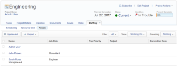
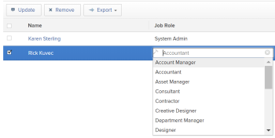

# Manage the Project Team

The Project&nbsp;Team consists of users who are associated with the project. They display on the People subtab of the project.

## Access requirements

You must have the following access to perform the steps in this article:

<table cellspacing="0"> 
 <col> 
 <col> 
 <tbody> 
  <tr> 
   <td role="rowheader">Adobe Workfront plan*</td> 
   <td> 
Any
 </td> 
  </tr> 
  <tr> 
   <td role="rowheader">Adobe Workfront license*</td> 
   <td> 
Plan 
 </td> 
  </tr> 
  <tr> 
   <td role="rowheader">&nbsp;</td> 
   <td>&nbsp;</td> 
  </tr> 
  <tr> 
   <td role="rowheader">Access level configurations*</td> 
   <td> 
Edit access to Projects
 
View or higher access to Users
 
Note: If you still don't have access, ask your Workfront administrator if they set additional restrictions in your access level. For information on how a Workfront administrator can modify your access level, see <a href="../../../administration-and-setup/add-users/configure-and-grant-access/create-modify-access-levels.md" class="MCXref xref">Create or modify custom access levels</a>.
 </td> 
  </tr> 
  <tr> 
   <td role="rowheader">Object permissions</td> 
   <td> 
View or higher permissions to the project
 
For information on requesting additional access, see <a href="../../../workfront-basics/grant-and-request-access-to-objects/request-access.md" class="MCXref xref">Request access to objects in Adobe Workfront</a>.
 </td> 
  </tr> 
 </tbody> 
</table>

&#42;To find out what plan, license type, or access you have, contact your Workfront administrator.

## Add users to a Project Team

When you add users to the project team, they gain permissions on the project and the tasks, issues, and documents of the project. For more information, see the article [Project Team overview](../../../manage-work/projects/planning-a-project/project-team-overview.md).

You can add users to the project team in the following ways:

* [Automatically add users to a Project Team](#automatically-adding-users-to-a-project-team) 
* [Manually add users to a Project Team](#manually-adding-users-to-a-project-team)

### Automatically add users to a Project Team

The users that fulfill the following roles on the project are automatically added to the project team and appear on the People subtab when the project is created:

* The creator of the project
* The project owner
* The project sponsor

Users are also automatically added to the project team when they are assigned to the following roles:

* Users assigned to tasks on the project
* Users assigned to issues on the project

### Manually add users to a Project Team

You can manually add users to a project team by using the Team Scheduling tab.

>[!IMPORTANT]
>
>You can add to the Project Team only users that belong to the Group associated with the project.

1. Go to the project where you want to add users to the project team, then click the **Staffing** tab. The Staffing tab might be located under the **More** menu. 

      

1. Click the **Scheduling** tab, then click **Add Users**.

   The Add Users to Project Team dialog box displays.

   

1. In the **Add Users** box, begin typing the name of the user you want to add to the project team, then click the name when it appears in the drop-down list.

   Repeat this step to add multiple users to the project team.

1. Click **Add**.

   The users are now available in the project scheduling area.

For more information about using the project scheduling area, see the article [Get started with Resource Scheduling](../../../resource-mgmt/resource-scheduling/get-started-resource-scheduling.md).

##  Update the users' roles on the Project Team

You can update the role that a user fulfills on the project as you view the Project&nbsp;Team.&nbsp;This is important when approvals on the project are assigned to job roles. Only the users who fulfill the roles specified in the approval process receive the approval notifications. For information about establishing approval settings, see [Configure global approval settings](../../../administration-and-setup/customize-workfront/configure-approval-milestone-processes/establish-approval-settings.md).

1. Go to a project, then click **Staffing** > **People**. You might need to click **More**, then&nbsp;**Staffing**.  The name of the users who are associated with the project display in a list. 

1. Double-click in the **Job Role** column in the same row as the user whose job role on the project you want to update to change the role that the user fulfills on this project.

   A list of roles displays.

   

   You must have a Plan license with access to edit users to update their roles on the Project&nbsp;Team.

   >[!IMPORTANT]
   >
   >The role of the user updates for the project and the Primary Role of the user updates in the user's profile. 
   >
   >
   >Updating the job role that the user fulfills on the project also changes the Primary&nbsp;Role on the user's profile.

1. Select the role from the list when it appears, then press Enter .

## Remove users from a Project Team

When you remove users from their roles on the project, they remain part of the project team.

If you remove a user from the project team and the user is assigned to tasks or issues in the project, the user is unassigned from the tasks, and issues and the tasks and issues are returned to the Unassigned area in the scheduling timeline.

For more information about removing users from the project team, see the article [Remove users from projects](../../../manage-work/projects/manage-projects/remove-users-from-projects.md).
