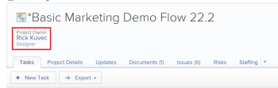

# Update project owners and sponsors

>[!IMPORTANT]
>
>You're currently viewing the Adobe Workfront Classic version of this document. Adobe Workfront Classic is no longer supported. All Adobe Workfront Classic functionality, along with this documentation, will be removed in July 2022. Please transition to the the new Adobe Workfront experienceas soon as possible, and switch to the new Adobe Workfront experience version of this document.

When you create a project in Adobe Workfront, you are automatically set as the Project&nbsp;Owner of the project. You can update this field with another user. You can also update the Project Sponsor field of a project.

For information about projects owners and sponsors, see [Overview of project owners and sponsors](../../../manage-work/projects/planning-a-project/project-owners-and-sponsors.md).

>[!TIP]
>
>You can identify an owner and a sponsor for a template. When you create a project from that template, the Template Owner becomes the Project Owner and the Template Sponsor becomes the Project Sponsor.&nbsp;For information about editing templates, see [Edit project templates](../../../manage-work/projects/create-and-manage-templates/edit-templates.md).

## Access requirements

You must have the following access to perform the steps in this article:

<table> 
 <col> 
 <col> 
 <tbody> 
  <tr> 
   <td role="rowheader">Adobe Workfront plan*</td> 
   <td> 
Any
 
&nbsp;
 </td> 
  </tr> 
  <tr> 
   <td role="rowheader">Adobe Workfront license*</td> 
   <td> 
Plan 
 </td> 
  </tr> 
  <tr> 
   <td role="rowheader">Access level configurations*</td> 
   <td> 
Edit access to Projects
 
Note: If you still don't have access, ask your Workfront administrator if they set additional restrictions in your access level. For information on how a Workfront administrator can modify your access level, see <a href="../../../administration-and-setup/add-users/configure-and-grant-access/create-modify-access-levels.md" class="MCXref xref">Create or modify custom access levels</a>.
 </td> 
  </tr> 
  <tr> 
   <td role="rowheader">Object permissions</td> 
   <td> 
Edit permissions to a project
 
For information on requesting additional access, see <a href="../../../workfront-basics/grant-and-request-access-to-objects/request-access.md" class="MCXref xref">Request access to objects </a>.
 </td> 
  </tr> 
 </tbody> 
</table>

&#42;To find out what plan, license type, or access you have, contact your Workfront administrator.

## Update the Project Owner of a project

1. Go to the project you want to update.
1. Click the&nbsp;**Project Details** tab, then click&nbsp;**Edit Overview**. 

1. Specify the name of a user for the **Project Owner** field.

   Only active users can be specified as Project Owners.

1. Click&nbsp;**Save**.

   The Project Owner updates in the project header.

## Update the Project Sponsor of a project

1. Go to the Project you want to update.
1. Click the&nbsp;**Project Details** tab, then click&nbsp;**Edit Overview**. 

1. Specify the name of a user for the **Project Sponsor** field.

   Only active users can be specified as Project Sponsors.

1. Click&nbsp;**Save**.

   The Project&nbsp;Sponsor updates in the Project&nbsp;Details area.

