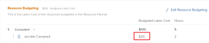
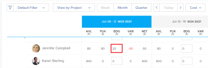

# Understand Budgeted Labor Cost and Budgeted Hours for projects

As you budget your resources for work on projects, Adobe Workfront calculates the Budgeted Labor Cost for the roles, projects, and users based on cost per hour values.

The Budgeted Labor Cost of a project is a calculation between the cost associated with the job roles assigned to complete the work on the project and the amount of hours estimated (Budgeted Hours) that might take each role to complete the work.

>[!IMPORTANT]
>
>The Budgeted Labor Cost for users does not affect that of the project.

Depending on which resource planning tools you are using in Workfront, you might find several fields that contain Budgeted Labor Cost and Budgeted Hours information. 

## Overview of the Budgeted Labor Cost for Job Roles and the Project

Workfront uses the Budgeted Labor Cost of the job roles on the project to calculate the Budgeted Labor Cost of the project.

The `Budgeted Labor Cost` of a project is calculated by the following formula:

```
Budgeted Labor Cost = SUM(Budgeted Hours for each job role on the project * Cost per Hour rate of each job role on the project)
```

The `Budgeted Hours` in the calculation above refers to the following:

* The hours budgeted for job roles in the Resource Budgeting area of the project or the Resource Planner.

  For more information about budgeting resources in the Resource Planner, see the "Budgeting Resources in the Resource Planner" section in the article [Resource Planner overview](../../../resource-mgmt/resource-planning/get-started-resource-planner.md).

  For more information about budgeting resources in the Resource Budgeting area of the Business Case, see [Budget resources in the Business Case](../../../manage-work/projects/define-a-business-case/budget-resources-in-business-case.md).

Important: When budgeting your resources, you must make a decision whether you are using the legacy or the new resource planning tools. For more information about the resource planning tools in Workfront, see the article Difference between Legacy Resource Planning and Planning. Legacy resource planning tools are currently deprecated and will be removed from Workfront in the near future. You might not have access to this functionality because it is supported by Flash, which has been deprecated in most environments.

* The `Cost per Hour rate of a job role` in the above calculation refers to the cost associated with each job role on the project.   
  For more information about creating and managing job roles and associating them with Cost rates, see the article [Create and manage job roles](../../../administration-and-setup/set-up-workfront/organizational-setup/create-manage-job-roles.md).

>[!NOTE]
>
>Workfront calculates all cost information using the currency of the project. If you specify Budgeted Hours for your resources in the Resource Planner, the option to change project currency is disabled.  
>For more information about changing the currency of a project, see the article [Change the project currency](../../../manage-work/projects/project-finances/change-project-currency.md).

## Overview of the Budgeted Labor Cost for Users

>[!IMPORTANT]
>
>The User Budgeted Labor Cost does not affect the Budgeted Labor Cost of the project. Only the Budgeted Labor Cost of the job roles on a project affects the Budgeted Labor Cost of the project.  
>The total of all Budgeted Labor Costs of all users may or may not equal the Budgeted Labor Cost of the job roles associated with the users.

If users are associated with the job roles on the project and their hours are budgeted in the Resource Planner, their Budgeted Labor Cost displays in the following areas in Workfront:

* The Resource Budgeting area of the Business Case under their respective roles.

  

* The Resource Planner when viewing information in the Project and Role view by Cost.

  

Users display in the Resource Budgeting area of the Business Case under their respective roles or in the Resource Planner if they meet the following requirements:

* They are associated with one of the job roles on the project.
* They have Budgeted Hours specified in the Resource Planner.
* They have a Cost per Hour Rate associated with their profile.

  For more information about adding Cost per Hour rates to users, see the article [Edit a user's profile](../../../administration-and-setup/add-users/create-and-manage-users/edit-a-users-profile.md).

* The user is part of one of the Resource Planner associated with the project.

The Budgeted Labor Cost of a user is calculated by the following formula:

```
User Budgeted Labor Cost = Budgeted hours for the user on the project * Cost per Hour rate of the user
```

## Locate the Budgeted Labor Cost of a project

Depending on which tools you use to budget your resources, you can view the following Budgeted Labor Cost information in Workfront: You can view the following Budgeted Labor Cost information in Workfront:

* The Budgeted Labor Cost as reflected in the Resource Budgeting area of the Business Case or the Resource Planner displays in the following areas of Workfront under the following names:

  <table cellspacing="15"> 
   <col> 
   <col> 
   <tbody> 
    <tr> 
     <td>Budgeted Labor Cost display name</td> 
     <td>Area of Workfront</td> 
    </tr> 
    <tr> 
     <td>Budgeted Labor Cost</td> 
     <td>Resource Budgeting area of the Business Case</td> 
    </tr> 
    <tr> 
     <td>Budgeted Cost</td> 
     <td>Utilization report Cost view</td> 
    </tr> 
    <tr> 
     <td>BDG </td> 
     <td>Resource Planner Project or Role views, by Cost</td> 
    </tr> 
    <tr> 
     <td>Resource Planner Project Budgeted Labor Cost</td> 
     <td> <!--
       Resource Estimates report
      --> <p>Project report</p> <p>Project (Financial Data) report</p> <p>Task report</p> <p>Issue report</p> <p>Budgeted Hour report</p> <p>For information about creating a report, see the article <a href="../../../reports-and-dashboards/reports/creating-and-managing-reports/create-custom-report.md" class="MCXref xref">Create a custom report</a>.</p> </td> 
    </tr> 
   </tbody> 
  </table>

The Budgeted Labor Cost as reflected in the Resource Estimates area of the Business Case or the Capacity Planner displays in the following areas of Workfront under the following names: Budgeted Labor Cost display name Area of Workfront Legacy Budgeted Labor Cost Legacy Resource Estimates area of the Business Case Budgeted Labor Cost Resource Estimates report Project report Project (Financial Data) report Task report Issue report Budgeted Hour report 

## Locate the Budgeted Hours of a project

Budgeted Hours affect the value of the Budgeted Labor Cost of the project.

The Budgeted Labor Cost of a project is the cost associated with the job roles assigned to complete the work on the project and the amount of hours estimated (Budgeted Hours) that might take each role to complete the work.

You can view the Budgeted Hours in Workfront in the fields listed in the table below.

>[!NOTE]
>
>Any other mention of Budgeted Hours in Adobe Workfront refers to hours budgeted using deprecated features that have been removed from Workfront . These are view-only fields and do not update with current information when you use current resource budgeting tools.

Depending on which tools you use to budget your resources, you can view the following Budgeted Hours in Workfront: 
The hours budgeted in the Resource Budgeting area of the Business Case or the Resource Planner display in the following areas of Workfront and under the following names:

<table cellspacing="15"> 
 <col> 
 <col> 
 <tbody> 
  <tr> 
   <td>Budgeted Hours display name</td> 
   <td>Areas of Workfront</td> 
  </tr> 
  <tr> 
   <td>Hours</td> 
   <td>Resource Budgeting area of the Business Case</td> 
  </tr> 
  <tr> 
   <td>BDG</td> 
   <td>Resource Planner viewed by Hours</td> 
  </tr> 
  <tr> 
   <td>Budgeted Hours</td> 
   <td> <p>Utilization report Hours view</p> <p>For more information about the Utilization report, see the article <a href="../../../reports-and-dashboards/reports/using-built-in-reports/resource-utilization-report.md" class="MCXref xref">Overview of the Resource Utilization report</a>.</p> </td> 
  </tr> 
  <tr> 
   <td>Bud. Hours</td> 
   <td> <p>Budgeted Hour report</p> <p>For more information about creating a report, see the article <a href="../../../reports-and-dashboards/reports/creating-and-managing-reports/create-custom-report.md" class="MCXref xref">Create a custom report</a>.</p> </td> 
  </tr> 
 </tbody> 
</table>

The hours budgeted in the Legacy Resource Estimates area of the Business Case or the Capacity Planner display in the following areas of Workfront and under the following names: Budgeted Hours display name Area of Workfront Hours Legacy Resource Estimates area of the Business Case Capacity Planner Budgeted Hours Resource Estimates report Project report Project (Financial Data) report Task report Issue report Budgeted Hour report Bud. Hours Resource Estimates report 

