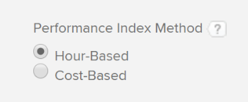

# Calculate Budgeted Cost of Work Performed (BCWP)

## Overview of Budgeted Cost of Work Performed (BCWP)

Also known as the Earned Value, the Budgeted Cost of Work Performed (BCWP) is a project performance metric that represents the amount of the task that has actually completed at the time when this metric is calculated.

Adobe Workfront calculates the Budgeted Cost of Work Performed (BCWP) for both projects and tasks.

Consider the following when reviewing the values for the BCWP on a task or project:

* Workfront calculates the BCWP for a task based on your configuration for the Performance Index Method (PMI) of the project.

  You can configure your project to calculate the PMI using hours or cost and the BCWP is also calculated using the same values.

  For information about configuring how the BCWP is calculated, see the section [Configure how BCWP is calculated](#configure-how-bcwp-is-calculated) in this article.

* Workfront calculates the BCWP for a project by adding all the BCWP values from all the parent tasks and individual tasks on the project.

  The values from children tasks are not added to the BCWP of the project.

## Access requirements

You must have the following access to perform the steps in this article:

<table cellspacing="0"> 
 <col> 
 <col> 
 <tbody> 
  <tr> 
   <td role="rowheader">Adobe Workfront plan*</td> 
   <td> <p>Any</p> </td> 
  </tr> 
  <tr> 
   <td role="rowheader">Adobe Workfront license*</td> 
   <td> <p>Plan </p> </td> 
  </tr> 
  <tr> 
   <td role="rowheader">Access level configurations*</td> 
   <td> <p>Edit access to Projects</p> <p>Note: If you still don't have access, ask your Workfront administrator if they set additional restrictions in your access level. For information on how a Workfront administrator can modify your access level, see <a href="../../../administration-and-setup/add-users/configure-and-grant-access/create-modify-access-levels.md" class="MCXref xref">Create or modify custom access levels</a>.</p> </td> 
  </tr> 
  <tr> 
   <td role="rowheader">Object permissions</td> 
   <td> <p>Manage permissions to the project</p> <p>For information on requesting additional access, see <a href="../../../workfront-basics/grant-and-request-access-to-objects/request-access.md" class="MCXref xref">Request access to objects in Adobe Workfront</a>.</p> </td> 
  </tr> 
 </tbody> 
</table>

&#42;To find out what plan, license type, or access you have, contact your Workfront administrator.

## Configure how BCWP is calculated {#configure-how-bcwp-is-calculated}

You can configure whether the BCWP is calculated in hours or costs by configuring how the Performance Index Method (PIM) of the project is calculated.

1. Go to a project and select the **Project Details** tab. 
1. Click **Finance**, then **Edit Finance** and locate the **Performance Index Method** field.

   

1. Select from the following options:

   | Hour-Based |Workfront calculates the BCWP using the Planned Hours of the tasks. |
   |---|---|
   | Cost-Based |Workfront calculates the BCWP using the Planned Cost of the tasks. |

1. Click **Save**.

   The BCWP of the tasks on the project is calculated using hours or costs.

## Calculate BCWP

Workfront calculates the Budgeted Cost of Work Performed (BCWP) for a task or project using the following formulas:

* 

  ```
  Task BCWP = Actual Percent Complete x Task Budget
  ```

* 

  ```
  Project BCWP = SUM(BCWP values of all parent and individual tasks)
  ```

The following values are used in these calculation:

| Actual Percent Complete |This is the actual percent complete of the task as it appears in Workfront. |
|---|---|
| Task Budget |This is the value for the Planned Hours or Planned Cost of the task. |

For example, if the actual percent complete of the task is 25% and the Task Budget or the Planned Cost is $10,000, then the BCWP for the task is:

```
BCWP = 25% x $10,000 = $2,500
```

## Locate the BCWP for a project or a task

You can view the value of the Budgeted Cost of Work Performed in a report or list, by adding the BCWP column to your view.

1. Go to a list of tasks or projects.
1. Expand the **View** menu and select **New View** or **Customize View**.

1. Click **Add Column**.
1. In the **Show in this column:** field start typing **BCWP** and click to select it when it displays in the list.

   

1. Click **Save View**.
1. The BCWP field displays in the view.

