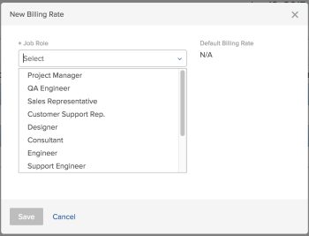
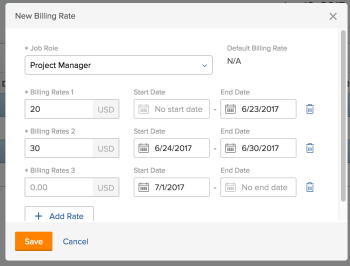

# Override Job Role Billing Rates at the project level

As a project manager, you can specify what the billing rate is for a job role on a specific project. This project-level billing rate overrides the billing rate at the system level for this job role. Workfront uses the project-level billing rate of the job role to calculate revenue, instead of using the system-level billing rate.

This article describes how you can override the system job role billing rates for a project.

For general information about overriding job role billing rates for projects and calculating project&nbsp;Revenue, see [Overview of overriding Job Role Billing Rates and calculating Revenue on a project](../../../manage-work/projects/project-finances/override-role-billing-rates-and-calculate-project-revenue.md).

For more information about which job role is used to calculate revenue on the project, see the "Understanding Revenue Calculations for Tasks Based on User and Role Assignments" section in the article [Overview of Billing and Revenue](../../../manage-work/projects/project-finances/billing-and-revenue-overview.md).

>[!NOTE]
>
>In the case of Actual Revenue, the billing rates applied to hours that are added to a Billing Record which is marked as Billed, should not be affected by billing rate overrides that occur after the Billing Record has been billed.

## Access requirements

You must have the following access to perform the steps in this article:

<table cellspacing="0"> 
 <col> 
 <col> 
 <tbody> 
  <tr> 
   <td role="rowheader">Adobe Workfront plan*</td> 
   <td> 
Any
 </td> 
  </tr> 
  <tr> 
   <td role="rowheader">Adobe Workfront license*</td> 
   <td> 
Plan 
 </td> 
  </tr> 
  <tr> 
   <td role="rowheader">Access level configurations*</td> 
   <td> 
Edit access to Projects and Financial Data
 
Administrative access for Job&nbsp;roles
 
Note: If you still don't have access, ask your Workfront administrator if they set additional restrictions in your access level. For information on how a Workfront administrator can modify your access level, see <a href="../../../administration-and-setup/add-users/configure-and-grant-access/create-modify-access-levels.md" class="MCXref xref">Create or modify custom access levels</a>.
 </td> 
  </tr> 
  <tr> 
   <td role="rowheader">Object permissions</td> 
   <td> 
Manage permissions to the project that includes Edit Financial&nbsp;Data 
 
For information on requesting additional access, see <a href="../../../workfront-basics/grant-and-request-access-to-objects/request-access.md" class="MCXref xref">Request access to objects in Adobe Workfront</a>.
 </td> 
  </tr> 
 </tbody> 
</table>

&#42;To find out what plan, license type, or access you have, contact your Workfront administrator.

## Override Job Role Billing Rates at the project level

You can override the billing rate of a job role on a project in the following ways:

* One time, by selecting a new rate for the job role.  
  The new rate is used for the entire duration of the project, to calculate revenue.

* Several times, by selecting several new rates for specific date ranges.   
  A different rate can be used during each specified date range.

>[!TIP]
>
>You cannot override user billing rates for a project.

To override a billing rate for a project:

1. Go to the project you want to override billing rates for.
1. Click the **Billing Rates** tab. This tab might be located under **More**.
1. Click **Add Billing Rate**.
1. Click **New Billing Rate**.
1. In the **Job Role** field, select the job role you want to change the billing rate for.  
     
   The **Default Billing Rate** field displays the system-level rate for this job role.

1. In the **Billing Rates 1** field, enter the one time billing rate override, then click **Save** to override the billing rate one time,   
   Or Click **Add Rate** to add more billing rate overrides.

1. (Conditional) If you are adding more than one billing rate override, specify the following information:  
   - **Billing Rates 1**: the value of the Billing Rate from the beginning of the project to the first date of the first override. This is typically the same amount as the **Default Rate**.  
   - **Start Date**: this is the date when the Default Rate ends.  
   - **End Date**: the date when the new billing rate override ends.   
     
   Workfront applies the override job role rate to the hours that occur during the time frames specified when calculating revenue on the project.  
   There should be no gaps between the time frames of two override rates. The **Start Date** of an override rate should be the day immediately following the **End Date** of the previous override date.

   >[!NOTE]
   >
   >You cannot specify a **Start Date** for the first override rate, nor an **End Date** for the last override rate. We recommend that you use the Default Rate for the first override rate.  
   >Workfront assumes that the first override rate is applied for all hours with a date older than the**End Date** of the first override, and that the last override rate is applied for all hours with a date newer than the **Start Date** of the last override.  
   >If an hour is logged before the Planned Start Date of the project the very first billing rate is used.  
   >If an hour is logged after the Planned Completion Date of the project the very last billing rate is used.

1. Click **Save**.

