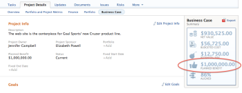

# Overview of project Planned Benefit

>[!IMPORTANT]
>
>You're currently viewing the Adobe Workfront Classic version of this document. Adobe Workfront Classic is no longer supported. All Adobe Workfront Classic functionality, along with this documentation, will be removed in July 2022. Please transition to the the new Adobe Workfront experienceas soon as possible, and switch to the new Adobe Workfront experience version of this document.

The Planned Benefit is the estimated amount of money that an organization might benefit from if a project is completed.

The Planned Benefit is not calculated by Adobe Workfront. As the Project Owner, you manually specify the Planned Benefit of a project in the Business Case. We recommend that each organization establish a policy as to how this value is determined.

The Planned Benefit of a project affects the Net Value of a project.  
For more information about calculating the Net Value of a project, see the article [Calculate Net Value](../../../manage-work/projects/project-finances/calculate-net-value.md).

## Access requirements

You must have the following access to perform the steps in this article:

<table cellspacing="0"> 
 <col> 
 <col> 
 <tbody> 
  <tr> 
   <td role="rowheader">Adobe Workfront plan*</td> 
   <td> 
Any
 </td> 
  </tr> 
  <tr> 
   <td role="rowheader">Adobe Workfront license*</td> 
   <td> 
Plan 
 </td> 
  </tr> 
  <tr> 
   <td role="rowheader">Access level configurations*</td> 
   <td> 
Edit access to Projects and Financial&nbsp;Data
 
Note: If you still don't have access, ask your Workfront administrator if they set additional restrictions in your access level. For information on how a Workfront administrator can modify your access level, see <a href="../../../administration-and-setup/add-users/configure-and-grant-access/create-modify-access-levels.md" class="MCXref xref">Create or modify custom access levels</a>.
 </td> 
  </tr> 
  <tr> 
   <td role="rowheader">Object permissions</td> 
   <td> 
Manage permissions to the project with permissions to Manage Finance
 
For information on requesting additional access, see <a href="../../../workfront-basics/grant-and-request-access-to-objects/request-access.md" class="MCXref xref">Request access to objects </a>.
 </td> 
  </tr> 
 </tbody> 
</table>

&#42;To find out what plan, license type, or access you have, contact your Workfront administrator.

## Locate the Planned Benefit of a project

You can view or update the Planned Benefit of a project in the following areas in Workfront:

* In the Business Case Summary.  
  For more information about the Business Case of a project, see the article [Create a Business Case for a project](../../../manage-work/projects/define-a-business-case/create-business-case.md).

* In a project report, when you add the Planned Benefit column to the view of the report.  
  For more information about building reports in Workfront, see the article [Create a custom report](../../../reports-and-dashboards/reports/creating-and-managing-reports/create-custom-report.md).

* In the Portfolio Optimizer.  
  For more information about the Portfolio Optimizer, see the article [Portfolio Optimizer overview](../../../manage-work/portfolios/portfolio-optimizer/portfolio-optimizer-overview.md).

## Update the Planned Benefit of a project

1. Go to a project for which you wish to update the Planned Benefit.
1. Click the **Project Details** tab, then click the **Business Case** sub-tab.
1. Click **Edit Project Info** and specify the planned benefit amount in the **Planned Benefit** field.

1. Click **Save**.

