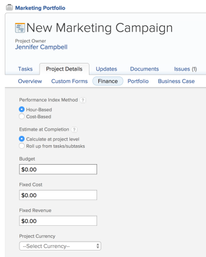

# Set the Performance Index Method (PIM)

>[!IMPORTANT]
>
>You're currently viewing the Adobe Workfront Classic version of this document. Adobe Workfront Classic is no longer supported. All Adobe Workfront Classic functionality, along with this documentation, will be removed in July 2022. Please transition to the the new Adobe Workfront experienceas soon as possible, and switch to the new Adobe Workfront experience version of this document.

The Performance Index Method (PIM) for the project controls the method Adobe Workfront uses to calculate project performance metrics such as Cost ```Performance Index``` (CPI), Cost Schedule Performance Index (CSI), Schedule Performance Index (SPI), and Estimate At Completion (EAC).

Workfront calculates these values using the following:

* Hours
* Cost

## Access requirements

You must have the following access to perform the steps in this article:

<table> 
 <col> 
 <col> 
 <tbody> 
  <tr> 
   <td role="rowheader">Adobe Workfront plan*</td> 
   <td> <p>Any</p> </td> 
  </tr> 
  <tr> 
   <td role="rowheader">Adobe Workfront license*</td> 
   <td> <p>Plan </p> </td> 
  </tr> 
  <tr> 
   <td role="rowheader">Access level configurations*</td> 
   <td> <p>Edit access to Projects and Financial&nbsp;Data</p> <p>Note: If you still don't have access, ask your Workfront administrator if they set additional restrictions in your access level. For information on how a Workfront administrator can modify your access level, see <a href="../../../administration-and-setup/add-users/configure-and-grant-access/create-modify-access-levels.md" class="MCXref xref">Create or modify custom access levels</a>.</p> </td> 
  </tr> 
  <tr> 
   <td role="rowheader">Object permissions</td> 
   <td> <p>Manage permissions to the project with permissions to Manage Finance</p> <p>For information on requesting additional access, see <a href="../../../workfront-basics/grant-and-request-access-to-objects/request-access.md" class="MCXref xref">Request access to objects </a>.</p> </td> 
  </tr> 
 </tbody> 
</table>

&#42;To find out what plan, license type, or access you have, contact your Workfront administrator.

## Considerations about PIM in Workfront

* Your Workfront administrator or a group administrator sets up the default for whether the Performance Index Method (PIM) should be hour-based or cost-based. The calculations for the performance metrics change according to how this default is set. For more information about how to change the default for how to calculate the PIM, see [Configure system-wide project preferences](../../../administration-and-setup/set-up-workfront/configure-system-defaults/set-project-preferences.md).
* Project managers can also change the setting for the PIM, at the project level, for individual projects in the Finance subtab of the project. You must have Manage permissions to the project to edit the Finance subtab of the project.

## Set the Performance Index Method (PIM) for a project

1. Go to a project which you are the owner of.

   >[!IMPORTANT]
   >
   >You need Manage permissions to the project to perform the following steps. We also recommend that only the Project Owner should make changes to the Finance subtab of the project.

1. Select the **Project Details** tab.
1. Click the **Finance** subtab.
1. Click **Edit Finance**.

   

1. Select from the following options in the **Performance Index Method** field:

   | Hour-Based |Workfront uses the Planned Hours in calculating the CPI and EAC of the project, and the EAC of the project displays as a number, in hours.  |
   |---|---|
   | Cost-Based |Workfront uses the Planned Labor Cost in calculating the CPI and EAC of the project, and the EAC displays as a currency value. When you select this option, ensure that your task assignees (job roles or users) are associated with cost rates. |

1. Click **Save**.

