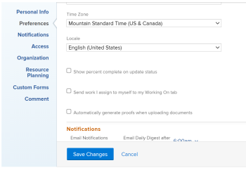

# View and update Percent Complete for tasks

You can update the percent complete for a task&nbsp;in any of the following ways:

* **In a task list:** You can update the percent complete of a task when the Percent Complete column is displayed.  
  For more information about inline editing, see [Inline edit items in a list in Adobe Workfront](../../../workfront-basics/navigate-workfront/use-lists/inline-edit-objects.md).

* **In the Milestone view:**You can update the percent complete of a task when using the Milestone view on a project list or a project report. For more information, see [Use the Milestone view](../../../reports-and-dashboards/reports/reporting-elements/use-milestone-view.md).

* **As you update the task:**&nbsp;You can update the percent complete option of a task when adding an update to the task.

  >[!IMPORTANT]
  >
  >This option displays only after you enable the Show Percent Complete option.&nbsp;  
  >To enable the percent complete update bar for tasks, do the following:   
  >1. Go to&nbsp;**Your name in the Global Navigation Bar> My Settings** >&nbsp;**Preferences** and&nbsp;select&nbsp;**Show percent complete on update status**.  
  
  >  >
  >

