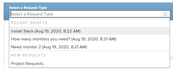
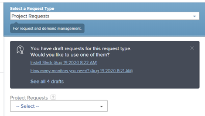

# Create and submit Adobe Workfront requests

>[!IMPORTANT]
>
>You're currently viewing the Adobe Workfront Classic version of this document. Adobe Workfront Classic is no longer supported. All Adobe Workfront Classic functionality, along with this documentation, will be removed in July 2022. Please transition to the the new Adobe Workfront experienceas soon as possible, and switch to the new Adobe Workfront experience version of this document.

<!--
<div data-mc-conditions="QuicksilverOrClassic.Draft mode">
<p>(NOTE: Linked to the UI - do not change/ remove; THIS IS NOW SPLIT IN THREE ARTICLES>> MAKE SURE THE TRANSITION TO THE OTHER TWO IS CLEAR SINCE THIS IS LINKED TO UI)</p>
<p>(NOTE:&nbsp;If they come out with templates AND drafts, consider splitting this article to keep Create in one and Working with Drafts and Requests in another??)</p>
<p>(NOTE: this article is linked from Submitting Workfront Requests from Salesforce) </p>
</div>
-->

&nbsp;

Planned work is represented in Adobe Workfront by projects and tasks. However, you might work in an environment where unplanned work—in the form of random requests—can come in at any time. Workfront provides a workflow to accommodate this type of environment through the use of Request Queues.&nbsp;

After you create a request in a Request Queue, you can either assign it to be completed or you can convert it to a task or a project.   
For more information about converting issues to a task or project, see the article [Overview of converting issues in Adobe Workfront](../../../manage-work/issues/convert-issues/convert-issues.md).

You can create a request in the following ways:

* From scratch as described in this article. 
* From drafts. For information, see [Create requests from drafts](../../../manage-work/requests/create-requests/create-requests-from-drafts.md).

## Access requirements

You must have the following access to perform the steps in this article:

<table> 
 <col> 
 <col> 
 <tbody> 
  <tr> 
   <td role="rowheader">Adobe Workfront plan*</td> 
   <td> <p>Any </p> </td> 
  </tr> 
  <tr> 
   <td role="rowheader">Adobe Workfront license*</td> 
   <td> <p>Request or higher</p> </td> 
  </tr> 
  <tr> 
   <td role="rowheader">Access level*</td> 
   <td> <p>Edit access to Issues</p> <p>Note: If you still don't have access, ask your Workfront administrator if they set additional restrictions in your access level. For information on how a Workfront administrator can change your access level, see <a href="../../../administration-and-setup/add-users/configure-and-grant-access/create-modify-access-levels.md" class="MCXref xref">Create or modify custom access levels</a>.</p> </td> 
  </tr> 
 </tbody> 
</table>

&#42;To find out what plan, license type, or access you have, contact your Workfront administrator.

## Prerequisites for using Request Queues

As a Workfront administrator, you must create Request Queues and make them available to users&nbsp;before they can use this functionality. A user with a Planner license and with Edit access to Projects and Manage permissions to a specific project can also create Request Queues.&nbsp;

For information about how to create Requests Queues, see the article [Create a Request Queue](../../../manage-work/requests/create-and-manage-request-queues/create-request-queue.md).

You must create the following components of a Request Queue:

* A project in Current status, published as a Help Request&nbsp;Queue.
* Queue Topics.  
  For more information, see the article [Create Queue Topics](../../../manage-work/requests/create-and-manage-request-queues/create-queue-topics.md).

* Routing Rules.  
  For more information, see the article [Create Routing Rules](../../../manage-work/requests/create-and-manage-request-queues/create-routing-rules.md).

* (Optional) Topic Groups.  
  For more information, see the article [Create Topic Groups](../../../manage-work/requests/create-and-manage-request-queues/create-topic-groups.md).

* (Optional) Request custom form.  
  For more information, see the article [Create or edit a custom form](../../../administration-and-setup/customize-workfront/create-manage-custom-forms/create-or-edit-a-custom-form.md).

* (Optional) Request approval process.  
  For more information, see the article [Create an approval process for work items](../../../administration-and-setup/customize-workfront/configure-approval-milestone-processes/create-approval-processes.md).

## Create requests and generate drafts in the Workfront web app

When you create a request in the Workfront web app, Workfront saves the request as a draft before you submit it. Workfront creates a draft as soon as you select your request queue and start entering information for it.

You can continue submitting the request, or you can complete as much information as you have available and navigate away from it to finish it later. Workfront saves the drafted request that you started in the Drafts folder.

>[!IMPORTANT]
>
>Consider the following when working with drafts:
>
>* Workfront does not create draft requests when you submit them from a third-party application, like emailing them into Workfront, or creating them using any another application. When you submit a request from outside the Workfront web app the request is saved in  the All&nbsp;Requests or Requests I've Submitted  t   abs.  
>* If the structure of a request queue changes, you can no longer access existing drafts.&nbsp;For example, if a queue topic is removed, or a topic group is added, the saved drafts are no longer accessible. 
>

For information about creating requests from existing drafts, see [Create requests from drafts](../../../manage-work/requests/create-requests/create-requests-from-drafts.md). For information about deleting request drafts, see also [Delete a request draft](../../../manage-work/requests/create-requests/delete-request-draft.md).

To create a request in the Workfront web app:&nbsp;

1. Go to the **Requests** area in the Global Navigation Bar.
1. Click **New Request**.
1. From the **Select a Request Type** drop-down menu, do one of the following:

   * (Conditional) Select an available draft from the **Recent Drafts** section.  
     The three most recent drafts from three different queue topics display by default. This area displays only if you have saved drafts before without submitting them.

     

   * Choose or search for a request queue for your request from the **New Request** tab, then click it when it displays in the list.

     >[!TIP]
     >
     >* The first 200 requests queues display by default, in alphabetical order. 
     >* The name of the request queue is the name of the project which has been published as a Help Request Queue. 
     >* Hovering over the information icon  next to the name of the selected request queue displays the description of the project configured as a request queue. 
     >   
     >For more information about how to publish a project as a Help&nbsp;Request Queue, see the article [Create a Request Queue](../../../manage-work/requests/create-and-manage-request-queues/create-request-queue.md).

     If you have started a request for this request type before and you did not submit it when you first created it, a notification displays under the request type you selected to let you know that a draft of your request is saved in the Drafts area. The first two drafts are listed by default.&nbsp;Click **See all `<number>` drafts** to see a list of all available drafts for the request type you selected, then click the one you want to continue editing when you see it in the list.

     

     Click the **X** icon to close the draft notification and continue entering a new request.

     A new draft automatically saves for you in the Drafts  tab  after you start entering information for the new request and you give the request a name in the Subject field.

1. (Optional) If your Request Queue includes Topic Groups, select the name of the Topic Group in the first drop-down field. Otherwise, select a Queue&nbsp;Topic.

   You can have up to 10 tiers of Topic Groups built into&nbsp;your Request Queue.   
   For more information about how to create Topic Groups, see the article [Create Topic Groups](../../../manage-work/requests/create-and-manage-request-queues/create-topic-groups.md). For more information about creating Queue Topics, see the article [Create Queue Topics](../../../manage-work/requests/create-and-manage-request-queues/create-queue-topics.md).

   >[!TIP]
   >
   >If you selected a draft ```or a previous path```, the topic groups and queue topics are already selected. You can select a different one, if needed.

1. Depending on what fields the Workfront administrator enabled in the **New Issue Fields** section of the **Queue Details**&nbsp;subtab on the project, you might find&nbsp;any of the following fields when you submit a new request:

   <table> 
    <col> 
    <col> 
    <tbody> 
     <tr> 
      <td role="rowheader"><strong>Subject</strong> </td> 
      <td>Specify a name for your request. This is a mandatory field.</td> 
     </tr> 
     <tr> 
      <td role="rowheader"><strong>Description</strong> </td> 
      <td>Specify a description for your request.</td> 
     </tr> 
     <tr> 
      <td role="rowheader"><strong>URL</strong> </td> 
      <td> <p>Specify a URL that might relate to your request.</p> </td> 
     </tr> 
     <tr> 
      <td role="rowheader"><strong>Priority</strong> </td> 
      <td> <p>Specify a priority for your request. The priority should define how fast you think this request should be resolved. The default&nbsp;options are: </p> 
       <ul> 
        <li>None</li> 
        <li>Low </li> 
        <li>Normal</li> 
        <li>High</li> 
        <li>Urgent</li> 
       </ul> <p>Your system administrator can modify the names of priorities.</p> </td> 
     </tr> 
     <tr> 
      <td role="rowheader"><strong>Severity</strong> </td> 
      <td> <p>Specify a severity for your request. The severity should define the impact this request has on your work should it not be resolved in time. The default&nbsp;options are:</p> 
       <ul> 
        <li>Cosmetic</li> 
        <li>Causes Confusion</li> 
        <li>Bug with workaround</li> 
        <li>Bug with no workaround</li> 
        <li>Fatal error</li> 
       </ul> <p>Your system administrator can modify the names of severities.</p> </td> 
     </tr> 
     <tr> 
      <td role="rowheader"><strong>Primary Contact</strong> </td> 
      <td>The Primary Contact of a request defaults to you, as you are the point person to address any questions pertaining to the request. However, you can change this to any other Workfront user.</td> 
     </tr> 
     <tr data-mc-conditions="QuicksilverOrClassic.Classic"> 
      <td role="rowheader"><strong>Assigned To*</strong> </td> 
      <td> <p>Specify the name of an active user who this request should be assigned to. We recommend using Routing Rules for your Request Queues so that they can be automatically routed to the appropriate users. You can specify only one user. </p> </td> 
     </tr> 
     <tr data-mc-conditions="QuicksilverOrClassic.Classic"> 
      <td role="rowheader"><strong>Job Role*</strong> </td> 
      <td> <p>Specify the name of an active job role that the request should be assigned to.&nbsp;We recommend using Routing Rules for your Request Queues so that they can be automatically routed to the appropriate job roles. You can specify only one role. </p> </td> 
     </tr> 
     <tr data-mc-conditions="QuicksilverOrClassic.Classic"> 
      <td role="rowheader"><strong>Team*</strong> </td> 
      <td> <p>Specify the name of an active team that the request should be assigned to.&nbsp;We recommend using Routing Rules for your Request Queues so that they can be automatically routed to the appropriate teams. You can specify only one team. </p> </td> 
     </tr> 
     <tr> 
      <td role="rowheader" colspan="2"> <p>Note:   <p style="font-weight: normal;">* Depending on how the request queue was set up, you might be able to only assign one type of resource to the request (for example, users). If a routing rule is also associated to the request queue and it automatically routes the request to a different type of resource (for example, a team), your request is assigned to both the entity that you manually specify when submitting the request (users) and the resource specified in the routing rule (the team.) </p> <p style="font-weight: normal;">For more information, see the following articles:</p> 
        <ul> 
         <li> <p><a href="../../../manage-work/requests/create-and-manage-request-queues/create-request-queue.md" class="MCXref xref">Create a Request Queue</a> </p> </li> 
         <li> <p><a href="../../../manage-work/requests/create-and-manage-request-queues/create-routing-rules.md" class="MCXref xref">Create Routing Rules</a> <br> </p> </li> 
        </ul> </p> </td> 
     </tr> 
     <tr> 
      <td role="rowheader"><strong>Planned Hours</strong> </td> 
      <td> <p>Estimate how many hours it would take for this request to complete.</p> </td> 
     </tr> 
     <tr> 
      <td role="rowheader"><strong>Planned Start Date</strong> </td> 
      <td> <p>Specify the date when work on this request should start.</p> </td> 
     </tr> 
     <tr> 
      <td role="rowheader"><strong>Planned Completion Date</strong> </td> 
      <td>Specify the date when you would like for this request to be resolved.</td> 
     </tr> 
     <tr> 
      <td role="rowheader"><strong>Status</strong> </td> 
      <td>The default status of a new request is "New." Your system administrator might have changed the name of this&nbsp;status. You can also change the status to something else from this drop-down menu.</td> 
     </tr> 
     <tr> 
      <td role="rowheader"><strong>Documents</strong> </td> 
      <td> <p>Add documents to your request. </p> <p>Tip: Depending on how the request queue was set up, the Documents section might display before or after the custom fields. </p> <p>Documents that you upload to Workfront are stored for 24 hours in a drafted request. After that, you must reattach them when you return to edit and submit the draft. Documents that are linked from other drives are saved on the draft permanently. </p> </td> 
     </tr> 
    </tbody> 
   </table>

1. (Optional) If your Workfront administrator associated a custom form with the Request Queue or with the Queue Topic, specify the fields inside the custom form.   
   Custom forms are different for every Workfront instance.&nbsp;
1. (Optional and conditional)&nbsp;At any point during entering the request, click **Discard** if you want to delete the draft that is automatically created. This deletes the draft which cannot be recovered. A confirmation message displays to acknowledge that you are deleting the draft. 
1. (Optional) Click **Cancel** on the confirmation message if you want to revert your action and keep the ```draft.```

1. Do one of the following:

   * Click **Submit Request** if you are ready to submit the request. The request is saved in the  Requests I've Submitted tab . Depending on the Routing Rule of the Request Queue, this request might be routed to a different project than the one designated&nbsp;as a Request Queue. For information about routing rules, see [Create Routing Rules](../../../manage-work/requests/create-and-manage-request-queues/create-routing-rules.md).

     Or

     Click anywhere outside your request if you are not quite ready to submit it and you might come back and finish it later.  Your request is saved in the Drafts  tab and it will be available to you next time you submit a request for this request queue.

   When you submit the request, the draft automatically deletes and cannot be restored.

   For information about addressing incoming requests, see the article [Manage work and team requests](../../../people-teams-and-groups/work-with-team-requests/manage-work-and-team-requests.md).

   For information about locating submitted or drafted requests, also see [Locate submitted requests](../../../manage-work/requests/create-requests/locate-submitted-requests.md).

## Create requests from outside of Workfront

After your Workfront administrator creates the Request Queue, you can share the URL of that request queue outside of Workfront, or&nbsp;embed it in other applications you use in your organization.&nbsp;

You can share a Request Queue by doing one of the following:

* Using a Direct Access URL to the request.
* Embedding the code of the Request Queue into an iframe.&nbsp;

For information about the Direct Access URL and the Embed Code field, see the article [Create a Request Queue](../../../manage-work/requests/create-and-manage-request-queues/create-request-queue.md).

## Create requests by emailing&nbsp;into Workfront

If your Request Queue is enabled to receive requests through email, you can email your requests directly to the email associated with the Request Queue.

The body text of the email is added as the request description.

>[!NOTE]
>
>HTML formatting is stripped when the request enters Workfront, but signatures and existing Reply-to thread contents are not stripped and appear in the request description.

For information about how to enable a Request Queue to receive requests through email, see [Enable users to email an issue into a Request Queue project](../../../manage-work/requests/create-requests/enable-email-issues-into-projects.md).

## Create requests using the Outlook&nbsp;client

You can submit requests using the Outlook client. You can create a new request or you can convert an email into a request.&nbsp;

For information about submitting requests using the Outlook client, see the article [Create an Adobe Workfront request from an Outlook email](../../../workfront-integrations-and-apps/using-workfront-with-outlook/create-a-wf-request-from-an-outlook-email.md).

## Create requests by using the Workfront mobile app

You can submit requests using the mobile app on your smartphone. You can create a new request&nbsp;and submit it to the Request Queues you have access to see in the web application.&nbsp;

For information about submitting requests&nbsp;through the mobile app, see the [Requests](../../../workfront-basics/mobile-apps/using-the-workfront-mobile-app/workfront-for-android.md#requests) section in the articles:

* [Adobe Workfront for Android](../../../workfront-basics/mobile-apps/using-the-workfront-mobile-app/workfront-for-android.md) 
* [Adobe Workfront for iOS](../../../workfront-basics/mobile-apps/using-the-workfront-mobile-app/workfront-for-ios.md)

## Create requests from other applications

You can submit requests using any applications that have been integrated with Workfront:&nbsp;

* You can build a custom integration between Workfront and another application that allows you to submit requests to Workfront from the other application.  
  For more information about custom Workfront integrations, see the article [Adobe Workfront integrations](../../../administration-and-setup/configure-integrations/workfront-integrations-1.md).

* You can subscribe to Workfront Fusion and configure other applications on that platform to submit Workfront requests.  
  For information about the Workfront Fusion platform, see the article [Legacy Workfront Fusion](../../../administration-and-setup/configure-integrations/legacy-workfront-fusion.md).

* You can submit requests from Salesforce if you have installed the Workfront app for Salesforce.  
  For information about submitting requests from Salesforce using our Workfront app for Salesforce, see the article [Submit Adobe Workfront requests from Salesforce objects](../../../workfront-integrations-and-apps/using-workfront-with-salesforce/submit-workfront-requests-from-salesforce-objects.md).

## Locate submitted requests

For information about locating submitted or drafted requests, see [Locate submitted requests](../../../manage-work/requests/create-requests/locate-submitted-requests.md). 
