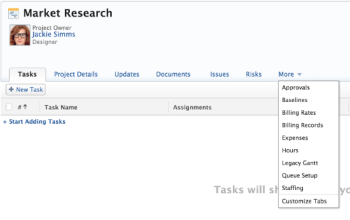

# Enable users to email an issue into a Request Queue project

>[!IMPORTANT]
>
>You're currently viewing the Adobe Workfront Classic version of this document. Adobe Workfront Classic is no longer supported. All Adobe Workfront Classic functionality, along with this documentation, will be removed in July 2022. Please transition to the the new Adobe Workfront experienceas soon as possible, and switch to the new Adobe Workfront experience version of this document.

<!--
<p style="color: #ff1493;" data-mc-conditions="QuicksilverOrClassic.Draft mode">(NOTE:&nbsp;When updating POP account information here, also update information in these articles: Allowing users to reply to email notifications, Configuring Email Notifications, Understanding the Queue Details Tab in a Project )</p>
-->

You can configure a project to allow users to add issues to the project via email. You can allow for issues to be emailed into a project only if the project is designated as a Request Queue. For more information about creating a Request Queue project, see [Create a Request Queue](../../../manage-work/requests/create-and-manage-request-queues/create-request-queue.md).

## Access requirements

You must have the following access to perform the steps in this article:

<table cellspacing="0"> 
 <col> 
 </col> 
 <col> 
 </col> 
 <tbody> 
  <tr> 
   <td role="rowheader">Adobe Workfront plan*</td> 
   <td> <p>Any</p> </td> 
  </tr> 
  <tr> 
   <td role="rowheader">Adobe Workfront license*</td> 
   <td> <p>Request or higher</p> </td> 
  </tr> 
  <tr> 
   <td role="rowheader">Access level configurations*</td> 
   <td> <p>Edit access to Issues</p> <p>Note: If you still don't have access, ask your Workfront administrator if they set additional restrictions in your access level. For information on how a Workfront administrator can change your access level, see <a href="../../../administration-and-setup/add-users/configure-and-grant-access/create-modify-access-levels.md" class="MCXref xref">Create or modify custom access levels</a>.</p> </td> 
  </tr> <!--
   <tr data-mc-conditions="QuicksilverOrClassic.Draft mode"> 
    <td role="rowheader">Object permissions</td> 
    <td> <p>To configure the request queue, you must have Manage permissions to the project.</p> <p>For information on requesting additional access, see <a href="../../../workfront-basics/grant-and-request-access-to-objects/request-access.md" class="MCXref xref">Request access to objects </a>.<br></p> </td> 
   </tr>
  --> 
 </tbody> 
</table>

&#42;To find out what plan, license type, or access you have, contact your Workfront administrator.

## Prerequisites

The following prerequisites are required to configure a project to allow users to add issues to the project via email.

These conditions must be met, before enabling this feature:

* Users who are emailing issues to this account must be active users with a license for Workfront.  
* External Users cannot email issues to a request queue because they do not have access to create issues.
* Users who are emailing issues to this account must have Add Issue permissions on the project. 
* The emails coming from the email address associated with an active Workfront user are the only emails allowed to send issues to the project. 
* The project is set up as a Request Queue. 
* The email account associated with the project is not linked to a Workfront user account.

## Configure the project in Workfront

>[!NOTE]
>
>Keep the following in mind when enabling email queue settings:
>
>Workfront allows one unique email per request queue across all clusters. If you choose to disable your request queue, you'll retain the email address you created as long as it is still in the Intake Email Address box. If you choose to discontinue use of the intake email, you must delete it from the Intake Email Field so it can be available for future use.

1. Go to the project that you want to enable to receive issues via email.
1. Click the **More** drop-down list, then click **Queue Setup**.

   

1. Select the **Queue Details** sub-tab.
1. In the **Queue Type** area, select **Publish as Help Request Queue**.

1. Scroll down to the **Email Queue Settings** area, then select **Enable Request intake via email**.

1. Enter the beginning of the email address in the **Intake Email Address** box.

   You must create a unique email address. We recommend using your company name as part of your intake email address.

   >[!CAUTION]
   >
   >
   >
   >>[!CAUTION]
   >>
   >>```<li>This email address cannot be recovered from the recycle bin if the project containing the request queue is deleted.</li>``` ```<li>Because this email address must be unique, it may not be available in the future if deleted.</li>``` ```<li>Emails forwarded to this email address are not added as issues to the project in&nbsp;Workfront. Only emails created from this email address are added as issues.</li>``` 
   >
   >

1. (Optional) Select the **Forward all issues that fail to submit via email**, then enter a forwarding email address in the box below.

   This email address receives information about emails that failed to submit to the project.

1. Click **Save**. Now, when users with an active Workfront account send an email to this email address, an issue is created in the Workfront project.

   >[!NOTE]
   >
   >Users must have access to create issues in the project in order to submit via email. You can grant this access in the Sharing dialog box under Advanced Settings.  
  
   >External Users cannot email issues to a request queue because they do not have access to create issues.

## Receive the issue in Workfront

When a Workfront user sends an email to Workfront, the following things happen:

* The Subject line of the email becomes the Issue Name.
* The body of the email becomes the Description of the Issue.
* If there are any documents attached to the email, those documents are attached to the issue in Workfront.
* The user who is sending the email becomes the Primary Contact of the new issue in Workfront.
* The body text of the email cannot exceed 4,000 characters.
* Email attachments cannot exceed 7 MB total.

