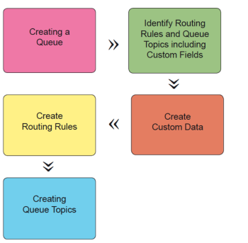

# Overview of Requests in&nbsp;Adobe Workfront

You can use requests to mitigate concerns and resolve issues that might delay the completion of a project. By submitting a ```request``` or an issue to a ```request queue``` (also called a help queue), you can communicate your needs to the correct person who can then help to resolve it and move a project along.

## Request Queue flow

Request queue are a set of steps that must be configured manually to allow for the request for information to flow through the appropriate channels until the issue is addressed.

>[!NOTE]
>
>Request queues are not linked to Adobe Workfront's help desk (used for Workfront Customer Support). Every Workfront system is capable of accommodating request queues.

Your Workfront Administrator can build your own request queues following a set of steps.

The following image illustrates an overview for how the steps of building a request queue must be implemented:



## Requests area

You can access the Request Queues in your organization by going to the Requests area in your Global Navigation bar. You can see requests that have been submitted here, or enter a new request.

>[!NOTE]
>
>The requests that you can see in the Requests area might be limited to your access and permission levels.

For information about submitting requests, see [Create and submit Workfront requests](create-submit-requests.md).

For information about creating Request Queues, see [Create a Request Queue](../../../manage-work/requests/create-and-manage-request-queues/create-request-queue.md). 
