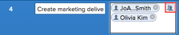
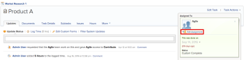
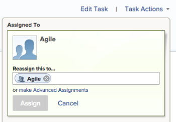
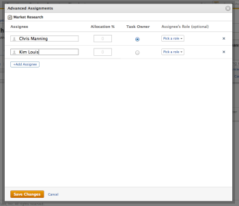

# Create advanced assignments

>[!IMPORTANT]
>
>You're currently viewing the Adobe Workfront Classic version of this document. Adobe Workfront Classic is no longer supported. All Adobe Workfront Classic functionality, along with this documentation, will be removed in July 2022. Please transition to the the new Adobe Workfront experienceas soon as possible, and switch to the new Adobe Workfront experience version of this document.

You can manage task or issue assignments by using Advanced Assignments.

You can adjust the following assignment information when making advanced assignments:

* Assign users to the task or issue (this can be accomplished outside of an advanced assignment).
* Adjust and redistribute the number of hours each assignee is allocated.
* Determine which user should be designated as the owner of the task or issue.
* Specify which role each user is fulfilling when working on the task or issue.

>[!NOTE]
>
>When assigning users to work, their availability according to their schedules affects the Planned and Projected Dates of tasks and issues. For information about schedules, see [Create a schedule](../../../administration-and-setup/set-up-workfront/configure-timesheets-schedules/create-schedules.md).

## Areas of Adobe Workfront where you can make advanced assignments

This article describes how to access Advance Assignments on the task or issue page.

In addition, you can make advanced assignments in the following areas of Workfront:

* In lists and reports when the Assignments field displays in the view.
* In the Assignments section when editing a task. For more information, see [Edit tasks](../../../manage-work/tasks/manage-tasks/edit-tasks.md).
* On the task or issue page when assigning the task or issue.

## Access requirements

You must have the following access to perform the steps in this article:

<table> 
 <col> 
 <col> 
 <tbody> 
  <tr> 
   <td role="rowheader">Adobe Workfront plan*</td> 
   <td> <p>Any</p> </td> 
  </tr> 
  <tr> 
   <td role="rowheader">Adobe Workfront license*</td> 
   <td> <p>Work or higher</p> </td> 
  </tr> 
  <tr> 
   <td role="rowheader">Access level configurations*</td> 
   <td> <p>Edit access to&nbsp;Tasks and Issues</p> <p>Note: If you still don't have access, ask your Workfront administrator if they set additional restrictions in your access level. For information on how a Workfront administrator can modify your access level, see <a href="../../../administration-and-setup/add-users/configure-and-grant-access/create-modify-access-levels.md" class="MCXref xref">Create or modify custom access levels</a>.</p> </td> 
  </tr> 
  <tr> 
   <td role="rowheader">Object permissions</td> 
   <td> <p>Contribute or higher permissions to a the task or issue</p> <p>For information on requesting additional access, see <a href="../../../workfront-basics/grant-and-request-access-to-objects/request-access.md" class="MCXref xref">Request access to objects </a>.</p> </td> 
  </tr> 
 </tbody> 
</table>

&#42;To find out what plan, license type, or access you have, contact your Workfront administrator.

## Make advanced assignments

1. Go to the project where you want to assign a task or an issue. 
1. From the **Tasks** or **Issues** tabs of the project, click the task or issue name.

   >[!TIP]
   >
   >You can make advanced assignments directly on the task or issue list if there are two or more people assigned. Click inside the **Assignments** field on the same line as the task or issue, then click the **People icon** to open the Advanced Assignments window. Skip to step 5 to continue creating advanced assignments.  
   >   >
   >

1. If the task or issue is unassigned, click **Assign this to...**.

   Or

   If the task or issue is assigned, click **Edit Assignment**.

   

1. Click **make Advanced Assignments**.

   

1. In the **Assignee** field, begin typing the name of a user, then click the name when it appears in the drop-down list.

   >[!NOTE]
   >
   >If the user's name contains a special character, you must include the special character in the search field.

1. (Optional) Click **Add Assignee** to assign multiple resources to the task or issue.

   >[!TIP]
   >
   >You can assign multiple users or job roles, and you can assign only one team. ```You can assign only active users, ```job roles```, and teams.```
   >
   >
   >```If a user, ```job role```, or a team was assigned before they were deactivated, they remain assigned to the work item. In this case, we recommend the following:``` 
   >
   >   
   >   
   >   * ```Reassign the work item to active resources.``` 
   >   * ```Associate the users in a deactivated team with an active team and reassign the work item to the active team.``` 
   >   
   >

1. For each user in the **Assignee** column, specify the following information:

   <!--
   <p data-mc-conditions="QuicksilverOrClassic.Draft mode">(NOTE: REVISE ALL THESE STEPS FOR QS; SOME WILL GO AWAY WITH THE NEW ADVANCED ASSIGNMENT WIDGET!!!)</p>
   -->

   * **Hours** or **Allocation %** : When the Duration Type of a task is Simple, specify the number of hours each user or job role should be assigned to the task. The sum of all assigned hours for each user is equal to the number in the **Planned Hours** field at the bottom of the  Hours  column. In all other cases, specify the percentage of time (or allocation)&nbsp;that you want the assignee to spend solving the task or issue.

     <!--   
     <p data-mc-conditions="QuicksilverOrClassic.Draft mode">(NOTE: make sure this is right in the new UI for both classic and QS???)</p>   
     -->

     >[!TIP]
     >
     >
     >   
     >   
     >   * ```After you manually modify assignment allocations on tasks, the Planned Hours of the tasks might update accordingly. For more information, see the section "Update task Planned Hours when managing user allocations" in the article``` [Planned Hours overview](../../../manage-work/tasks/task-information/planned-hours.md).
     >   * You cannot manually modify assignment allocations on issues. 
     >   * You cannot manually modify allocations for teams assigned to tasks.
     >   
     >

   * **Task Owner:** Select the radio button in the row of the user who should function as the owner of the task or issue. Workfront marks the first user or job role that you assign to a task or issue as the Owner or Primary Assignment. A team cannot be designated the Task Owner of a task or issue.

     >[!IMPORTANT]
     >
     >Depending on how your Workfront administrator ```or group administrator``` set up your project preferences, Workfront might use the schedule of the task owner to calculate the timeline of the task when you have multiple users assigned to the task. For information about multiple task assignees, see the "Assign multiple users to a task" section in the article [Assign tasks](../../../manage-work/tasks/assign-tasks/assign-tasks.md).

   * **Assignee's Role:** Select the role the user should use when fulfilling this assignment.  Each role that is defined for the user in the user profile is displayed in the **Pick a role** drop-down menu.

     

1. Click **Save Changes**.

