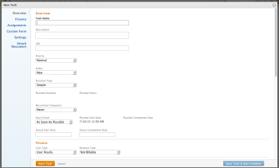
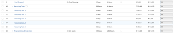

# Create recurring tasks

You can create recurring tasks for tasks you have to repeat as part of a single project.

For general information about recurring tasks, including the impact of editing an existing recurring task, see [Recurring tasks overview](../../../manage-work/tasks/manage-tasks/recurring-tasks-overview.md).

## Access requirements

You must have the following access to perform the steps in this article:

<table cellspacing="0"> 
 <col> 
 <col> 
 <tbody> 
  <tr> 
   <td role="rowheader">Adobe Workfront plan*</td> 
   <td> 
Any
 </td> 
  </tr> 
  <tr> 
   <td role="rowheader">Adobe Workfront license*</td> 
   <td> 
Work or higher
 </td> 
  </tr> 
  <tr> 
   <td role="rowheader">Access level configurations*</td> 
   <td> 
Edit access to Tasks and Projects
 
Note: If you still don't have access, ask your Workfront administrator if they set additional restrictions in your access level. For information about access to tasks, see <a href="../../../administration-and-setup/add-users/configure-and-grant-access/grant-access-tasks.md" class="MCXref xref">Grant access to tasks</a>. For information on how a Workfront administrator can change your access level, see <a href="../../../administration-and-setup/add-users/configure-and-grant-access/create-modify-access-levels.md" class="MCXref xref">Create or modify custom access levels</a>. 
 </td> 
  </tr> 
  <tr> 
   <td role="rowheader">Object permissions</td> 
   <td> 
Contribute permissions to the project with ability to Add Tasks or higher
 
When you create a task you automatically receive Manage permissions to the task
 
 For information about task permissions, see <a href="../../../workfront-basics/grant-and-request-access-to-objects/share-a-task.md" class="MCXref xref">Share a task in&nbsp;Adobe Workfront</a>. 
 
For information on requesting additional permissions, see <a href="../../../workfront-basics/grant-and-request-access-to-objects/request-access.md" class="MCXref xref">Request access to objects in Adobe Workfront</a>.
 </td> 
  </tr> 
 </tbody> 
</table>

&#42;To find out what plan, license type, or access you have, contact your Workfront administrator.

## Create a recurring task

>[!NOTE]
>
>You cannot create a recurring task by modifying an existing task. You must create a task from scratch.

1. Go to the project where you want to create a recurring task, then click the **Tasks** tab.
1. Click **New Task.**

   The New Task dialog box displays.

   

1. In the **Recurrence Frequency** drop-down list, select the frequency with which the task repeats. Select from the following options:

   <table cellspacing="0"> 
    <col> 
    <col> 
    <thead> 
     <tr> 
      <th data-mc-conditions="QuicksilverOrClassic.Classic">Recurrence</th> 
      <th data-mc-conditions="QuicksilverOrClassic.Classic">Description</th> 
     </tr> 
    </thead> 
    <tbody> 
     <tr> 
      <td role="rowheader" data-mc-conditions="QuicksilverOrClassic.Classic"><strong>Never:</strong> </td> 
      <td> 
 The task never repeats.
 </td> 
     </tr> 
     <tr> 
      <td role="rowheader" data-mc-conditions="QuicksilverOrClassic.Classic"><strong>Daily</strong> </td> 
      <td> 
The task repeats every day, every other day, every 3rd day, and so forth, depending on the cadence that you select. You can configure tasks to repeat up to every 6th day.
 
Select the date and time to begin creating recurring tasks. Then, select the date and time to finish creating recurring tasks, or select the number of occurrences.
 </td> 
     </tr> 
     <tr> 
      <td role="rowheader" data-mc-conditions="QuicksilverOrClassic.Classic"><strong>Work Days</strong> </td> 
      <td> 
 The task repeats every working day, every other working day, every 3rd working day, and so forth, depending on the cadence that you select. You can configure tasks to repeat up to every 6th working day.
 
Select the date and time to begin creating recurring tasks. Then, select the date and time to finish creating recurring tasks, or select the number of occurrences.
 
This option uses the default schedule that is defined by the system administrator, as described in <a href="../../../administration-and-setup/set-up-workfront/configure-timesheets-schedules/create-schedules.md" class="MCXref xref">Create a schedule</a>.
 </td> 
     </tr> 
     <tr> 
      <td role="rowheader" data-mc-conditions="QuicksilverOrClassic.Classic"><strong>Weekly</strong> </td> 
      <td> 
 The task repeats each day of the week that you select, either every week, every other week, every 3rd week, or every 4th week.
 
Select the date and time to begin creating recurring tasks. Then, select the date and time to finish creating recurring tasks, or select the number of occurrences.
 </td> 
     </tr> 
     <tr> 
      <td role="rowheader" data-mc-conditions="QuicksilverOrClassic.Classic"><strong>Monthly</strong> </td> 
      <td> 
 The task repeats either on a specific date of the month that you select, or the task repeats on a specific day of the week and a specific week of the month (for example, the 3rd Wednesday).
 
Tasks repeat either every month, every other month, every 3rd month, and so forth, depending on the cadence that you select. You can configure tasks to repeat up to every 12th month.
 
Select the date and time to begin creating recurring tasks. Then, select the date and time to finish creating recurring tasks, or select the number of occurrences.
 </td> 
     </tr> 
    </tbody> 
   </table>

   >[!NOTE]
   >
   >If you have a Schedule Exception associated with the project, recurring tasks can't start during the exception. Recurring tasks that occur during the schedule exception are scheduled to start on the first business day that follows the exception. For more information on schedule exceptions, see the article [Create a schedule](../../../administration-and-setup/set-up-workfront/configure-timesheets-schedules/create-schedules.md).

1. Click **Save Task.**

   

1. (Optional) Modify each recurring task as you would any other task in the project.

   For example, you can add assignments, predecessors, durations, and modify any other information about the task, including custom fields.

