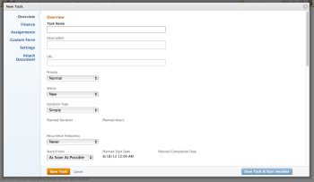

# Create tasks in a project

>[!IMPORTANT]
>
>You're currently viewing the Adobe Workfront Classic version of this document. Adobe Workfront Classic is no longer supported. All Adobe Workfront Classic functionality, along with this documentation, will be removed in July 2022. Please transition to the the new Adobe Workfront experienceas soon as possible, and switch to the new Adobe Workfront experience version of this document.

You can create tasks in a project only after you created the project.

For example, after creating a project, you might want to add tasks and modify them to organize the project plan. For more information about creating a project, see [Create a project](../../../manage-work/projects/create-projects/create-project.md).

For information about creating personal tasks that are not in a project, see the "Create a personal task" section in the article [Create work items from the Home area](../../../workfront-basics/using-home/using-the-home-area/create-work-items-in-home.md).

This article describes how you create tasks from scratch. You can also create tasks in the following ways:

* By copying or duplicating existing tasks.&nbsp;For information, see [Copy and duplicate tasks](../../../manage-work/tasks/manage-tasks/copy-and-duplicate-tasks.md).
* By moving tasks from one project to another.&nbsp;For information, see [Move tasks](../../../manage-work/tasks/manage-tasks/move-tasks.md).

## Access requirements

You must have the following access to perform the steps in this article:

<table cellspacing="0"> 
 <col> 
 <col> 
 <tbody> 
  <tr> 
   <td role="rowheader">Adobe Workfront plan*</td> 
   <td> <p>Any</p> </td> 
  </tr> 
  <tr> 
   <td role="rowheader"> <p role="rowheader">Adobe Workfront license*</p> </td> 
   <td> <p>Work or higher</p> </td> 
  </tr> 
  <tr> 
   <td role="rowheader">Access level configurations*</td> 
   <td> <p>Edit access to Tasks and Projects</p> <p>Note: If you still don't have access, ask your Workfront administrator if they set additional restrictions in your access level. For information about access to tasks, see <a href="../../../administration-and-setup/add-users/configure-and-grant-access/grant-access-tasks.md" class="MCXref xref">Grant access to tasks</a>. For information on how a Workfront administrator can change your access level, see <a href="../../../administration-and-setup/add-users/configure-and-grant-access/create-modify-access-levels.md" class="MCXref xref">Create or modify custom access levels</a>. </p> </td> 
  </tr> 
  <tr> 
   <td role="rowheader">Object permissions</td> 
   <td> <p>Contribute permissions to the project with ability to Add Tasks or higher</p> <p>When you create a task you automatically receive Manage permissions to the task</p> <p> For information about task permissions, see <a href="../../../workfront-basics/grant-and-request-access-to-objects/share-a-task.md" class="MCXref xref">Share a task </a>. </p> <p>For information on requesting additional permissions, see <a href="../../../workfront-basics/grant-and-request-access-to-objects/request-access.md" class="MCXref xref">Request access to objects </a>.</p> </td> 
  </tr> 
 </tbody> 
</table>

&#42;To find out what plan, license type, or access you have, contact your Workfront administrator.

## Create tasks in a project

1. Go to the project where you want to create a task.
1. Click **Tasks**. 
1. (Conditional) If you are currently viewing the task list in an agile view, click the **List View** icon  in the upper-right corner to display the task list. 
1. (Optional) Enable either the**Manual Save** or **Timeline Planning** mode for the task list. The **Autosave** option is enabled by default.

   

   >[!TIP]
   >
   >You can reverse your changes when you select Manual Save or Timeline Planning.

1. Create a new task by doing one of the following:

   * Click **New Task** at the top of the task list
   * Click **Add More Tasks** at the bottom of the task list

1. (Conditional)&nbsp;If you clicked **New Task** in step 5, do the following:

   <!--
   <p data-mc-conditions="QuicksilverOrClassic.Classic,QuicksilverOrClassic.Draft mode">(NOTE: ensure this stays accurate)</p>
   -->

   1. Specify the fields in the New Task dialog box.

      For more information about editing a task including how to assign it, see [Edit tasks](../../../manage-work/tasks/manage-tasks/edit-tasks.md).

      

   1. (Conditional and optional) If you want the task to be recurring, update the **Recurrence Frequency** field. For more information about creating recurring tasks, see [Create recurring tasks](../../../manage-work/tasks/create-tasks/create-recurring-tasks.md). 
   
   1. (Optional) Click **Attach Document** in the left panel to attach a document to the new task. 
   1. (Conditional)&nbsp;If you selected to attach a document, click the **Add Documents** drop-down menu and select a service where the document resides, or paste an image you previously copied to your clipboard.

1. (Conditional) If you clicked **Add More Tasks** in step 5, start entering the task information using in-line editing. 

   <!--
   <MadCap:conditionalText data-mc-conditions="QuicksilverOrClassic.Draft mode">
   (NOTE: ensure this stays accurate)
   </MadCap:conditionalText>
   -->

   This option provides the greatest convenience, especially when adding multiple tasks to the list.

   

1. (Conditional) Do one of the following:

   * If you clicked **New Task** in step 5, click **Save Task** to save your changes.   
   
     <!--   
     <MadCap:conditionalText data-mc-conditions="QuicksilverOrClassic.Draft mode">   
     (NOTE: is this step still right?)   
     </MadCap:conditionalText>   
     -->

   * If you clicked **Add More Tasks** in step 5, do the following:

     <!--   
     <p data-mc-conditions="QuicksilverOrClassic.Classic,QuicksilverOrClassic.Draft mode"> <!--   
     <MadCap:conditionalText data-mc-conditions="QuicksilverOrClassic.Draft mode">   
     (NOTE: is this step still right?)   
     </MadCap:conditionalText>   
     --> </p>   
     -->

      1. Click anywhere in the browser to submit your changes, or press Enter.
      1. (Optional) In a task list, select the newly created task, then click **Indent**.

         This makes the new task a child or subtask of the previous task.

         For more information about children tasks, see [Tasks overview](../../../manage-work/tasks/task-information/tasks-overview.md).
      
      1. ```(Conditional) If you disabled the **Autosave** option, do the following:```

         * Click **Undo** at any time to reverse your last change, or **Cancel** to reverse all the changes you made to the task list. 
         
         * If you previously clicked **Undo**, click **Redo** to re-apply the last change you canceled.
         
         * Click **Save** to save your changes to the task list.

