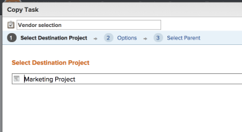
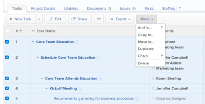

# Copy and duplicate tasks

>[!IMPORTANT]
>
>You're currently viewing the Adobe Workfront Classic version of this document. Adobe Workfront Classic is no longer supported. All Adobe Workfront Classic functionality, along with this documentation, will be removed in July 2022. Please transition to the the new Adobe Workfront experienceas soon as possible, and switch to the new Adobe Workfront experience version of this document.

You can copy a task from a project to another project, or you can duplicate a task within the same project.

You can copy or duplicate one or several tasks or parent tasks at a time.

## Access requirements

You must have the following access to perform the steps in this article:

<table cellspacing="0"> 
 <col> 
 <col> 
 <tbody> 
  <tr> 
   <td role="rowheader">Adobe Workfront plan*</td> 
   <td> <p>Any</p> </td> 
  </tr> 
  <tr> 
   <td role="rowheader">Adobe Workfront license*</td> 
   <td> <p>Work or higher </p> </td> 
  </tr> 
  <tr> 
   <td role="rowheader">Access level configurations*</td> 
   <td> <p>Edit access to Tasks and Projects</p> <p>Note: If you still don't have access, ask your Workfront administrator if they set additional restrictions in your access level. For information on how a Workfront administrator can modify your access level, see <a href="../../../administration-and-setup/add-users/configure-and-grant-access/create-modify-access-levels.md" class="MCXref xref">Create or modify custom access levels</a>.</p> </td> 
  </tr> 
  <tr> 
   <td role="rowheader">Object permissions</td> 
   <td> <p>Manage permissions to a task </p> <p>Contribute or higher permissions to the project</p> <p>For information on requesting additional access, see <a href="../../../workfront-basics/grant-and-request-access-to-objects/request-access.md" class="MCXref xref">Request access to objects </a>.</p> </td> 
  </tr> 
 </tbody> 
</table>

&#42;To find out what plan, license type, or access you have, contact your Workfront administrator.

## Considerations for copying tasks

Consider the following when copying a task:

* Issues are not copied with the task.
* Milestones are transferred to the copied task and removed from the original task.

You can copy a task in the following areas of the Adobe Workfront web application:

* At the task level, from the **Task Actions** menu in the upper-right corner.

  For information, see the [Copy a task at the task level](#copy-a-task-at-the-task-level) section in this article.

* In a task list, by doing one of the following:

   * Right-click the name of a task.
   * Select the task (or tasks) and expand the **More** menu at the top of the task list.
   * Select a task and expanding the **More** icon  next to the task name.

     This option is not available when selecting multiple tasks.

  For information, see the [Copy tasks in a list](#copy-tasks-in-a-list) section in this article.

## Copy tasks in a list {#copy-tasks-in-a-list}

1. Go to the project that contains the task or tasks that you want to copy.

   Or

   Go to a task report. 

1. Select the **Tasks** tab.
1. Select **Autosave** in the upper-right corner of the list of tasks.

   >[!IMPORTANT]
   >
   >You can copy tasks in a list only when automatically saving your changes. For information about saving options when editing tasks, see [Edit tasks in a list](../../../manage-work/tasks/manage-tasks/edit-tasks-in-a-list.md).

1. Select the task or tasks that you want to copy and click **More** > **Copy To**. 
1. Continue with copying the task, as described in the section [Copy a task at the task level](#copy-a-task-at-the-task-level) starting with Step 4. 

   <!--
   <MadCap:conditionalText data-mc-conditions="QuicksilverOrClassic.Draft mode">
   (NOTE: is this still accurate?!)
   </MadCap:conditionalText>
   -->

## Copy a task&nbsp;at the task level {#copy-a-task-at-the-task-level}

In addition to copying tasks in a list of tasks, you can also copy a task after you have opened it.&nbsp;

This is helpful for ad hoc tasks, which are not located on a task list of a project. For more information on ad hoc tasks, see [Create ad hoc work items](../../../workfront-basics/using-home/my-work/create-ad-hoc-work-items-my-work.md). 

<!--
<MadCap:conditionalText data-mc-conditions="QuicksilverOrClassic.Draft mode">
(NOTE:&nbsp;This article is conditioned for classic.)
</MadCap:conditionalText>
-->

1. Find a task in your Workfront system by searching for it.
1. Click the name of the task to open it.&nbsp;
1. In the upper-right corner of the task, click **Task Actions**, then click&nbsp;**Copy to**.

   The Copy Task box displays.

   

1. (Optional) Update the task name.

   >[!TIP]
   >
   >This option is not available when selecting more than one task in a list.

1. Type the name of the project&nbsp;where you want the task copy the task to in the **Select Destination Project** field.&nbsp;

   >[!TIP]
   >
   >Only 50 projects display in the list.

1. (Optional) If you want to copy the task within the same project, type the name of the current project in the **Select Destination Project** field.
1. (Optional) Click&nbsp;**Next Step**&nbsp;to clear any information that you don't want to transfer to the copied task. Select to clear any of the following options:

   * Constraints

     >[!NOTE]
     >
     >When moving or copying a task with date-specific constraints to another project and the constraint dates of the task are outside the dates of the new project, either the Task&nbsp;Constraint changes to As Soon as Possible or As Late as Possible or the Planned Start or Planned Completion dates of the projects are adjusted. Some examples of date-specific constraints are Must Start On, Must&nbsp;Finish On, Start No Earlier Than, Start No Later Than, etc. For information about task constraints and how task constraints or project dates can be affected, see [Task Constraint overview](../../../manage-work/tasks/task-constraints/task-constraint-overview.md) and look for a specific constraint.

   * Assignments
   * Approval Processes
   * Progress
   * All Predecessors

     This is selected by default. 
   
   * Financial information
   * Documents

     This includes versions, proofs, and linked documents.&nbsp;

     This does not include document approvals. Document approvals can never be moved when a task is moved.
   
   * Reminder Notifications
   * Expenses
   * Permissions
   * Custom Data

     Custom forms

1. (Optional) Click **Go back a Step** to move to the previous step.
1. (Optional) Click&nbsp;**Next Step.**

   Or

   Click **Select Parent** if you want to choose a parent for the tasks that copy to the new project.

   If you do not select a parent task, the tasks are copied as main tasks rather than subtasks and they&nbsp;are placed at the end of the task list on the specified&nbsp;project.&nbsp;

1. (Optional) Select a parent by doing one of the following:  
   In the task list, select one of the parents in the project plan.  
   Or  
   Using the **Search** field, search for a parent task by name. The task should appear in the list.

1. Select the radio button for the parent, after you have found it.&nbsp;
1. (Optional) Click **Go back a Step** to move to the previous step
1. Click **Finish and Copy Task.**

   The moved&nbsp;task now resides&nbsp;on the specified project and&nbsp;is either a subtask to a parent task, or the last task on the project.

## Duplicate tasks

You can quickly duplicate a task in a task list, if you need an identical task on the same project.

* [Considerations for duplicating tasks](#considerations-for-duplicating-tasks) 
* [Duplicate tasks](#duplicate-tasks)

### Considerations for duplicating tasks {#considerations-for-duplicating-tasks}

* You can duplicate a task in a task list only when the list is sorted by task number.

* The new task will have the same name as the original task.
* You cannot select what information is duplicated to the new task. Almost all the information from the original task will be transferred to the duplicated task, including parent relationship, by default. 
* The following items are not transferred to the new task:

   * Logged hours
   * Notes
   * Issues
   * Only the predecessors which are in the same group of copied tasks are also copied with their successor tasks.

     ``` ```**Example: **``````For example, if you copy Task 2 and its predecessor, Task 1, at the same time, then you have a copy of Task 2 and a copy of Task 1. The copy of Task 1 will be the predecessor of the copy of Task 2. But if you copy just Task 2 without copying its predecessor, then its copy will have no predecessor.

* When you duplicate a parent task, all children tasks are also duplicated, even when the children tasks are not selected. 
* You can duplicate multiple tasks at the same time.

  However, you cannot duplicate multiple tasks that are not sequential at the same time. 

* Milestones are moved to the new task and removed from the original task.

### Duplicate tasks {#duplicate-tasks}

1. Go to the project that contains the task or tasks that you want to duplicate.
1. Select the **Tasks** tab.
1. 
   Do one of the following:

   * ```(Conditional) Select **Autosave** in the upper-right corner of the list, select the tasks you want to duplicate, then click **More** > **Duplicate**.``` 
   
     

   * ```Select either the **Manual save** or **Timeline planning** options from the upper-right corner of the list of tasks, then do the following:```

      1. Select the task or tasks you want to duplicate, and click **Duplicate**. 
      1. (Optional) Click **Undo** to reverse your changes and not duplicate the tasks.
      1. (Optional and conditional) Click **Redo** if you had previously clicked **Undo**, to keep the changes and duplicate the tasks.
      
      1. Click **Save** to save your changes.

   1. Edit tasks in a list

