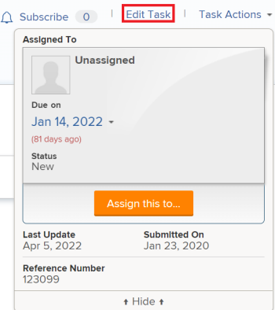
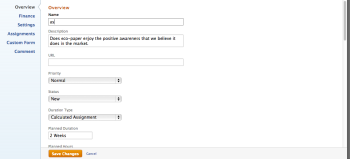
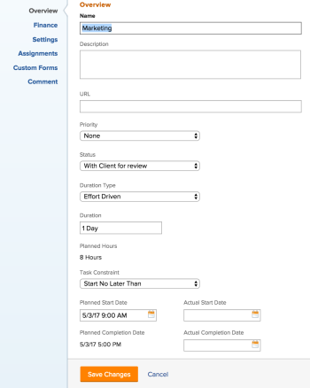
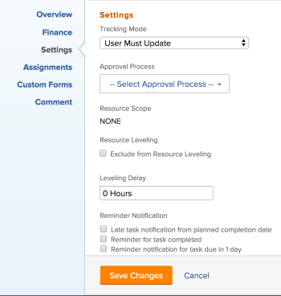
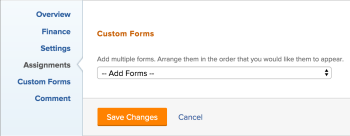

# Edit tasks

>[!IMPORTANT]
>
>You're currently viewing the Adobe Workfront Classic version of this document. Adobe Workfront Classic is no longer supported. All Adobe Workfront Classic functionality, along with this documentation, will be removed in July 2022. Please transition to the the new Adobe Workfront experienceas soon as possible, and switch to the new Adobe Workfront experience version of this document.

<!--
<div data-mc-conditions="QuicksilverOrClassic.Draft mode">
<p>(NOTE: some information in this area is repeated in the following articles. If you need to update a fied, update it in both:</p>
<p>** Task finances in details</p>
<p>** Task information in overview)</p>
</div>
-->

You can edit information on tasks that you have created, or that you have Contribute or Manage permissions to.

## Access requirements

You must have the following access to perform the steps in this article:

<table cellspacing="0"> 
 <col> 
 <col> 
 <tbody> 
  <tr> 
   <td role="rowheader">Adobe Workfront plan*</td> 
   <td> <p>Any </p> </td> 
  </tr> 
  <tr> 
   <td role="rowheader">Adobe Workfront license*</td> 
   <td> <p>Work or higher</p> </td> 
  </tr> 
  <tr> 
   <td role="rowheader">Access level*</td> 
   <td> <p>Edit access to Tasks and&nbsp;Projects</p> <p>Note: If you still don't have access, ask your Workfront administrator if they set additional restrictions in your access level. For information on how a Workfront administrator can change your access level, see <a href="../../../administration-and-setup/add-users/configure-and-grant-access/create-modify-access-levels.md" class="MCXref xref">Create or modify custom access levels</a>.</p> </td> 
  </tr> 
  <tr> 
   <td role="rowheader">Object permissions</td> 
   <td> 
    <ul> 
     <li> <p>Contribute permissions to a task to edit it in the Task Details area </p> </li> 
     <li> <p>Manage permissions to a task to edit it in the Edit Task box</p> </li> 
    </ul> 
    <ul> 
     <li> <p>Contribute or higher permissions to the project</p> </li> 
    </ul> <p>For information on requesting additional access, see <a href="../../../workfront-basics/grant-and-request-access-to-objects/request-access.md" class="MCXref xref">Request access to objects </a>.</p> </td> 
  </tr> 
 </tbody> 
</table>

&#42;To find out what plan, license type, or access you have, contact your Workfront administrator.

## Limitations for editing tasks

There are some limitations that might prevent you from editing tasks.

Consider the following when editing tasks:

* Updating tasks triggers notifications for projects that are a Current status. To avoid confusion for users who are assigned to the tasks, limit editing tasks as much as possible when the project is in the Current status. 
* You cannot edit tasks that are in an Approval Process. You can only log time or update the Status for a task in an approval process. 
* You can edit and add documents to tasks on a project that has a status of Complete, Dead, or is Pending Approval only when your Workfront administrator ```or a group administrator``` enabled this functionality in the Project Preferences area. For information about setting project preferences, see [Configure system-wide project preferences](../../../administration-and-setup/set-up-workfront/configure-system-defaults/set-project-preferences.md). 

* You can always edit the following information on a task when the project has been marked Complete, Dead, or is in an Approval Process:

   * Log time
   * Edit existing expenses
   * Attach a custom form

## Edit a task in a list

You can edit task information in a list of tasks, by inline editing fields displayed in the view of the list.

For information about editing tasks in lists, see [Edit tasks in a list](../../../manage-work/tasks/manage-tasks/edit-tasks-in-a-list.md).

## Edit a task in the Edit Task box

You can edit a task using the Edit Task or Task Details areas. The following steps describe editing a task in the Edit Task box.

1. Go to the **Projects** area in the Global Navigation Bar. 
1. Select the **Projects** tab.  
1. Click the name of a project to open it.
1. Select the **Tasks** tab. 
1. Do one of the following:

   * To edit limited information about the task, click a task in the list and click **Task Details**, then go to the subtabs listed to edit the information under each subtab.

     &nbsp;Select from the following subtabs:

      * Overview

        For information about editing the Overview subtab, see [Manage task information in the Task Details Overview area](../../../manage-work/tasks/manage-tasks/task-information-in-overview.md). 
      
      * Custom Forms
      * Finance

        For information about editing the Finance subtab, see [Manage task finances in the Task Details tab](../../../manage-work/tasks/manage-tasks/task-finances-in-details.md).

     >[!TIP]
     >
     >For information about all fields that display in the Details area, continue with editing all fields using the Edit Task box below.

   * To edit all information about the task, either click the name of a task in the list, then click **Edit Task.**

   

   Or

   Select the task that you want to edit in the task list, then click **Edit.**

   The **Edit Task** box displays.

   The fields available in the subtabs of the Task Details are included in the Edit Task box.

   >[!IMPORTANT]
   >
   >You must have Manage permissions to the task in order to see the Edit Task option.

   

1. Consider specifying information in any of the following sections:

   * [Overview](#overview)
   * [Finance](#finance)
   * [Settings](#settings)
   * [Assignments](#assignments)
   * [Custom Forms](#custom-forms)
   * [Comment](#comment)

### Overview {#overview}

1. Begin editing a task as described above.
1. Click **Overview**.

   

1. Update any of the following fields in the table below.

   >[!TIP]
   >
   >The following fields are automatically populated based when the tasks are created. They are populated according to the Task & Issue preferences set by your Workfront administrator ```or by the group administrator of the group associated with the project:```
   >
   >   
   >   
   >   * Planned Start Date
   >   * Duration Type
   >   * Revenue Type
   >   * Cost Type
   >   * Actual&nbsp;Completion Date
   >   
   >   
   >For information about setting task preferences for new tasks at the system ```or group level```, see [Configure system-wide task and issue preferences](../../../administration-and-setup/set-up-workfront/configure-system-defaults/set-task-issue-preferences.md) .

   <table cellspacing="0"> 
    <col> 
    <col> 
    <tbody> 
     <tr> 
      <td role="rowheader"><strong>Name</strong> </td> 
      <td> <p>Update the name of the task.<br></p> </td> 
     </tr> 
     <tr> 
      <td role="rowheader"><strong>Description</strong> </td> 
      <td>Add additional information about the task.</td> 
     </tr> 
     <tr> 
      <td role="rowheader"><strong>URL</strong> </td> 
      <td>Specify a web link that relates to the information about the task.</td> 
     </tr> 
     <tr> 
      <td role="rowheader"><strong>Priority</strong> </td> 
      <td> <p>This is a visual flag for you which allows you to prioritize your tasks. </p> <p>Select from the following options: </p> 
       <ul> 
        <li> <p> None</p> </li> 
        <li> <p> Low </p> </li> 
        <li> <p>Normal </p> </li> 
        <li> <p>High </p> </li> 
        <li> <p> Urgent </p> </li> 
       </ul> <p>Depending on the Project Preferences selected by your Workfront administrator, the names of priorities might be different for you. For information about task priorities, see <a href="../../../manage-work/tasks/task-information/task-priority.md" class="MCXref xref">Update Task Priority</a>. </p> </td> 
     </tr> 
     <tr> 
      <td role="rowheader"><strong>Status</strong> </td> 
      <td> <p>Select the status of the task which indicates what stage of development the task is in.</p> <p>Tip: You can update the task Status in the task header. </p> </td> 
     </tr> 
     <tr> 
      <td role="rowheader"><strong>Duration Type</strong> </td> 
      <td> <p style="font-weight: normal;">This identifies the relationship between the following: The number of resources assigned to a task The total effort required to complete the task The total duration of the task. Your Workfront administrator <span> or a group administrator</span> selects the default Duration Type setting for the tasks in your system or your group. For information about setting project defaults, see <a href="../../../administration-and-setup/set-up-workfront/configure-system-defaults/set-project-preferences.md" class="MCXref xref">Configure system-wide project preferences</a>. Duration Types enable you to set consistent resource assignments based on the needs of the task. For more information about the Duration Type of a task, see <a href="../../../manage-work/tasks/taskdurtn/task-duration-and-duration-type.md" class="MCXref xref">Overview of Task Duration and Duration Type</a>. Select from the following options: Calculated Assignment Calculated Work Effort Driven Simple<br></p> </td> 
     </tr> 
     <tr> 
      <td role="rowheader"><strong>Duration</strong> </td> 
      <td> 
       <div> 
        <div> 
         <p>This is the amount of time that you allow a task to remain open before it is completed. </p> 
         <p>Important: Because the task duration is typically the amount of time between the Planned Start and the Planned Completion Dates, it affects the timeline of the project.</p> 
         <p>To indicate the Duration of the task and the unit of time do the following:</p> 
         <ul> 
          <li data-mc-conditions="QuicksilverOrClassic.Classic"> <p data-mc-conditions="QuicksilverOrClassic.Classic">Type the length of time followed by the abbreviation for the unit of time.</p> </li> 
         </ul> 
         <p> You can choose from the regular time or elapsed time options in the following table: </p> 
         <table cellspacing="3"> 
          <col> 
          <col data-mc-conditions=""> 
          <tbody> 
           <tr> 
            <td>Unit of Time</td> 
            <td>Abbreviation</td> 
           </tr> 
           <tr> 
            <td>Minutes</td> 
            <td>M</td> 
           </tr> 
           <tr> 
            <td>Hours</td> 
            <td>H</td> 
           </tr> 
           <tr> 
            <td>Days.&nbsp;This is the default. </td> 
            <td>D</td> 
           </tr> 
           <tr> 
            <td>Weeks</td> 
            <td>W</td> 
           </tr> 
           <tr> 
            <td>Months</td> 
            <td>T</td> 
           </tr> 
           <tr> 
            <td>Elapsed Minutes</td> 
            <td>EM</td> 
           </tr> 
           <tr> 
            <td>Elapsed Hours</td> 
            <td>EH</td> 
           </tr> 
           <tr> 
            <td>Elapsed Days</td> 
            <td>ED</td> 
           </tr> 
           <tr> 
            <td>Elapsed Weeks</td> 
            <td>EW</td> 
           </tr> 
           <tr> 
            <td>Elapsed Months</td> 
            <td>ET</td> 
           </tr> 
          </tbody> 
         </table> 
         <p>Note: Elapsed time is a unit of time for a task's Duration. It is the time between the Planned Start Date and the Planned Completion Date of a task that includes holidays, weekends, and time off. In other words, elapsed time is the passage of calendar days. Regular time takes into account holidays, weekends, and time off and excludes them from the Duration of the task. For more information about task duration, see <a href="../../../manage-work/tasks/taskdurtn/task-duration-and-duration-type.md" class="MCXref xref">Overview of Task Duration and Duration Type</a>. </p> 
         <p> <!--
           <MadCap:conditionalText data-mc-conditions="QuicksilverOrClassic.Draft mode">
            You cannot specify the Duration of a task when the Duration Type of the task is Simple, or when the Task Constraint is Fixed Dates. (NOTE: Anna said this is now possible for all duration types in the Assignments area. It's not here, but to clear confusion, I am drafting this out of here.)<![CDATA[
    ]]>
           </MadCap:conditionalText>
          --></p> 
        </div> 
       </div> </td> 
     </tr> 
     <tr> 
      <td role="rowheader"><strong>Planned Hours</strong> </td> 
      <td> <p>Specify the amount of Planned Hours for the task, in hours. This is the amount of actual time it would take the assignees of the task to complete it. You can only specify the amount of Planned Hours for a task when the Duration Type is set to Calculated Assignment. For more information about duration types, see <a href="../../../manage-work/tasks/taskdurtn/task-duration-and-duration-type.md" class="MCXref xref">Overview of Task Duration and Duration Type</a>.</p> </td> 
     </tr> 
     <tr data-mc-conditions=""> 
      <td role="rowheader">Work Effort </td> 
      <td> 
       <div> 
        <p>The amount of effort required to complete the task. Your project manager might decide to use this field instead of Planned Hours to estimate the effort needed to complete a task. This field is visible only when the following conditions are met:</p> 
        <ul> 
         <li> <p>The task has a Simple Duration&nbsp;Type. </p> </li> 
         <li>Your project manager has enabled the Use Work Effort to automatically calculate task Planned Hours field on the project. </li> 
        </ul> 
        <p>Select from the following options:</p> 
        <ul> 
         <li>Small</li> 
         <li>Medium <span style="font-weight: normal;">(this is the default value for a new task)</span></li> 
         <li>Large</li> 
        </ul> 
        <p>Note: Updating the amount of effort could update the task Planned Hours. The update is immediate if the project Update Type is Automatic. When the project Update Type is Manual you must recalculate timeline to see the updated Planned Hours. </p> 
        <p>For information about using Work Effort instead of Planned Hours to estimate task effort, see <a href="../../../manage-work/tasks/task-information/work-effort.md" class="MCXref xref">Work Effort overview</a>. </p> 
       </div> </td> 
     </tr> 
     <tr> 
      <td role="rowheader"><strong>Task Constraint</strong> </td> 
      <td> <p>Decide when the task must be completed by specifying a Task Constraint. </p> <p>Select from the following options: </p> 
       <ul> 
        <li> <p><span>Fixed Dates</span> </p> <p>Specify a <strong>Planned Start</strong> and a <strong>Planned Completion Date</strong>. </p> </li> 
        <li> <p><span>Must Start On</span> </p> <p>Specify a <strong>Planned Start Date</strong>. </p> </li> 
        <li> <p><span>Must Finish On</span> </p> <p>Specify a <strong>Planned Completion Date</strong>. </p> </li> 
       </ul> 
       <ul> 
        <li> <p><![CDATA[
   ]]><span>As Soon as Possible</span><![CDATA[
   ]]></p> </li> 
        <li> <p><span>As Late as Possible</span><![CDATA[
   
   ]]></p> </li> 
        <li> <p><span>Earliest Available Time</span><![CDATA[
   
   ]]></p> </li> 
        <li> <p> <span>Latest Available Time</span><![CDATA[
   
   ]]></p> </li> 
        <li> <p><span>Start No Later Than</span> </p> </li> 
        <li> <p>Specify a Planned Start Date</p> </li> 
        <li> <p><span>Start No Earlier Than</span> </p> <p>Specify a <strong>Planned Start Date</strong>. </p> </li> 
        <li> <p> Finish <span>No Later Than</span></p> <p>Specify a <strong>Planned Completion Date</strong>. </p> </li> 
        <li> <p> Finish <span>No Earlier Than</span></p> <p>Specify a <strong>Planned Completion Date</strong></p> </li> 
       </ul> <p>For more information on Task Constraint, see <a href="../../../manage-work/tasks/task-constraints/task-constraint-overview.md" class="MCXref xref">Task Constraint overview</a>.</p> </td> 
     </tr> 
     <tr> 
      <td role="rowheader">Planned Start</td> 
      <td> <p>When the task is planned to start. The planned start date of a task is set and influenced by a number of factors:</p> 
       <ul> 
        <li>Depending on the system-wide preference for the task planned start date, the start date of a new task on a project can either be today, or the start date of the project, by default. <span>The group administrator for the group associated with the project can also set this preference for the group.</span> For more information about the system-level or group-level task preferences, see <a href="../../../administration-and-setup/set-up-workfront/configure-system-defaults/set-task-issue-preferences.md" class="MCXref xref">Configure system-wide task and issue preferences</a>.</li> 
        <li>Depending on the predecessors of the task, the planned start date is picked by Workfront to be the next available date after the predecessors finish, or start, depending on the predecessor relationship. For more information about predecessor relationships, see <a href="../../../manage-work/tasks/use-prdcssrs/predecessors-overview.md" class="MCXref xref">Overview of task predecessors</a>.</li> 
        <li>The project manager or the task owner can manually set the planned start date when the task constraint is either Fixed Dates or Must Start On. For more information about task constraints, see <a href="../../../manage-work/tasks/task-constraints/task-constraint-overview.md" class="MCXref xref">Task Constraint overview</a>.</li> 
       </ul> </td> 
     </tr> 
     <tr> 
      <td role="rowheader"><span style="font-weight: bold;">Actual Start Date</span> <span style="font-weight: normal;">(Optional)</span></td> 
      <td>Specify an Actual Start Date for the task. The default is typically automatically populated when you change the status of the task to In Progress. The actual start date can also be manually modified by the project manager, or the task owner. </td> 
     </tr> 
     <tr> 
      <td role="rowheader">Planned Completion Date</td> 
      <td> <p>The anticipated completion date as shown when the task is planned. The planned completion date can be set by a number of factors:</p> 
       <ul> 
        <li>The planned completion date is calculated from the planned start date by adding the Duration of the task to the planned start date. When the project manager or Workfront specifies the Duration of the task, this triggers an update to the planned completion date. If the planned date changes, it will often be because the Duration of the has been updated.</li> 
        <li>The project manager or the task owner can manually set the planned completion date when the task constraint is either Fixed Dates or Must Finish On. For more information about task constraints, see <a href="../../../manage-work/tasks/task-constraints/task-constraint-overview.md" class="MCXref xref">Task Constraint overview</a>.</li> 
        <li>If the Duration Type of the task changes, and the number of resources on the tasks changes at the same time, the planned completion date will change, as well. For more information about duration types, see <a href="../../../manage-work/tasks/taskdurtn/task-duration-and-duration-type.md" class="MCXref xref">Overview of Task Duration and Duration Type</a>.</li> 
       </ul> </td> 
     </tr> 
     <tr> 
      <td role="rowheader">Actual Completion Date <span style="font-weight: normal;">(Optional)</span></td> 
      <td> <p>Specify the actual date and time when the task completes. The default date and time when a task is completed always coincides with the actual time when the status becomes Completed. The actual completion date can also be manually modified by the project manager, or the task owner. <![CDATA[								]]></p> </td> 
     </tr> 
    </tbody> 
   </table>

1. (Optional) Continue editing the following sections, depending on the information you want to modify.

   Or

   Click **Save Changes**.

### Finance {#finance}

1. Begin editing a task as described above.
1. Click **Finance**.

   

1. Update any of the following:

   <table cellspacing="0"> 
    <col> 
    <col> 
    <tbody> 
     <tr> 
      <td role="rowheader"><strong>Cost Type</strong> </td> 
      <td> <p> Specify the Cost Type for the task. This is going to determine how the cost of the task is calculated, based on the number of hours on the tasks. Select from the following options: No CostFixed Hourly User Hourly Role HourlyFor more information about tracking costs, see <a href="../../../manage-work/projects/project-finances/track-costs.md" class="MCXref xref">Track costs</a> . Your Workfront administrator or a group administrator selects the default Cost Type setting for the tasks in your system or your group. For information about setting project defaults, see <a href="../../../administration-and-setup/set-up-workfront/configure-system-defaults/set-project-preferences.md" class="MCXref xref">Configure system-wide project preferences</a> .</p> </td> 
     </tr> 
     <tr> 
      <td role="rowheader"><strong>Revenue Type</strong> </td> 
      <td> <p>Specify the Revenue Type for the task. This is going to determine how the Revenue on the task is calculated, based on the number of hours on the tasks. </p> <p>Select from the following options: </p> 
       <ul> 
        <li> <p> Not Billable </p> </li> 
        <li> <p>User Hourly </p> </li> 
        <li> <p>Role Hourly </p> </li> 
        <li> <p>Fixed Hourly </p> </li> 
        <li> <p>User Hourly w/Cap </p> </li> 
        <li> <p>Role Hourly w/Cap </p> </li> 
        <li> <p>User Hourly Plus Fixed </p> </li> 
        <li> <p>Role Hourly Plus Fixed </p> </li> 
        <li> <p>Fixed Revenue </p> </li> 
       </ul> <p>For more information about tracking revenue, see<a href="../../../manage-work/projects/project-finances/billing-and-revenue-overview.md" class="MCXref xref">Overview of Billing and Revenue</a> . </p> <p>Your Workfront administrator or group administrator selects the default Revenue Type setting for the tasks in your system or your group. For information about setting project defaults, see <a href="../../../administration-and-setup/set-up-workfront/configure-system-defaults/set-project-preferences.md" class="MCXref xref">Configure system-wide project preferences</a>.</p> </td> 
     </tr> 
    </tbody> 
   </table>

1. (Optional) Continue editing the following sections, depending on the information you want to modify.

   Or

   Click **Save Changes**.

### Settings {#settings}

1. Begin editing a task as described above.
1. Click **Settings**.

   

1. Update any of the following:

   <table cellspacing="0"> 
    <col> 
    <col> 
    <tbody> 
     <tr> 
      <td role="rowheader"><strong>Tracking Mode</strong> </td> 
      <td> <p>Specify how the progress status of the task is tracked. </p> <p>Select from the following options: </p> 
       <ul> 
        <li> <p> User Must Update </p> </li> 
        <li> <p>Assume on Time </p> </li> 
        <li> <p>Ignore Late Warnings</p> </li> 
        <li> <p> Autocomplete </p> </li> 
        <li> <p>Predecessor </p> </li> 
       </ul> <p>For more information about the Tracking Mode on tasks, see <a href="../../../manage-work/tasks/task-information/task-tracking-mode.md" class="MCXref xref">Task Tracking Mode overview</a>.</p> </td> 
     </tr> 
     <tr> 
      <td role="rowheader"><strong>Approval Process</strong> </td> 
      <td> <p>Select an approval process that you want to associate with the task. Your Workfront administrator must define system-level Approval Processes before you can associate them with tasks. A user with administrative access to Approval processes can also create group-specific approval processes. </p> <p>For more information about creating Approval Processes, see <a href="../../../administration-and-setup/customize-workfront/configure-approval-milestone-processes/create-approval-processes.md" class="MCXref xref">Create an approval process for work items</a>. Consider the following when adding approval processes: </p> 
       <ul> 
        <li> <p>Only active approval processes display in the list. </p> </li> 
        <li> <p>System-wide and group-specific approval processes display in the list. An approval process associated with a group other than that of the project does not display in the list. </p> <p>Important:  If the group of the project changes, the group-specific approval process previously attached becomes a single-use approval process. For more information about how changes to the group of the project or changes in the approval process affect approval settings, see <a href="../../../administration-and-setup/customize-workfront/configure-approval-milestone-processes/how-changes-affect-group-approvals.md" class="MCXref xref">How group and approval process changes affect assigned approval processes</a>. </p> </li> 
        <li> <p data-mc-conditions="QuicksilverOrClassic.Classic"> If you added a single-use approval process, it displays as "&lt;Custom&gt;" in this field. </p> <!--
          <p data-mc-conditions="QuicksilverOrClassic.Draft mode">(NOTE: this bullet stays here although the sections it might appear in are QS only, so we can use the snippet for both Qs and classic)</p>
         --> </li> 
        <li> <p>You can define default approval processes to be automatically attached to tasks when the tasks are added to a project. For information about setting up the project to include default task approval processes, see the "Tasks" section in the article <a href="../../../manage-work/projects/manage-projects/edit-projects.md" class="MCXref xref">Edit projects</a>. </p> </li> 
        <li> <p>When bulk-editing tasks, the following scenarios exist: </p> 
         <ul> 
          <li> <p>When you select multiple tasks from the same group, both system-level and group-level approval processes display in this field. </p> </li> 
          <li> <p>When you select multiple tasks from different groups, only system-level approval processes display in this field. </p> </li> 
          <li> <p>When any of the tasks have a single-use approval process attached, it is replaced by the system-level or group-level approval process you select. </p> </li> 
         </ul> </li> 
       </ul> </td> 
     </tr> 
     <tr> 
      <td role="rowheader"> <p> </p> <p><strong>Resource Scope</strong> </p> </td> 
      <td> <p>If the task has a <strong>Fixed Dates</strong><strong>Task Constraint</strong>, specify the Resource Scope. Select from the following:<br></p> 
       <ul> 
        <li> <p><strong>None</strong> (this is the default):</p> </li> 
        <li> <p><strong>Global</strong> </p> </li> 
       </ul> <p>If you want the task assignee to not be allocated to any other task during the duration of the task, select the <strong>Global</strong> Resource Scope.</p> <p>For more information about the Resource Scope of a task, see <a href="../../../manage-work/tasks/task-information/resource-scope.md" class="MCXref xref">Resource Scope overview</a>. <!--
         <MadCap:conditionalText data-mc-conditions="QuicksilverOrClassic.Draft mode">
          (NOTE: this is a classic only article and snippet)
         </MadCap:conditionalText>
        --></p> </td> 
     </tr> 
     <tr> 
      <td role="rowheader"><strong>Resource Leveling</strong> </td> 
      <td> <p>Select the <strong>Exclude from Resource Leveling</strong> field if you want the resources assigned to the task to be excluded from leveling.</p> </td> 
     </tr> 
     <tr> 
      <td role="rowheader"><strong>Leveling Delay</strong> </td> 
      <td> <p>Specify the Leveling Delay, in hours. </p> <p> For more information about leveling delays, see <a href="../../../manage-work/tasks/task-information/task-leveling-delay.md" class="MCXref xref">Update task Leveling Delay</a>. </p> </td> 
     </tr> 
     <tr> 
      <td role="rowheader"><strong>Reminder Notifications</strong> </td> 
      <td> <p>Select which Reminder Notifications you would like to attach to this task. Your system administrator must configure Reminder Notifications before you can select them on a task. For more information about configuring Reminder Notifications, see <a href="../../../administration-and-setup/manage-workfront/emails/set-up-reminder-notifications.md" class="MCXref xref">Set up reminder notifications</a>.</p> </td> 
     </tr> 
    </tbody> 
   </table>

1. (Optional) Continue editing the following sections, depending on the information you want to modify.

   Or

   Click **Save Changes**.

### Assignments {#assignments}

1. Begin editing a task as described above.
1. Click **Assignments**.

   

1. Click **Add Assignee** to add a new assignee to the task. You can assign users, roles, or teams to a task. You can have multiple users or job roles assigned to a task. You can only assign one team to a task.

   >[!TIP]
   >
   >You can assign multiple users or job roles, and you can assign only one team. ```You can assign only active users, ```job roles```, and teams.```
   >
   >
   >```If a user, ```job role```, or a team was assigned before they were deactivated, they remain assigned to the work item. In this case, we recommend the following:``` 
   >
   >   
   >   
   >   * ```Reassign the work item to active resources.``` 
   >   * ```Associate the users in a deactivated team with an active team and reassign the work item to the active team.``` 
   >   
   >

1. (Optional) If you have multiple assignees, select the **Task Owner** radio button to indicate which user or role is considered the Task Owner or the Primary Assignee. Workfront marks the first user or job role that you assign to a task or issue as the Owner or Primary Assignee. 
1. (Conditional and optional) If your **Task Constraint** is **Calculated Work** or **Effort Driven**, specify the **Allocation %** (allocation percentage)&nbsp;for each assignee. This is the amount of time from the schedule of the assignee that they can spend on this task. Changing the allocation percentage for an assignee will change the Planned Hours of a task. When the **Task Constraint** is **Simple**, you can specify the following:

   * Allocation **Hours** of each assignee.
   * **Planned Hours** of the task
   * **Duration** of the task

1. (Optional) Indicate whether an assignee is the primary assignee on the task, by selecting the **Task Owner** radio button. 
1. (Optional) Select a role from the **Assignee's Role** drop-down menu. This is the role that the assignee can fulfill on this task.

   >[!TIP]
   >
   >Only the job roles associated with each assignee in their profile appear in the drop-down menu.

1. (Optional) Continue editing the following sections, depending on the information you want to modify.

   Or

   Click **Save Changes**.

### Custom Forms {#custom-forms}

You can define default custom forms to be automatically attached to tasks when the tasks are added to a project. For information about setting up the project to include default task custom forms , see the "Tasks" section in the article [Edit projects](../../../manage-work/projects/manage-projects/edit-projects.md).

1. Begin editing a task as described above. 
1. Click **Custom Forms**.

   

1. Select the custom form or forms that you want to associate with the task. You must build the custom forms before they are available to select in this field. Only active custom forms display in the list. For more information about building custom forms, see [Create or edit a custom form](../../../administration-and-setup/customize-workfront/create-manage-custom-forms/create-or-edit-a-custom-form.md).You can add up to ten custom forms to a task. 
1. (Conditional) If you attached a custom form to the task, edit any fields on the form. You must specify all required fields before you can save the task.

   >[!NOTE]
   >
   >Depending on how your Workfront administrator set the permissions for the sections in your custom form, not everyone can view or edit the same fields on a given custom form. The permissions to edit fields within a section of a custom form depend on the permissions you have on the task itself. For information about setting task permissions, see [Share a task](../../../workfront-basics/grant-and-request-access-to-objects/share-a-task.md).

1. (Optional) Continue editing the following section, depending on the information you want to modify.

   Or

   Click **Save Changes**.

### Comment {#comment}

1. Begin editing a task as described above.
1. Click **Comment**.

   

1. Specify a comment that you want to display in the updates stream of the task in the available field. This comment is visible for everyone with View access to the task and with access to view Notes.
1. Click **Save Changes**.

   Your changes will be submitted for this task. Any notifications that are triggered by making edits to the task and meet the conditions to be sent at this time, will now be sent to the users associated with this task.

## Edit tasks in bulk

You can edit tasks in bulk in a list and update all their information at the same time when you select to automatically save the changes you are making to tasks in the list.

For information about saving tasks in bulk , see the "Edit tasks in bulk" section in the article [Edit tasks in a list](../../../manage-work/tasks/manage-tasks/edit-tasks-in-a-list.md).
