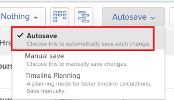
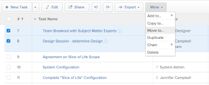
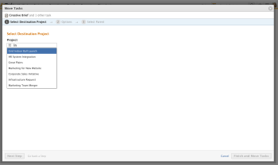

# Move tasks

>[!IMPORTANT]
>
>You're currently viewing the Adobe Workfront Classic version of this document. Adobe Workfront Classic is no longer supported. All Adobe Workfront Classic functionality, along with this documentation, will be removed in July 2022. Please transition to the the new Adobe Workfront experienceas soon as possible, and switch to the new Adobe Workfront experience version of this document.

You can move tasks in Adobe Workfront between the following objects:

* An ad hoc task to a project.
* A task from a project to another project.
* A task from a project under a different parent in another project. 
* A task within the same project under a different parent.

You can move a task at the task level or you can move a task from a list of tasks.

## Access requirements

You must have the following access to perform the actions in this article:

<table> 
 <col> 
 <col> 
 <tbody> 
  <tr> 
   <td role="rowheader">Adobe Workfront plan*</td> 
   <td> 
Any
 </td> 
  </tr> 
  <tr> 
   <td role="rowheader">Adobe Workfront licenses*</td> 
   <td> 
Work or higher
 </td> 
  </tr> 
  <tr> 
   <td role="rowheader">Access level configurations*</td> 
   <td> 
Edit access to Tasks and Projects
 
Note: If you still don't have access, ask your Workfront administrator if they set additional restrictions in your access level. For information on how a Workfront administrator can modify your access level, see <a href="../../../administration-and-setup/add-users/configure-and-grant-access/create-modify-access-levels.md" class="MCXref xref">Create or modify custom access levels</a>.
 </td> 
  </tr> 
  <tr> 
   <td role="rowheader">Object permissions</td> 
   <td> 
Manage permissions to the tasks
 
Contribute or higher permissions to the project with ability to Add Tasks
 
For information on requesting additional access, see <a href="../../../workfront-basics/grant-and-request-access-to-objects/request-access.md" class="MCXref xref">Request access to objects </a>.
 </td> 
  </tr> 
 </tbody> 
</table>

&#42;To find out what plan, license type, or access you have, contact your Workfront administrator.

## Move a task in a list

To move a task displayed in a task list:

1. Go to the project that contains the task or tasks that you want to move.
1. On the**Tasks** tab, click the **Task List** sub-tab. 

1. Ensure that the **Autosave** toggle is enabled, then select the task or tasks that you want to move.

   

   >[!IMPORTANT]
   >
   >You cannot move tasks when the **Autosave** toggle is disabled.

1. (Optional and conditional) If you want to move the selected tasks within the same project, click the tasks you selected, drag them and drop them where you want them moved on the project.

   After you dropped the tasks in the correct place on the project, the changes you made to the task hierarchy are saved immediately. All the information associated with each task is moved with the tasks.

1. (Conditional) If you want to have access to more options for editing the tasks as you are moving them, including moving them to another project, click the **More** &nbsp;drop-down menu at the top of the task list, then click **Move to**.

   

   The Move Task box displays

1. Continue with moving the task, as described in the section [Move a task at the task level](#move-a-task-at-the-task-level) starting with Step 4. 

   <!--
   <MadCap:conditionalText data-mc-conditions="QuicksilverOrClassic.Draft mode">
   (NOTE: is this still accurate?!)
   </MadCap:conditionalText>
   -->

## Move a task&nbsp;at the task level {#move-a-task-at-the-task-level}

In addition to moving tasks from a list of tasks, you can also move a task at the task level, after you have opened it.&nbsp;

This is helpful for ad hoc tasks, which are not located on a task list of a project. For more information on ad hoc tasks, see [Create ad hoc work items](../../../workfront-basics/using-home/my-work/create-ad-hoc-work-items-my-work.md). 

<!--
<MadCap:conditionalText data-mc-conditions="QuicksilverOrClassic.Draft mode">
(NOTE: This article is conditioned for classic.)
</MadCap:conditionalText>
-->

1. Find a task in your Workfront system by searching for it.
1. Click the name of the task to open it.&nbsp;
1. In the upper-right corner of the task, click **Task Actions**, then click&nbsp;**Move**.

   The Move Task box displays.

   

1. Type the name of the project where you want the task to move in the **Select Destination Project** section.&nbsp;

   >[!TIP]
   >
   >Only 50 projects display in the list.

   If you want to move the task within the same project, type the name of the current project in the **Select Destination Project** section.

1. (Optional) Click&nbsp;**Next Step**&nbsp;to clear any of the following options from the task:&nbsp;

   * Constraints

     >[!NOTE]
     >
     >When moving or copying a task with date-specific constraints to another project and the constraint dates of the task are outside the dates of the new project, either the Task&nbsp;Constraint changes to As Soon as Possible or As Late as Possible or the Planned Start or Planned Completion dates of the projects are adjusted. Some examples of date-specific constraints are Must Start On, Must&nbsp;Finish On, Start No Earlier Than, Start No Later Than, etc. For information about task constraints and how task constraints or project dates can be affected, see [Task Constraint overview](../../../manage-work/tasks/task-constraints/task-constraint-overview.md) and look for a specific constraint.

   * Assignments
   * Approval Processes
   * Progress
   * All Predecessors
   * Financial information
   * Documents

     This includes versions, proofs, and linked documents.&nbsp;

     This does not include document approvals. Document approvals can never be moved when a task is moved.
   
   * Reminder Notifications
   * Expenses
   * Permissions

1. (Optional) Click **Go back a Step** to move to the previous step.
1. (Optional) Click&nbsp;**Next Step.**

   Or

   Click **Select Parent** if you want to choose a parent for the tasks moved to the new project.

   If you do not select a parent task, the tasks are moved&nbsp;as main tasks rather than subtasks and they&nbsp;will be placed at the end of the task list on the specified&nbsp;project.&nbsp;

1. (Optional) Select a parent by doing one of the following:  
   In the task list, select one of the parents in the project plan.  
   Or  
   Using the **Search** field, search for a parent task by name. The task should appear in the list.

1. Select the radio button for the parent, after you have found it.&nbsp;
1. (Optional) Click **Go back a Step** to move to the previous step
1. Click **Finish and Move Task.**

   The moved&nbsp;task now resides&nbsp;on the specified project and&nbsp;is either a subtask to a parent task, or the last task on the project.

