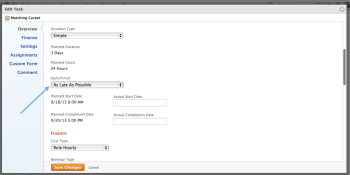

# Task&nbsp;Constraint overview: As Late As Possible

As Late As Possible (ALAP) is a Adobe Workfront Task Constraint which places the completion time of the task as close to the end of the project as possible.

Using this constraint&nbsp;may cause predecessor or dependent Tasks to be rescheduled.

For more information about predecessor relationships, see [Use task predecessors](../../../manage-work/tasks/use-prdcssrs/use-task-predecessors.md).

As Late as Possible is the default constraint if a project uses a schedule mode of&nbsp;Schedule from Completion Date and system or group default for the Start&nbsp;Date of a task is Based on the Project&nbsp;Planned Date.

For information about where to set the default Constraint for a new task, refer to [Configure system-wide task and issue preferences](../../../administration-and-setup/set-up-workfront/configure-system-defaults/set-task-issue-preferences.md).

For information about how to update the Task&nbsp;Constraint on a task, see [Update the Task Constraint of a task](../../../manage-work/tasks/task-constraints/update-task-constraint-of-task.md).

<!--

<h2>Use the As Late As Possible Task Constraint</h2>

To update the Task Constraint to As Late As Possible:&nbsp;

<ol>
<li value="1">Go to a task whose Task Constraint you want to update.</li>
<li value="2"> 
Click&nbsp;<strong>Edit Task</strong>.
 </li>
<li value="3"> 
In the&nbsp;<strong>Overview</strong>&nbsp;section, expand the&nbsp;<strong>Task Constraint</strong>&nbsp;drop-down menu.
 </li>
<li value="4"> 
Select&nbsp;<strong>As Late As Possible</strong>.
 
  
 </li>
<li value="5">Click <strong>Save Changes</strong>.&nbsp;</li>
</ol>

-->

## The difference between Latest&nbsp;Available Time and As Late&nbsp;As Possible

The Latest&nbsp;Available Time constraint differs from the As Late&nbsp;As Possible constraint when the following criteria exist:

* The project is scheduled From Completion 
* Tasks in the project have a predecessor relationship 
* The predecessor task has a flexible task constraint

In this situation:

* **Latest Available Time:** Using the Latest&nbsp;Available Time constraint on the successor task gives priority to flexible constraint of the predecessor.

  For example, Task A is a predecessor to Task B. Task B has the Latest&nbsp;Available Time constraint and Task A has the As Soon&nbsp;As Possible constraint. In this situation, the task is scheduled as close&nbsp;to the start&nbsp;of the project as possible.

* **As Late As Possible:** In this scenario, using the As Late&nbsp;As Possible constraint on the successor task gives the priority to the successor task.

  For example, Task A is a predecessor to Task B. Task B has the As Late&nbsp;As Possible&nbsp;constraint and Task A has the As Soon&nbsp;As Possible constraint. In this situation, the task is scheduled as close to the end&nbsp;of the project as possible.

