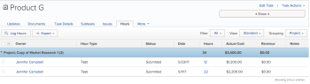
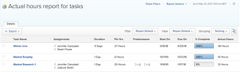

# View Actual Hours

The hours you log on your work items in Adobe Workfront are considered Actual Hours.

Actual Hours represent the actual time that it took you to complete a task, issue, or a project.

We recommend that hours should be logged on work items, which are tasks and issues.

However, as a Workfront administrator, you can allow users to log time on projects, as well, depending on what the workflows are in your organization.

For more information about how to set up your system to allow users to log time on projects, see [Configure timesheet and hour preferences](../../../administration-and-setup/set-up-workfront/configure-timesheets-schedules/timesheet-and-hour-preferences.md).

## Access requirements

You must have the following access to perform the steps in this article:

<table cellspacing="0"> 
 <col> 
 <col> 
 <tbody> 
  <tr> 
   <td role="rowheader">Adobe Workfront plan*</td> 
   <td> <p>Any</p> </td> 
  </tr> 
  <tr> 
   <td role="rowheader">Adobe Workfront license*</td> 
   <td> <p>Work or higher</p> </td> 
  </tr> 
  <tr> 
   <td role="rowheader">Access level configurations*</td> 
   <td> <p>View or higher access to Tasks,&nbsp;Projects, or Issues</p> <p>Note: If you still don't have access, ask your Workfront administrator if they set additional restrictions in your access level. For information on how a Workfront administrator can modify your access level, see <a href="../../../administration-and-setup/add-users/configure-and-grant-access/create-modify-access-levels.md" class="MCXref xref">Create or modify custom access levels</a>.</p> </td> 
  </tr> 
  <tr> 
   <td role="rowheader">Object permissions</td> 
   <td> <p>View or higher permissions to a task, a project, or an issue</p> <p>For information on requesting additional access, see <a href="../../../workfront-basics/grant-and-request-access-to-objects/request-access.md" class="MCXref xref">Request access to objects in Adobe Workfront</a>.</p> </td> 
  </tr> 
 </tbody> 
</table>

&#42;To find out what plan, license type, or access you have, contact your Workfront administrator.

## Actual Hours on tasks and issues vs. Actual Hours on projects

The Actual Hours on tasks and issues represent the number of hours logged directly on the tasks and issues.

>[!NOTE]
>
>Actual Hours from children tasks roll up to the Actual Hours on the parent task. The following formula applies for the Actual Hours on a parent task:

```
Parent Task Actual Hours = All Tasks Actual Hours + Parent Task Actual Hours
```

Actual Hours for Projects represent a total of Actual Hours from all the tasks on the project (including hours logged directly on parent tasks), all the issues on the project as well as the Actual Hours logged on the project itself.

The following formula applies for the Actual Hours on a project:

```
Project Actual Hours = All Tasks Actual Hours + All Issues Actual Hours + All Project Actual Hours
```

## Find Actual Hours

Finding the value for Actual Hours for an item is identical for tasks, projects, and issues.

You can find the Actual Hours information on tasks in the following locations:

* [Actual Hours in the Details tab](#details-tab) 
* [Actual Hours in the Hours tab](#hours-tab) 
* [Actual Hours in reports](#reports) 
* [Actual Hours in Resource Management tools](#resource-grid)

### Actual Hours in the Details tab

Finding Actual Hours in the Details tab is identical for projects, tasks, and issues.

To locate Actual Hours in Task Details:

1. Go to a task for which you want to review the Actual Hours.
1. Go to the **Task Details** tab.

   

1. Click **Overview** and notice the **Actual Hours** value.

   This is the total of hours logged on this task.

### Actual Hours in the Hours tab

Finding Actual Hours in the Hours tab is identical for projects, tasks, and issues.

To locate Actual Hours in Hours tab :

1. Go to a task for which you want to review the Actual Hours.
1. Go to the **Hours** tab.

   Depending on your Layout Template, the Hours tab might be listed under the **More** link.

   

   This displays a list of hour entries logged on the task. 

1. Ensure that the **Standard** view and the **Project** grouping are applied to this list.

   The number shown in the grouping line for the **Hours** column is the total number of Actual Hours on the task.

### Actual Hours in reports

When building tasks, issues, or projects reports, you can show the Actual Hours value for each task, issue, or project in the report.

Adding the Actual Hours column to a task view is similar to building a view in a report.

To show Actual Hours in a task report:

1. Go to the **Reporting** area in Global Navigation Bar.
1. Select the **Reports** tab.
1. Click **New Report**, then choose **Task** as your object.

1. Click **Add Column**, and start typing **Actual Hours** when the **Show in this column** drop-down field is displayed. Select the field when it appears in the list.

1. Click **Save + Close** to save the report.

   

   The Actual Hours column shows the number of hours logged on each task.

### Actual Hours in Resource Management tools

If you want to see the progress of the work your users are doing on their assigned tasks and issues, you can view them in the following Resource Management tools:

  <!--
  <li data-mc-conditions="QuicksilverOrClassic.Classic,QuicksilverOrClassic.Draft mode">User Resource Grid. This functionality is currently deprecated. <br>For information about the Resource Grid, see <a href="../../../resource-mgmt/legacy-res-planning/resource-grid-overview.md" class="MCXref xref">Overview of the Resource Grid </a>.</li>
  -->

* Utilization Report.  
  For information about the utilization report, see [Overview of the Resource Utilization report](../../../reports-and-dashboards/reports/using-built-in-reports/resource-utilization-report.md).

* Resource Planner.

  For information about viewing Actual Hours in the Resource Planner, see [View Available, Planned, and Actual Hours or FTE in the Resource Planner when using the User view](../../../resource-mgmt/resource-planning/view-hours-fte-user-view-resource-planner.md).

## Log time

You can log time on tasks, issues, and projects in multiple ways.

For more information about logging time in Workfront, see [Log time](../../../timesheets/create-and-manage-timesheets/log-time.md).   

