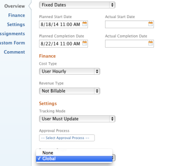

# Resource Scope overview

>[!IMPORTANT]
>
>Adobe Workfront Classic is no longer supported. All Adobe Workfront Classic functionality, along with this documentation, will be removed in July 2022. Please transition to the new Workfront experience as soon as possible.

<!--
<p data-mc-conditions="QuicksilverOrClassic.Draft mode">(NOTE: For production 21.2, format this article for classic ONLY and remove the QS text; tweak TOC and articles attached to this) </p>
-->

Resource Scope is a task-level field that indicates whether you can assign other tasks to the user during the timeframe of a certain task. The default value of the Resource Scope field is None and in most cases you cannot edit it.

When the **Task Constraint** of a task is **Fixed Dates**, you can edit the Resource Scope value and you can set it to Global. When you indicate that the Resource Scope of a task is Global, other tasks cannot be assigned to the same user during the same timeframe of the task.

For information about the Fixed Dates Task Constraint, see [Task Constraint overview: Fixed Dates](../../../manage-work/tasks/task-constraints/fixed-dates.md).

## Access requirements

You must have the following access to perform the steps in this article:

<table> 
 <col> 
 <col> 
 <tbody> 
  <tr> 
   <td role="rowheader">Adobe Workfront plan*</td> 
   <td> <p>Any</p> </td> 
  </tr> 
  <tr> 
   <td role="rowheader">Adobe Workfront license*</td> 
   <td> <p>Work or higher</p> </td> 
  </tr> 
  <tr> 
   <td role="rowheader">Access level configurations*</td> 
   <td> <p>Edit access to Tasks</p> <p>Note: If you still don't have access, ask your Workfront administrator if they set additional restrictions in your access level. For information on how a Workfront administrator can modify your access level, see <a href="../../../administration-and-setup/add-users/configure-and-grant-access/create-modify-access-levels.md" class="MCXref xref">Create or modify custom access levels</a>.</p> </td> 
  </tr> 
  <tr> 
   <td role="rowheader">Object permissions</td> 
   <td> <p>Manage permissions to a task</p> <p>For information on requesting additional access, see <a href="../../../workfront-basics/grant-and-request-access-to-objects/request-access.md" class="MCXref xref">Request access to objects </a>.</p> </td> 
  </tr> 
 </tbody> 
</table>

&#42;To find out what plan, license type, or access you have, contact your Workfront administrator.

## Edit the Resource Scope field on a task

1. Go to a task for which you want to edit the Resource Scope. 
1. Click **Edit Task**. 
1. In the **Overview** section, in the **Task Constraint** field, select **Fixed Dates**. 

1. Specify the **Planned Start Date** and the **Planned Completion Date** of the task. 

1. In the **Settings** section, locate the **Resource Scope** field.

   

   Select from the following options: 

   | **None** ```(this is the default)``` |Select this value if you allow for the user assigned to the task to be assigned to other tasks during the same time frame of the task. |
   |---|---|
   | **Global** |Select this value if you do not want to allow for the user assigned to the task to be assigned to other tasks during the same time frame of the task.  |

   >[!IMPORTANT]
   >
   >When the Task Constraint is not **Fixed Dates**, you cannot edit the Resource Scope. In that case, the Resource Scope always defaults to **None**, and the user assigned to the task can be assigned to other tasks during the same time frame.

   ```<li>Click <strong>Save Changes</strong>. </li>```

## Tasks with a Global Resource Scope

When trying to assign a user to a task with a Fixed Dates constraint and a Resource Scope of Global, and that user is already assigned to another task with a Fixed Dates constraint and a Resource Scope of Global, you receive a scheduling conflict warning.  


You cannot perform the following actions:

* Assign a user to a task that has a Global Resource Scope if the user is already assigned to another task that has a Global Resource Scope for the same time frame. 
* Reassign the task to a user who is already assigned to another task that has a Global Resource Scope for the same time frame.
* Change the dates on the task with Global Resource Scope to dates that belong to another task with a Global Resource Scope.

>[!IMPORTANT]
>
>All tasks to which the user is assigned must have the Resource Scope set to Global in order to receive this warning. The warning does not display for a user with scheduled tasks using any other task constraints or tasks with a Fixed Date constraint and a Resource Scope of None.

