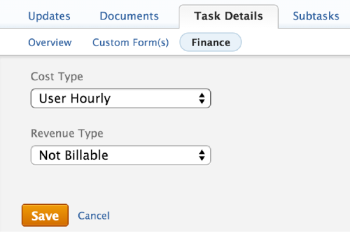

# Update task&nbsp;Cost Type

>[!IMPORTANT]
>
>You're currently viewing the Adobe Workfront Classic version of this document. Adobe Workfront Classic is no longer supported. All Adobe Workfront Classic functionality, along with this documentation, will be removed in July 2022. Please transition to the the new Adobe Workfront experienceas soon as possible, and switch to the new Adobe Workfront experience version of this document.

The Planned and Actual Cost of the tasks and their Labor Costs are determined by the Cost Type of each task.

You can configure the Cost Type for individual tasks within the project. Each cost type affects the Planned Cost and Actual Cost values.

For information about tracking costs in&nbsp;Adobe Workfront, see [Track costs](../../../manage-work/projects/project-finances/track-costs.md).

## Access requirements

You must have the following access to perform the steps in this article:

<table> 
 <col> 
 <col> 
 <tbody> 
  <tr> 
   <td role="rowheader">Adobe Workfront plan*</td> 
   <td> 
Any
 </td> 
  </tr> 
  <tr> 
   <td role="rowheader">Adobe Workfront license*</td> 
   <td> 
Plan 
 </td> 
  </tr> 
  <tr> 
   <td role="rowheader">Access level configurations*</td> 
   <td> 
Edit access to Projects, Tasks, and Financial&nbsp;Data
 
Note: If you still don't have access, ask your Workfront administrator if they set additional restrictions in your access level. For information on how a Workfront administrator can modify your access level, see <a href="../../../administration-and-setup/add-users/configure-and-grant-access/create-modify-access-levels.md" class="MCXref xref">Create or modify custom access levels</a>.
 </td> 
  </tr> 
  <tr> 
   <td role="rowheader">Object permissions</td> 
   <td> 
Contribute or higher permissions to a project
 
Manage permissions to a task
 
For information on requesting additional access, see <a href="../../../workfront-basics/grant-and-request-access-to-objects/request-access.md" class="MCXref xref">Request access to objects </a>.
 </td> 
  </tr> 
 </tbody> 
</table>

&#42;To find out what plan, license type, or access you have, contact your Workfront administrator.

## Configure the Cost Type of an individual task

1. Go to the task where you want to configure the Cost Type. 
1. Click the **Task Details** tab, then click **Finance.** 
1. Click **Edit Finance.**
1. In the **Cost Type** drop-down list, select the cost type that you want to apply to the task.

   

   Select from the following options:

   * No Cost
   * Fixed Hourly
   * User Hourly
   * Role Hourly

   For more information about each task cost type, see [Track costs](../../../manage-work/projects/project-finances/track-costs.md).

1. Click **Save****.**

