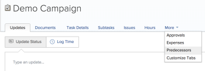
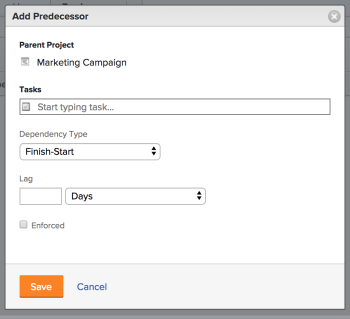

# Create a predecessor relationship using the Predecessors area

You can use predecessor tasks (or just predecessors) to link tasks that depend on other tasks to start or complete. For example, you would not want to host a party (dependent task) before you send out the invitations (predecessor task).

This article shows how you can set predecessors using the Predecessors tab within a task.

For information about setting predecessors in a list of tasks, see [Create a predecessor relationship on the task list](../../../manage-work/tasks/use-prdcssrs/create-predecessors-on-task-list.md).

You can view the predecessors of tasks in the following areas of Adobe Workfront:

* In the Predecessors tab of the dependent tasks
* In the Gantt Chart
* In the task list in the Predecessors column

For information about predecessors, see [Overview of task predecessors](../../../manage-work/tasks/use-prdcssrs/predecessors-overview.md).

## Access requirements

You must have the following access to perform the steps in this article:

<table cellspacing="0"> 
 <col> 
 <col> 
 <tbody> 
  <tr> 
   <td role="rowheader">Adobe Workfront plan*</td> 
   <td> 
Any
 </td> 
  </tr> 
  <tr> 
   <td role="rowheader">Adobe Workfront license*</td> 
   <td> 
Plan 
 </td> 
  </tr> 
  <tr> 
   <td role="rowheader">Access level configurations*</td> 
   <td> 
Edit access to Tasks and Projects
 
Note: If you still don't have access, ask your Workfront administrator if they set additional restrictions in your access level. For information on how a Workfront administrator can modify your access level, see <a href="../../../administration-and-setup/add-users/configure-and-grant-access/create-modify-access-levels.md" class="MCXref xref">Create or modify custom access levels</a>.
 </td> 
  </tr> 
  <tr> 
   <td role="rowheader">Object permissions</td> 
   <td> 
Manage permissions to the tasks and the project
 
For information on requesting additional access, see <a href="../../../workfront-basics/grant-and-request-access-to-objects/request-access.md" class="MCXref xref">Request access to objects in Adobe Workfront</a>.
 </td> 
  </tr> 
 </tbody> 
</table>

&#42;To find out what plan, license type, or access you have, contact your Workfront administrator.

## Create a predecessor for a task

1. Go to a task that you want to designate as a dependent task, then select the **Predecessors** tab.

   You might need to click **More** first, then select the **Predecessors** tab.

   

1. Click **+Add Predecessor**.

   

1. (Optional) To add a cross-project predecessor, click the **Cross-Project Predecessor** sub-tab, then **Add Predecessor**.

   For information about adding cross-project predecessors, see [Create cross-project predecessors](../../../manage-work/tasks/use-prdcssrs/cross-project-predecessors.md).

1. Type in the name of the task or tasks that you want to designate as the predecessors.

   

1. Select a **Dependency Type**.

   For information about task Dependency Types, see a [Overview of task dependency types](../../../manage-work/tasks/use-prdcssrs/task-dependency-types.md).

1. Specify a **Lag** amount in days.

   For information about Lag Types, see ​ [Overview of Lag Types](../../../manage-work/tasks/use-prdcssrs/lag-types.md).

1. Select **Enforced** if you want to enforce the predecessor relationship between the two tasks.

   For information about enforcing predecessors, see [Enforce predecessors](../../../manage-work/tasks/use-prdcssrs/enforced-predecessors.md).

1. Click **Save**.

   

