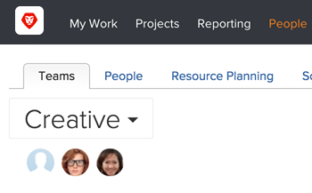
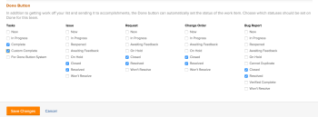

# Configure the Done button for tasks

>[!IMPORTANT]
>
>You're currently viewing the Adobe Workfront Classic version of this document. Adobe Workfront Classic is no longer supported. All Adobe Workfront Classic functionality, along with this documentation, will be removed in July 2022. Please transition to the the new Adobe Workfront experienceas soon as possible, and switch to the new Adobe Workfront experience version of this document.

The Done button can automatically set the status of a task or an issue. By default, Adobe Workfront&nbsp;marks a task as Completed when an assignee clicks Done on their work item.

## Overview

&nbsp;Users with certain permissions can configure the Done button to reflect certain statuses in the system. There are two different ways the Done button works for tasks in Workfront:

* If the user has an assigned Home Team, a Workfront administrator or a user with a Plan license can configure the Done button to reflect certain statuses for team members. See [Configure the Done button for a Team](#configure-the-done-button-for-a-team) in this article.
* If the user does not have a Home Team assigned, the Done button for tasks is tied to a complete status. There are no configuration options available in this scenario. The Done button automatically defaults to this status.

## Access requirements

You must have the following access to perform the steps in this article:

<table> 
 <col> 
 </col> 
 <col> 
 </col> 
 <tbody> 
  <tr> 
   <td role="rowheader">Adobe Workfront plan*</td> 
   <td> 
Any
 </td> 
  </tr> 
  <tr> 
   <td role="rowheader">Adobe Workfront license*</td> 
   <td> 
Plan 
 </td> 
  </tr> 
 </tbody> 
</table>

&#42;To find out what plan or license type you have, contact your Workfront administrator.

## Configure the Done button for a Team {#configure-the-done-button-for-a-team}

You can change which status is applied to the work item with the Done button. You can also set multiple statuses and allow the user to choose which status is appropriate.

1. Go to the&nbsp;**People**&nbsp;area on the Global Navigation Bar.  
   

1. Click the **Teams** tab.&nbsp;
1. Choose the team in&nbsp;the upper-left corner.
1. Click **Team Settings** in the upper-right corner.
1. Find the **Done Button** section at the bottom of the **Team Settings** page.

1. Select one status or more than one status for each work item type.  
   

   >[!NOTE]
   >
   >Consider the following when selecting statuses for tasks or issues:
   >
   >* When you select one status for each type of work item, the task or issue status is set to that status when a user clicks Done on their&nbsp;item.&nbsp;If you set multiple statuses for each type of work item, a drop-down menu is added to the Done button and the user must pick a status to change the status on the work item.  
   >* You can associate only system-level statuses with the Done button. You cannot associate Group-specific statuses with work item statuses.
   >* When a user assigned to the item places the item in the status associated with the Done button, the item displays as Done for that user regardless of whether the status you select is a Completed or Closed status or a working status. 
   >   
   >   
   >  For example, associating the Done button with In Progress causes the work item to display as Done for the user who changes the status from New to In progress. 
   >   
   >* Issue types are customizable and they might have different names than listed below in your environment.  
   >  Following&nbsp;are the default tasks and issue types:
   >     
   >  * Tasks
   >  * Issue
   >  * Request
   >  * Change Order
   >  * Bug Report

   If the task or issue is assigned to multiple users, you see a "Done with my part" option in the drop-down menu, in addition to the multiple statuses chosen for your team.  
   For more information about the functionality of "Done with my part", see [Mark items on the Working On List as Done](../../workfront-basics/using-home/my-work/mark-items-done-my-work.md).

1. Click **Save Changes**.

## Associate users with a Home Team

To make the changes to the Done button functionality visible to users, you can make the team whose settings you changed the Home Team of the users.&nbsp;

To associate users with a Home Team:

1. Go to the&nbsp;**People**&nbsp;area on your Global Navigation Bar.
1. Click the **People** tab.
1. Select the user or users that you want to associate with the Home Team.
1. Click **Edit**.
1. In the **Organization** section, select&nbsp;the **Home Team** field. Start typing the name of the team whose settings you want to associate with the&nbsp;users. Click the name of the team when you see it in the list.

1. Click **Save Changes**.  
   The&nbsp;users you selected are now associated with a&nbsp;Home Team. &nbsp;  
   Any team settings, including the statuses associated with the Done button are now visible to these users.&nbsp;

