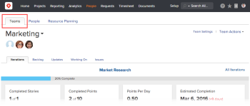

# Create a team

>[!IMPORTANT]
>
>You're currently viewing the Adobe Workfront Classic version of this document. Adobe Workfront Classic is no longer supported. All Adobe Workfront Classic functionality, along with this documentation, will be removed in July 2022. Please transition to the the new Adobe Workfront experienceas soon as possible, and switch to the new Adobe Workfront experience version of this document.

When you create a team you become the Team Owner, by default.

You can view Team Owners for all the teams when you create a report for Teams and include the Owner Name field in your report. (For more information about creating a report, see [Create a custom report](../../reports-and-dashboards/reports/creating-and-managing-reports/create-custom-report.md).)

For information on how an Adobe Workfront administrator can create a team from the Setup area, see [Create a team from the Setup area](../../administration-and-setup/add-users/create-and-manage-teams/create-a-team-from-setup.md).

## Access requirements

You must have the following access to perform the steps in this article:

<table> 
 <col> 
 </col> 
 <col> 
 </col> 
 <tbody> 
  <tr> 
   <td role="rowheader">Adobe Workfront plan*</td> 
   <td> 
Any
 </td> 
  </tr> 
  <tr> 
   <td role="rowheader">Adobe Workfront license*</td> 
   <td> 
Plan 
 </td> 
  </tr> 
 </tbody> 
</table>

&#42;To find out what plan or license type you have, contact your Workfront administrator.

## Create a team

1. Go to the **People**&nbsp;area, then click the **Teams** tab.

   

1. Click the drop-down arrow next to the team name that is currently selected, then click **Create New Team** at the bottom of the drop-down list.
1. In the **New Team** box that displays, specify the following information:

   * **Team Name:** Specify a name for the new team.
   * **Group**: If you want to assign the team to an associated group, start typing the name of the group, then select the name when it appears.

     >[!NOTE]
     >
     >When a team is assigned to a group or subgroup, any group administrators of that group or subgroup can manage the team without being a member of it. Group administrators can go to the Teams area from the Main Menu and click the Switch Teams arrow  to list all of the teams that are assigned to the groups that they manage.

   * **This is an Agile Team:**&nbsp;Select this option if you want to configure this new team to be an agile team.

     For more information about agile teams, see [Create an agile team](../../agile/get-started-with-agile-in-workfront/create-an-agile-team.md).
   
   * **Team Members:** Begin typing the name of a user to be on the team, then select the name when it appears in the drop-down list.

     Repeat this process to add multiple users to the team.

     There is no limit for how many users you can add to a team. However, we recommend to not have an excessively high number of users in one team, as your work management might become too complex for these teams.
   
   * **Description:** Specify a description for the team.

1. Click **Create Team.**

