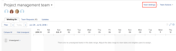

# Edit team settings

As an Adobe Workfront administrator or a user with a Plan or Work license, you can edit Team Settings.

You can add users to a team, set the team layout template, and set how status is recorded when work items are completed by a team.

## Access requirements

You must have the following access to perform the steps in this article:

<table cellspacing="0"> 
 <col> 
 </col> 
 <col> 
 </col> 
 <tbody> 
  <tr> 
   <td role="rowheader">Adobe Workfront plan*</td> 
   <td> 
Any
 </td> 
  </tr> 
  <tr> 
   <td role="rowheader">Adobe Workfront license*</td> 
   <td> 
Work or higher
 </td> 
  </tr> 
 </tbody> 
</table>

&#42;To find out what plan or license type you have, contact your Workfront administrator.

## Edit team settings

1. Click **People** in the Global Navigation Bar.
1. Click the **Teams** tab, then in the drop-down list,&nbsp;select the team that you want to edit.
1. Click **Team Settings** in the upper-right corner.

   Only team members with either a Plan or Work license see this option.

   

1. In team settings, you can make the following kinds of changes:

   * Modify the team name
   * Deactivate the team 
   * Associate the team with a group

     >[!NOTE]
     >
     >When a team is assigned to a group or subgroup, any group administrators of that group or subgroup can manage the team without being a member of it. Group administrators can go to the Teams area from the Main Menu and click the Switch Teams arrow  to list all of the teams that are assigned to the groups that they manage.

   * Designate the team owner
   * Add and remove team members
   * Add a description of the team
   * Apply a layout template to the team

     For more information on applying a custom layout template to a team, see the "Applying a Custom Template to a Team" section in [Change the My Work and Work Requests areas with Layout Templates](../../workfront-basics/manage-your-account-and-profile/configuring-your-user-profile/change-my-work-layout-templates.md).
   
   * Decide which calendar should display when you access the team
   * Decide if this team is an agile team, by selecting the **This is an Agile Team** option.

     For more information on agile teams and how to manage work inside an agile team, see [Create an agile team](../../agile/get-started-with-agile-in-workfront/create-an-agile-team.md).
   
   * Change the Work On It button to a Start button. For more information on how to configure the Start button, see [Replace the Work On It button with a Start button](../../people-teams-and-groups/create-and-manage-teams/work-on-it-button-to-start-button.md).
   * Customize the **Done** button. For more information on how to customize the Done button, see:

      * [Configure the Done button for tasks](../../people-teams-and-groups/create-and-manage-teams/configure-the-done-button-for-tasks.md) 
      * [Configure the Done button for issues](../../people-teams-and-groups/create-and-manage-teams/configure-the-done-button-for-issues.md)

1. Click **Save Changes**.

