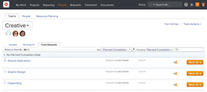

# Teams overview

>[!IMPORTANT]
>
>You're currently viewing the Adobe Workfront Classic version of this document. Adobe Workfront Classic is no longer supported. All Adobe Workfront Classic functionality, along with this documentation, will be removed in July 2022. Please transition to the the new Adobe Workfront experienceas soon as possible, and switch to the new Adobe Workfront experience version of this document.

The purpose of a team in Adobe Workfront is to capture the real-life dynamic of functional working groups in the workplace.

For information about how when to use teams instead of groups, see [Groups vs. teams in Adobe Workfront](../../people-teams-and-groups/work-with-groups-and-teams/understanding-differences-and-similarities-between-groups-and-teams.md).

## Team organization

A Workfront Team differs from a project team. Workfront teams include individuals of diverse job roles or various purposes, who are functionally affiliated and organized into a working unit. An individual can belong to more than one team. Team members might match org chart relationships, but they can also appear outside the department structure.

## Team creation

Teams are typically created by a Workfront administrator, but a user with appropriate access can create teams as well.&nbsp;Once a team is created, the Project Manager can assign an entire team to a task instead of deciding on an individual or job role.

## Team assignments

A Project Manager does not always know which individual will complete an assignment-simply that a particular work unit or team&nbsp;completes work of that specific nature.

Members of an assigned team can also Go to the People > Teams and see the tasks assigned to their team. They can assess the impact of a task and volunteer to work on it.

