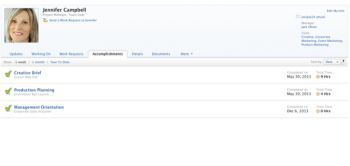

# View accomplishments

The Accomplishments list is located on the profile page of each user. The Accomplishments list displays&nbsp;completed tasks and issues that might need to be reopened or reviewed.

## Access requirements

You must have the following access to perform the steps in this article:

<table cellspacing="0"> 
 <col> 
 </col> 
 <col> 
 </col> 
 <tbody> 
  <tr> 
   <td role="rowheader">Adobe Workfront plan*</td> 
   <td> 
Any
 </td> 
  </tr> 
  <tr> 
   <td role="rowheader">Adobe Workfront license*</td> 
   <td> 
Work or higher to view your own accomplishments; Plan to view others' accomplishments
 </td> 
  </tr> 
 </tbody> 
</table>

&#42;To find out what plan or license type you have, contact your Workfront administrator.

## View your accomplishments

1. Click your avatar in the Global Navigation Bar.
1. Click your name to access your profile page.
1. Click the **Accomplishments** tab to view your accomplishments.  
   By default, accomplishments are displayed for the last week.  
   

1. To view accomplishments from the last month or year to date, click&nbsp;**1 month** or&nbsp;**Year To Date**.

## View another user's accomplishments

You can see only the tasks and issues for which you had View access when the task or issue was marked complete.

1. Click&nbsp;**People** in the Global Navigation Bar.
1. Click the&nbsp;**People** tab.
1. Click the name of the user whose accomplishments you want to view.
1. Click the&nbsp;**Accomplishments** tab to view the user's accomplishments.  
   By default, accomplishments are displayed for the last week.  

1. To view accomplishments from the last month or year to date, click&nbsp;**1 month** or&nbsp;**Year To Date**.

