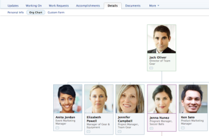

# View the organizational chart

The organizational chart feature allows you to to view the organizational chart associated with a particular Adobe Workfront user.&nbsp;Organizational charts are a great way to visualize the structure of a specific department.

## Access requirements

You must have the following access to perform the steps in this article:

<table cellspacing="0"> 
 <col> 
 </col> 
 <col> 
 </col> 
 <tbody> 
  <tr> 
   <td role="rowheader">Adobe Workfront plan*</td> 
   <td> 
Any
 </td> 
  </tr> 
  <tr> 
   <td role="rowheader">Adobe Workfront license*</td> 
   <td> 
Review or higher
 </td> 
  </tr> 
 </tbody> 
</table>

&#42;To find out what plan or license type you have, contact your Workfront administrator.

## Locate a user's organizational chart

1. Click&nbsp;**People** in the Global Navigation Bar.
1. Click the&nbsp;**People** tab, click on the user who you want to view the organizational chart for.
1. Click the&nbsp;**Details** tab, then click&nbsp;**Org Chart**.  
   The organizational chart is displayed for that user.  
   &nbsp;

