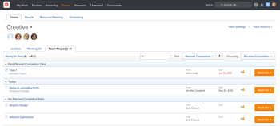
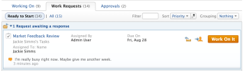
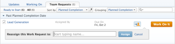

# Manage work and team requests

A request represents a pending task or issue assignment. Work requests are made to individuals, and team requests are made to&nbsp;teams.

>[!NOTE]
>
>Agile teams do not have team requests.

* [Organize requests](#organize-requests) 
* [Assign a request to a team](#assign-a-request-to-a-team) 
* [Reply to work requests](#reply-to-work-requests) 
* [Reassign requests](#reassign-requests) 
* [Work on a request](#work-on-a-request)

## Access requirements

You must have the following access to perform the steps in this article:

<table cellspacing="0"> 
 <col> 
 </col> 
 <col> 
 </col> 
 <tbody> 
  <tr> 
   <td role="rowheader">Adobe Workfront plan*</td> 
   <td> 
Any
 </td> 
  </tr> 
  <tr> 
   <td role="rowheader">Adobe Workfront license*</td> 
   <td> 
Review or higher to assign or work on a request; Work or higher to reassign a request
 </td> 
  </tr> 
 </tbody> 
</table>

&#42;To find out what plan or license type you have, contact your Workfront administrator.

## Organize&nbsp;requests&nbsp; {#organize-requests}

At the top of your Work Requests or the Team Requests lists, there are tools to help you organize your requests. You can sort or group by certain criteria, and you can also filter by a keyword to find a specific request in the list.&nbsp;

For more information on how to organize your Work Requests list, see [Organize work on the My Work page](../../workfront-basics/using-home/my-work/organize-work-my-work.md).

## Assign a request to a team {#assign-a-request-to-a-team}

Project managers and issue requestors can&nbsp;assign work to teams when they do not know which resource is right to do the work or when it does not matter who completes the work.

Tasks assigned to the team remain on the Team Requests tab until a user on the team volunteers to work on the request.

When a request is assigned to both a team and a user who is not a member of the team, the request is visible in both the Team Requests tab and in the user's work requests area.&nbsp;If the&nbsp;user who is not on the team volunteers to work on the task, the task still remains in the Team Requests tab until a user on the team volunteers to work on it.

Teams can be assigned to tasks and issues in any of the following ways:

* Through the Gantt Chart
* From a task or issue list (individually or in bulk)
* When a task or issue is created or modified
* Through routing rules on a request (issues only)

You can manually assign a request to a team from the team page,&nbsp;as described in this section.  Alternatively, you can assign a request to a team by creating an ad hoc work item and assigning it to the team, as described in [Create ad hoc work items](../../workfront-basics/using-home/my-work/create-ad-hoc-work-items-my-work.md).

To manually assign a request to a team from the team page:

1. Click the **People** tab in the Global Navigation Bar.
1. Click the **Teams** tab
1. Choose a team from the drop-down menu&nbsp;to select the team that you want to assign the request to.  
   

1. Click the **Team Actions**, then click**Send a Work Request**.

1. Fill in the information in the box that opens.
1. Click **Send Request**.  
   The team is now assigned a new task which is displayed on the Team Requests tab. This task is not currently associated with a project, but it can be moved, as described in [Move tasks](../../manage-work/tasks/manage-tasks/move-tasks.md).

## Reply to work&nbsp;requests {#reply-to-work-requests}

Before agreeing to work on a request (by clicking **Work On It**), you&nbsp;can send a message to the user who submitted the request. For example, you might need more information regarding the request or you might want to propose a new date&nbsp;before you agree to work on it.

You cannot reply to a team request.

To reply to a work request:

1. Click **My Work**&nbsp;in the Global Navigation Bar, then click the **Work Requests**&nbsp;tab.

1. Click the **Reply**&nbsp;icon on the request for which you want to contact the requestor.  
   

1. Click in the comment box, then specify your message.
1. (Optional) Click **Propose a new date**, then select the date when you think you can complete the request.
1. Click **Reply**.  
   The comment is sent to the user who submitted the request who receives an in-app notification about it.  
   You can view your comment in the drop-down list at the top of the **Work Requests** tab.  
     
   After the user responds, the response is displayed in the same location on the **Work Requests** tab.

## Reassign requests {#reassign-requests}

You can reassign requests that have been assigned to you or  your team:

1. Go to the **Work Requests**&nbsp;or **Team Requests**&nbsp;tab, depending on whether the request was made to you or a team you are a member of.  
   To Go to the **Work Requests**&nbsp;tab, click **My Work**&nbsp;in the Global Navigation Bar, then click **Work Requests.** 
   To Go to the **Team Requests**&nbsp;tab, click **People**&nbsp;in the Global Navigation Bar, on the **Teams**&nbsp;tab, select the team who was requested to work on the item that you want to reassign, then click the **Team Requests**&nbsp;tab.

1. Click the **Reassign**&nbsp;icon.  
   

1. Begin typing the name of the user, group, or team who you want to reassign the request to, then click **Assign**.  
   The request is reassigned.

## Work on a&nbsp;request {#work-on-a-request}

Work and team requests remain on the requests lists until a member of the assigned team&nbsp;acknowledges the work and adds it to their Working On list. If an assigned user who is not a member of the team adds the request to their Working On list, the request remains on the team request list.

Work items might&nbsp;be removed from the Working On&nbsp;list if the assigned resource changes before the individual user or&nbsp;team member commits to it.

Move an item to your Working On list only when you are currently working on the item or soon will be.

To commit to working on an item by moving it to your Working On list:

1. Click&nbsp;**Work On It**&nbsp;next to the item that you want to work on in the **Work Requests** or **Team Requests** tabs.  
   The work request is removed from the **Work Requests** or **Team Requests**&nbsp;list and transferred to your Working On list. When you click on Work on It, the work item is removed from the Team Requests list and other members of the team no longer see it on the Team Request page.

