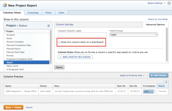
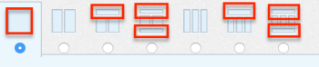
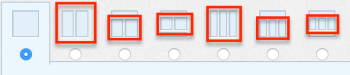

# Understand how reports display on a dashboard

You can manage how reports added to dashboards display on the dashboards.

For information about editing the layout of reports on a dashboard, see [Create a dashboard](../../../reports-and-dashboards/dashboards/creating-and-managing-dashboards/create-dashboard.md).

You can select which report columns should display on a dashboard when you are creating a report. If you want to always show all columns of the report on a dashboard, ensure that you specify that for each column when you create the report.

For more information about selecting which columns of a report should display on a dashboard, see [Create a custom report](../../../reports-and-dashboards/reports/creating-and-managing-reports/create-custom-report.md).

## Show all columns of the report on a dashboard

When the report is selected for an area of the dashboard that takes up the full width of the dashboard, then by default all columns of the report display on the dashboard.  

## Show only the first column of the report on a dashboard

When the report is selected for an area of the dashboard that takes up less than the full width of the dashboard, then by default only the first column of the report displays on the dashboard.  

