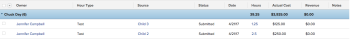

# Grouping: Project Sponsor for hours

>[!IMPORTANT]
>
>You're currently viewing the Adobe Workfront Classic version of this document. Adobe Workfront Classic is no longer supported. All Adobe Workfront Classic functionality, along with this documentation, will be removed in July 2022. Please transition to the the new Adobe Workfront experienceas soon as possible, and switch to the new Adobe Workfront experience version of this document.

This hour grouping organizes hours by the sponsor of the project where the hours are logged. The standard report builder interface for hour groupings does not provide a mapping to the Project Sponsor field. You must use the Text Mode interface to access this field.

## Access requirements

You must have the following access to perform the steps in this article:

<table cellspacing="0"> 
 <col> 
 <col> 
 <tbody> 
  <tr> 
   <td role="rowheader">Adobe Workfront plan*</td> 
   <td> 
Any
 </td> 
  </tr> 
  <tr> 
   <td role="rowheader">Adobe Workfront license*</td> 
   <td> 
Plan 
 </td> 
  </tr> 
  <tr> 
   <td role="rowheader">Access level configurations*</td> 
   <td> 
Edit access to&nbsp;Reports,&nbsp;Dashboards,&nbsp;Calendars
 
Edit access to Filters, Views, Groupings
 
Note: If you still don't have access, ask your Workfront administrator if they set additional restrictions in your access level. For information on how a Workfront administrator can modify your access level, see <a href="../../../administration-and-setup/add-users/configure-and-grant-access/create-modify-access-levels.md" class="MCXref xref">Create or modify custom access levels</a>.
 </td> 
  </tr> 
  <tr> 
   <td role="rowheader">Object permissions</td> 
   <td> 
Manage permissions to a report
 
For information on requesting additional access, see <a href="../../../workfront-basics/grant-and-request-access-to-objects/request-access.md" class="MCXref xref">Request access to objects </a>.
 </td> 
  </tr> 
 </tbody> 
</table>

&#42;To find out what plan, license type, or access you have, contact your Workfront administrator.

## Group by Project Sponsor for hours

To apply this grouping:

1. Go to a list of hours.
1. From the **Grouping**&nbsp;drop-down menu, select **New Grouping**.

1. Click**Switch to Text Mode**.
1. Remove the text&nbsp;in the **Group your Report** area.  

1. Replace&nbsp;the text with the following code:  
   <pre>group.0.linkedname=project:sponsor:name group.0.name= group.0.valuefield=project:sponsor:name group.0.valueformat=HTML textmode=true </pre>

1. Click **Save Grouping**.

