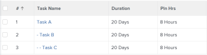
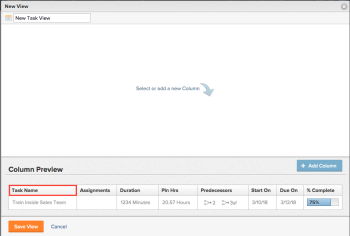

# View: display the parent-child relationship in a task by indenting the tasks

>[!IMPORTANT]
>
>You're currently viewing the Adobe Workfront Classic version of this document. Adobe Workfront Classic is no longer supported. All Adobe Workfront Classic functionality, along with this documentation, will be removed in July 2022. Please transition to the the new Adobe Workfront experienceas soon as possible, and switch to the new Adobe Workfront experience version of this document.

You can maintain the distinction of parent - child relationships in an exported task list by adding a custom view to the task list and ensuring this view is selected before you export the list. &nbsp;



1. Go to the project with the task list you'd like to export.
1. Click the **View** drop-down menu, and select **New View**.

1. Name the filter in the top-left corner of the screen.
1. Click in the **Task Name** column header.  
   

1. Select&nbsp;**Switch to Text Mode** in the top-right corner.
1. Click anywhere in the textbox to edit text, and remove all existing text.
1. Paste the following text:  

   ```
   displayname=<br>linkedname=direct<br>namekey=name<br>querysort=name<br>textmode=true<br>valueexpression=IF({indent}<1,{name},IF({indent}<2,CONCAT(" - ",{name}),IF({indent}<3,CONCAT(" - - ",{name}),IF({indent}<4,CONCAT(" - - - ",{name}),CONCAT(" - - - - ",{name})))))<br>valueformat=HTML
   ```

1. Click **Save**.
1. Click **Save View**.

