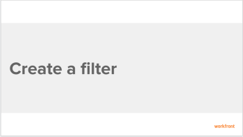
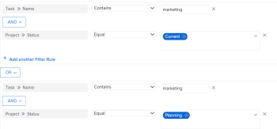

# Create or edit filters in Adobe Workfront

You can use filters to reduce the amount of information you display on the screen.

You can apply the following types of filters in&nbsp;Adobe Workfront:

* A quick filter to a list of objects to find an item in a list using a keyword.

  For information about quick filters, see [Apply the quick filter to a list](../../../workfront-basics/navigate-workfront/use-lists/apply-quick-filter-list.md).

* A permanent filter that you can use numerous time on multiple lists and reports. This article describes how to create a permanent filter or edit an existing one.

## Access requirements

You must have the following access to perform the steps in this article:

<table cellspacing="0"> 
 <col> 
 <col> 
 <tbody> 
  <tr> 
   <td role="rowheader">Adobe Workfront plan*</td> 
   <td> 
Any
 </td> 
  </tr> 
  <tr> 
   <td role="rowheader">Adobe Workfront license*</td> 
   <td> 
Plan 
 </td> 
  </tr> 
  <tr> 
   <td role="rowheader">Access level configurations*</td> 
   <td> 
Edit access to Filters, Views, Groupings
 
Edit access to&nbsp;Reports,&nbsp;Dashboards,&nbsp;Calendars to create a filter in a report
 
Note: If you still don't have access, ask your Workfront administrator if they set additional restrictions in your access level. For information on how a Workfront administrator can modify your access level, see <a href="../../../administration-and-setup/add-users/configure-and-grant-access/create-modify-access-levels.md" class="MCXref xref">Create or modify custom access levels</a>.
 </td> 
  </tr> 
  <tr> 
   <td role="rowheader">Object permissions</td> 
   <td> 
Manage permissions to a report to create or edit a filter in a report
 
Manage permissions to a filter to edit it
 
For information on requesting additional access, see <a href="../../../workfront-basics/grant-and-request-access-to-objects/request-access.md" class="MCXref xref">Request access to objects in Adobe Workfront</a>.
 </td> 
  </tr> 
 </tbody> 
</table>

&#42;To find out what plan, license type, or access you have, contact your Workfront administrator.

## Walk-through

View the following video to learn how to create a filter.

## How-to steps

1. Go to a list or a report that contains the filter that you want to customize.
1. Click the Filter drop-down list. 
1. Click New Filter at the bottom of the list of filters Or Select the filter that you want to customize, then click on the drop-down list again and click Customize Filter. The interface builder for customizing the Filter launches.
1. Do any of the following:

  * Modify existing filter rules by clicking the existing rule and selecting a new option.
  * Add a filter rule by clicking `Add another Filter Rule`, begin typing the name of the option for which you want to add a rule in the `Start typing field name` box, then click it when it appears in the drop-down list.

    Fields associated with the object of your filter are listed in the `Start typing field name` box. 
  
  * Click `AND` or `OR` when adding a new filter rule.  
    When adding filter rules, use the filter modifiers to establish the condition of your filter. For more information about filter modifiers, see [Filter and condition modifiers](../../../reports-and-dashboards/reports/reporting-elements/filter-condition-modifiers.md).

    >[!NOTE]
    >
    >When you connect a group of AND&nbsp;statements by multiple OR statements, you must repeat the fields that are not changing between the OR statements for each group of statements. 
    >
    >
    >    >
    >

    >
    >When you build a filter for tasks that contain the word "marketing" and are in projects with a status of Current or Planning, you must have the following filter rules:
    ><pre>Task: Name Contains Marketing</pre><pre>AND</pre><pre>Project: Status Equals Current</pre><pre>OR</pre><pre>Task: Name Contains Marketing</pre><pre>AND</pre><pre>Project:&nbsp;Status Equal Planning</pre>Although Task: Name Contains "marketing" does not change between the two AND filter groups, it must be repeated in the second group.

  * Delete an existing filter rule by clicking the 'X' icon.

1. (Optional) Click `Switch to Text Mode` to add a filter using the Text Mode interface.

   For more information about creating a filter using the text mode interface, see [Edit a filter using text mode](../../../reports-and-dashboards/reports/text-mode/edit-text-mode-in-filter.md). 

1. Click `Save Filter` to replace the current Filter with your changes.
1. (Optional) If you no longer want to display a filter in the `Filter` drop-down menu, click `Remove Filter`.

   The My Filters dialog box is displayed.

   All filters that you have rights to remove are available to remove. Other filters are displayed as dimmed.

1. Click the ( `x`) next to any filters you want to remove, then click `Done`.

## Additional information

See also:

* [Reporting elements: filters, views, and groupings](../../../reports-and-dashboards/reports/reporting-elements/reporting-elements-filters-views-groupings.md) 
* [Filters overview in Adobe Workfront](../../../reports-and-dashboards/reports/reporting-elements/filters-overview.md) 
* [Text Mode overview](../../../reports-and-dashboards/reports/text-mode/understand-text-mode.md) 
* [Text mode syntax overview](../../../reports-and-dashboards/reports/text-mode/text-mode-syntax-overview.md) 
* [Edit a filter using text mode](../../../reports-and-dashboards/reports/text-mode/edit-text-mode-in-filter.md) 
* [Overview of common uses for Text Mode](../../../reports-and-dashboards/reports/text-mode/understand-common-uses-text-mode.md)

&nbsp;

<!--
You can limit the amount of information you display on the screen in a list of items with a filter. You can define certain criteria based on particular pieces of information about an object and only display those objects that meet those criteria. You can apply the following types of filters in Adobe Workfront: Quick filters in a list of objects to find an item using a keyword. These are temporary filters that you cannot save for future use. For information about quick filters, see Apply the quick filter to a list. Permanent filters that you can save and use numerous time on multiple lists and reports. This article describes how to create a permanent filter or edit an existing one in a list or report. Filters in other areas of Workfront, outside of lists and reports. For a list of all filters in Workfront and the areas where you can apply them, see Filters overview in Adobe Workfront. Access requirements You must have the following access to perform the steps in this article: Adobe Workfront plan* Any Adobe Workfront license* Request or higher Access level configurations* Edit access to Filters, Views, and Groupings Note: If you still don't have access, ask your Workfront administrator if they set additional restrictions in your access level. For information on how a Workfront administrator can modify your access level, see Create or modify custom access levels. Object permissions Manage permissions to a filter For information on requesting additional access, see Request access to objects in Adobe Workfront. *To find out what plan, license type, or access you have, contact your Workfront administrator. Create or edit a filter You can create filters in lists and reports in the following ways: From scratch Edit an existing filter and save it as a new filter Regardless of the method you use to create filters, creating a filter from scratch or from an existing filter is similar. Go to a list or a report where you want to create a filter or that contains the filter that you want to customize. Click the Filter drop-down list. Tip: The report creator must allow for filters to be edited in order to view the Filter drop-down list on a report. The Report Default filter is applied to a report by default. The Report Default filter can be customized only when you edit the report. Click New Filter at the bottom of the list of filters Or Select the filter that you want to customize, then click on the drop-down list again and click Customize Filter. The builder for customizing the filter opens. Do any of the following: Modify existing filter rules by clicking the existing rule and selecting a new option. Add a filter rule by clicking Add another Filter Rule, begin typing the name of the option for which you want to add a rule in the Start typing field name box, then click it when it appears in the drop-down list. Fields associated with the object of your filter are listed in the Start typing field name box. Click AND or OR when adding a new filter rule. When adding filter rules, use the filter modifiers to establish the condition of your filter. For more information about filter modifiers, see Filter and condition modifiers. Note: When you connect a group of AND statements by multiple OR statements, you must repeat the fields that are not changing between the OR statements for each group of statements. Example: When you build a filter for tasks that contain the word "marketing" and are in projects with a status of Current or Planning, you must have the following filter rules: Task: Name Contains Marketing AND Project: Status Equals Current OR Task: Name Contains Marketing AND Project:&nbsp;Status Equal Planning Although Task: Name Contains "marketing" does not change between the two AND filter groups, it must be repeated in the second group. Delete an existing filter rule by clicking the 'X' icon. (Optional) Click Switch to Text Mode to add a filter using the Text Mode interface. For more information about creating a filter using the text mode interface, see Edit a filter using text mode. Click Save Filter to create a new filter or replace the selected one with your changes. Or Click Save as New Filter to create a new filter from the selected one. The new filter displays in the list of filters and it is automatically applied to the list or report you selected. (Optional) Do one of the following: Share filters you create with other users, or make them available system-wide. For information, see Share a filter, view, or grouping in Adobe Workfront. Remove filters you no longer want to display in the list. For information, see Remove filters, views, and groupings.
-->

&nbsp;
