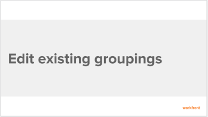
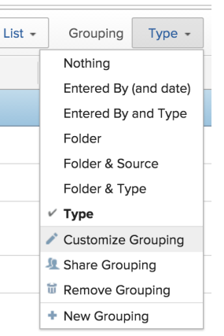

# Edit existing groupings

>[!IMPORTANT]
>
>You're currently viewing the Adobe Workfront Classic version of this document. Adobe Workfront Classic is no longer supported. All Adobe Workfront Classic functionality, along with this documentation, will be removed in July 2022. Please transition to the the new Adobe Workfront experienceas soon as possible, and switch to the new Adobe Workfront experience version of this document.

<!--

(NOTE: This is the third part of a former artcle split in 3: two how-tos and one refernece article about creating and customizing groupings)

-->

You can customize an existing grouping that you originally created or that was shared with you. Then, you can save it as a new grouping.

## Access requirements

You must have the following access to perform the steps in this article:

<table> 
 <col> 
 <col> 
 <tbody> 
  <tr> 
   <td role="rowheader">Adobe Workfront plan*</td> 
   <td> 
Any
 </td> 
  </tr> 
  <tr> 
   <td role="rowheader">Adobe Workfront license*</td> 
   <td> 
Plan 
 </td> 
  </tr> 
  <tr> 
   <td role="rowheader">Access level configurations*</td> 
   <td> 
Edit access to Filters, Views, Groupings
 
Edit access to&nbsp;Reports,&nbsp;Dashboards,&nbsp;Calendars to edit a grouping in a report
 
Note: If you still don't have access, ask your Workfront administrator if they set additional restrictions in your access level. For information on how a Workfront administrator can modify your access level, see <a href="../../../administration-and-setup/add-users/configure-and-grant-access/create-modify-access-levels.md" class="MCXref xref">Create or modify custom access levels</a>.
 </td> 
  </tr> 
  <tr> 
   <td role="rowheader">Object permissions</td> 
   <td> 
Manage permissions to a report to edit a grouping in a report
 
Manage permissions to a grouping 
 
For information on requesting additional access, see <a href="../../../workfront-basics/grant-and-request-access-to-objects/request-access.md" class="MCXref xref">Request access to objects </a>.
 </td> 
  </tr> 
 </tbody> 
</table>

&#42;To find out what plan, license type, or access you have, contact your Workfront administrator.

## Prerequisites

You must create a grouping before you can edit it.

For information on creating a grouping, see [Create groupings in Adobe Workfront](../../../reports-and-dashboards/reports/reporting-elements/create-groupings.md).

## Walk-through

View the following video to learn how to edit existing groupings.

## How-to steps

1. Go to a list of objects that contains the grouping that you want to customize.
1. Click the **Grouping** drop-down menu.
1. Select the grouping that you want to customize.
1. Click the **Grouping** drop-down menu, then click **Customize Grouping**.

   

   The interface builder for customizing the grouping opens.

1. In the **Grouping Preview** section, click **Add Grouping** to define how you want information in the report to be organized. A preview of what the grouping looks like in the report is shown below.

1. Begin typing the name of the field that represents the way that you want to organize information in the report, then click it when it appears in the drop-down list.
1. Repeat Steps 5 and 6 to define additional groupings.  
   You can define up to three groupings for organizing information. You can further organize your information with up to four groupings by creating a matrix report. For more information on matrix reports, see [Create a matrix report](../../../reports-and-dashboards/reports/creating-and-managing-reports/create-matrix-report.md).

1. Click **Save****Grouping** to replace the current grouping with your changes.

## Additional information

See also:

  <!--
  <li data-mc-conditions="QuicksilverOrClassic.Classic,QuicksilverOrClassic.Draft mode"><a href="https://one.workfront.com/s/learningpath2/workfront-reporting-20Y0z000000blhLEAQ" target="_blank">Learning Path for reports and dashboards</a> (link is not working anymore)</li>
  -->

* [Reporting elements: filters, views, and groupings](../../../reports-and-dashboards/reports/reporting-elements/reporting-elements-filters-views-groupings.md) 
* [Groupings overview in Adobe Workfront](../../../reports-and-dashboards/reports/reporting-elements/groupings-overview.md) 
* [Create groupings in Adobe Workfront](../../../reports-and-dashboards/reports/reporting-elements/create-groupings.md)

