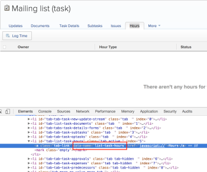
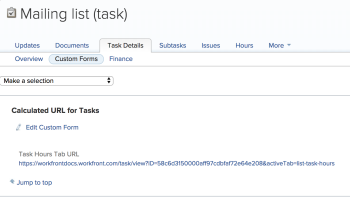
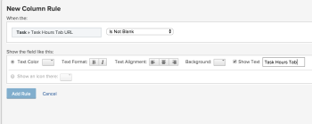
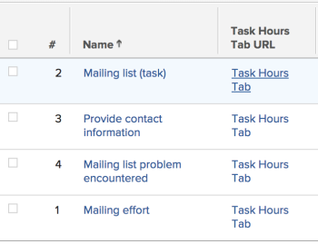
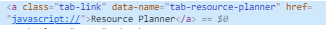
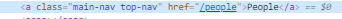

# Link tabs from lists and reports

>[!IMPORTANT]
>
>You're currently viewing the Adobe Workfront Classic version of this document. Adobe Workfront Classic is no longer supported. All Adobe Workfront Classic functionality, along with this documentation, will be removed in July 2022. Please transition to the the new Adobe Workfront experienceas soon as possible, and switch to the new Adobe Workfront experience version of this document.

<!--
<p data-mc-conditions="QuicksilverOrClassic.Draft mode">(NOTE: This is not possible in QS. This article is coded for Classic only)</p>
-->

In Adobe Workfront Classic, you can include links to a specific tab of an object in the view of a report or list for that object.  
For example, you can include the direct link to the Hours tab of a task in the view of a task report or list.

You can customize this link to a text value that is easily understood in your organization.  
For example, you can name it "Task Hours Tab". When you click the link, the Hours tab for that task opens.

You can create direct links to tabs by using text mode in Calculated Custom Fields as well as in custom calculated columns in views of lists and reports.

## Access requirements

You must have the following access to perform the steps in this article:

<table cellspacing="0"> 
 <col> 
 <col> 
 <tbody> 
  <tr> 
   <td role="rowheader">Adobe Workfront plan*</td> 
   <td> <p>Any</p> </td> 
  </tr> 
  <tr> 
   <td role="rowheader">Adobe Workfront license*</td> 
   <td> <p>Plan </p> </td> 
  </tr> 
  <tr> 
   <td role="rowheader">Access level configurations*</td> 
   <td> <p>Edit access to Filters, Views, Groupings</p> <p>Edit access to&nbsp;Reports,&nbsp;Dashboards,&nbsp;Calendars to edit reporting elements in a report</p> <p>Note: If you still don't have access, ask your Workfront administrator if they set additional restrictions in your access level. For information on how a Workfront administrator can modify your access level, see <a href="../../../administration-and-setup/add-users/configure-and-grant-access/create-modify-access-levels.md" class="MCXref xref">Create or modify custom access levels</a>.</p> </td> 
  </tr> 
  <tr> 
   <td role="rowheader">Object permissions</td> 
   <td> <p>Manage permissions to a report to edit reporting elements in a report</p> <p>Manage permissions to reporting elements to edit them</p> <p>For information on requesting additional access, see <a href="../../../workfront-basics/grant-and-request-access-to-objects/request-access.md" class="MCXref xref">Request access to objects </a>.</p> </td> 
  </tr> 
 </tbody> 
</table>

&#42;To find out what plan, license type, or access you have, contact your Workfront administrator.

## Find the name of the Active Tab for an object {#find-the-name-of-the-active-tab-for-an-object}

Adobe Workfront Classic allows you to build custom URLs to indicate specific tabs of an object, such as the Hours tab of a task or the Milestones tab on a project. These tabs are called **Active Tabs**.

To find the name of an **Active Tab**:

1. Go to the object whose tabs you want to view.
1. Find the tab that you want to direct link from a report or list, and right click on the name of the tab.
1. Click **Inspect**.
1. Use the find feature in your browser (CTRL+F or CMD+F) and search for the string **data-name** under the **tab active** line.

   

   The name of the **Active Tab** for the **Hours** tab of a **Task** is **list-task-hours**.

1. Save this name for future reference.

## Build a calculated custom field with a direct link to an Active Tab {#build-a-calculated-custom-field-with-a-direct-link-to-an-active-tab}

In Adobe Workfront Classic, you can use a calculated field to concatenate information about your object and an **Active Tab** for the object and create a direct link to that tab.

This way, you can create hyperlinks from one object to another or link a specific tab on the object (Hours, Updates, Documents, etc.) from a list or report for that object.

To build a calculated custom field for the direct link to an Active Tab:

1. Navigate to **Setup > Custom Forms > New Custom Form > Task**.
1. Specify a **Form Title**.  
   This is the name of your **Custom Form**.
1. Click **Add Field** > **Calculated**.
1. Specify a **Label**.

   This is the name of your **Calculated Custom Field**. For example, name it "Task Hours Tab."

1. In the **Calculation** box, copy and paste the calculation below. If you are building a **Calculated Custom Field** for another object or another tab, replace the code in bold with the respective object name and **Active Tab** name, respectively:

<!--WRITER: adjust text for variable. not bold-->

   <pre>CONCAT("https://<your domain>.my.workfront.com","/","<strong>task</strong>/view?ID=",ID,"&activeTab=<strong>list-task-hours</strong>")</pre>

   For information about finding the Active Tab on an object tab, see [Find the name of the Active Tab for an object](#find-the-name-of-the-active-tab-for-an-object).

   For information about the names of objects in the Workfront database, see the [API Explorer](../../../wf-api/general/api-explorer.md).

1. (Optional) In the **Instructions** box, copy and paste the same calculation:

   <pre>CONCAT("https://<your domain>.my.workfront.com","/","task/view?ID=",ID,"&activeTab=list-task-hours")</pre>

   The **Instruction** field shows the calculation when the field is viewed on the**Custom Form** of the task.

1. Click **Save + Close**.
1. Apply this **Custom Form** to a task.

   This displays a direct link to the **Hours** tab of the task in the custom field of the task, on the custom form.

   For information about applying a**Custom Form** to a task, see [Add a custom form to an object](../../../workfront-basics/work-with-custom-forms/add-a-custom-form-to-an-object.md).

   

## Build a report with links to specific object-level tabs

You must create a **Calculated Custom Field** with a link to an **Active Tab** before you can include the link in a report in Adobe Workfront Classic.

For more information about creating Calculated Custom Fields with links to an Active Tab, see [Build a calculated custom field with a direct link to an Active Tab](#build-a-calculated-custom-field-with-a-direct-link-to-an-active-tab).

For example, we want to build a task report with a direct link to the **Hours** tab of the task:

1. Navigate to **Reporting** > **Reports** > **New Report** > **Task Report**.
1. Click **Add Column**, then add the **Calculated Custom Field** as a column on your report.

   For example, the field we created is named "Task Hours Tab."

1. Click **Advanced Options**, then **Add a Rule for this Column**.
1. Add the following rule for the column: if the **Custom Field** is not blank, **Show Text** <my desired link name>.

   For example, show "Task Hours Tab".

   >[!IMPORTANT]
   >
   >Selecting **Show Text** disables the ability to inline edit the text in a column.

   

1. Click **Add Rule**, then **Done**.
1. Select the newly added column, then click **Switch to Text Mode**.
1. Click anywhere inside the text editor to edit the text mode, then add the following line of code to the text mode interface for the column.
1. 

   ```
   link.url=customDataLabelsAsString(fieldname)
   ```

1. Replace **fieldname** in the expression below with the name of your Calculated Custom Field as it appears in your system.

   For example:

   <pre>link.url=customDataLabelsAsString(<strong>Task Hours Tab</strong>)</pre>

1. Click **Save + Close**.

   

1. Click the link in the view to open the **Hours** tab of the task.

## Add an External Page that links to an Active Tab to a dashboard

In Adobe Workfront Classic, you can embed a tab into any dashboard by adding a direct link to that tab as an External Link.

1. Determine which tab you want to embed into the dashboard.

   For example, the Resource Planner tab.

1. Determine what the name of the tab is.

   For information about finding the name of an Active Tab, see the section [Find the name of the Active Tab for an object](#find-the-name-of-the-active-tab-for-an-object) in this article.

   For the Resource Planner tab, the Active Tab name is "resource-planner."

   

1. Determine the name of the main area of Workfront where the tab resides.

   For example, the Resource Planner is under the People area.

1. Right-click the **People** area, then click **Inspect** or **Inspect Element**.

   The name of the People area is "people."

   

1. Start building a dashboard.

   For information about building dashboards, see [Create a dashboard](../../../reports-and-dashboards/dashboards/creating-and-managing-dashboards/create-dashboard.md).

1. Click **Add External Page** in the dashboard builder interface.
1. Use the following generic code, and replace it with the information of the tab you want to add to the dashboard:

   ```
   https://<your domain>.my.workfront.com/<name of the Workfront area where the tab is found>?activeTab=<name of the Active Tab>
   ```

   For example, for the Resource Planner, this code becomes:

   ```
   https://<your domain>.my.workfront.com/people?activeTab=tab-resource-planner
   ```

1. Add the code from step 7 to the URL field in the dashboard builder interface.
1. Click **Save + Close**.

