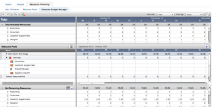
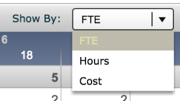
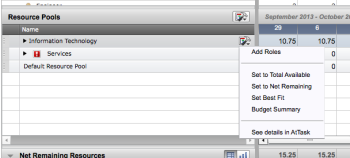
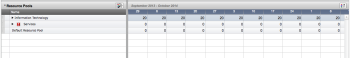
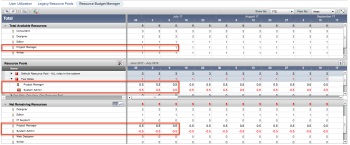

# Budget Legacy Resource Pools in the Resource Budget Manager

>[!IMPORTANT]
>
>The information in this article refers to functionality that is currently deprecated and will be removed from Workfront. For information about the current functionality for managing resources in Workfront, see the [Resource Planning in Adobe Workfront](../../resource-mgmt/resource-planning/resource-planning-overview.md) section.

The **Resource Budget Manager** is used to budget job role resources across multiple Legacy Resource Pools. If numbers for resource availability are set in a **Legacy Resource Pool**, use the **Resource Budget Manager** to verify and reconcile the number set across all Legacy Resource Pools.

## Overview of the Resource Budget Manager

Using the Resource Budget Manager you can ensure that the available resources for projects will be accurate.

>[!NOTE]
>
>There is no visibility into the resource allocation to work items in the Resource Budget Manager. Here, you can just define the available job role resources in your system and adjust the amount of time for which they are available to being assigned to work.

You can budget your available resource in the Resource Budget Manager by the following choices:

* Hours
* FTE
* Cost

  >[!NOTE]
  >
  >You must associate rates with job roles in order to budget your resources by cost.

After you create a Legacy Resource Pool complete with the job roles and Resource Estimates for each job role, you need to reconcile the availability of the job roles inside that Legacy Resource Pool with the availability of that job role across all Legacy Resource Pools, to avoid any resource over-allocation between job roles that might belong to multiple Legacy Resource Pools at the same time.

For more information about creating Legacy Resource Pools and budgeting resources within the pools, see [Work with Legacy Resource Pools](../../resource-mgmt/legacy-res-planning/work-with-legacy-resource-pools.md).

There are three areas inside the Resource Budget Manager:

* **Total Available Resources**: Shows all the job roles that are assigned as a Primary Job role to all active users in the system as well as their total availability. This section is not editable. The number of hours, FTE, or cost associated with each job role is a calculation made by the system which counts how many active users are assigned to that particular role as their Primary Role. The Other Roles of users are not counted in this area of the Resource Budget Manager.

  >[!NOTE]
  >
  >Before starting with resource management, ensure that each user is associated with at least one job role and they also have a value other than zero for the FTE field. If the FTE of the user is zero, no job role count appears in this area of the Resource Budget Manager.   
  >For more information about creating users, see [Add users](../../administration-and-setup/add-users/create-and-manage-users/add-users.md).  
  >The FTE is the Full Time Equivalent of hours worked per day by a user. The default is 8 hours a day, in which case 1 FTE = 8 hours.  
  >For more information about understanding FTE, see [Overview of FTE in the Legacy Resource Management tools](../../resource-mgmt/legacy-res-planning/legacy-fte.md).

* **Resource Pools**: Shows the Legacy Resource Pools and the job roles associated with each pool. This section is editable and allows you to specify how many of the total available job roles in the system are associated with one specific Legacy Resource Pool.   
  For example, you can have 3 Designers in the system, but you want to assign 1 designer to each Legacy Resource Pool you have. You specify this count in this area of the Resource Budget Manager.  
  This area also allows you to manually add in the Other Roles of the users, which are not counted in the top portion of the Resource Budget Manager.   
  For more information about budgeting job roles in the Legacy Resource Pools, see [Budget Legacy Resource Pools in the Resource Budget Manager](#budget-resource-pool).

* **Net Remaining Resources**: Shows the difference between the total of job roles in the system (counted in the first section of the Budget Resource Manager) and the number of job roles associated with a Resource Pool (counted in the middle section of the Resource Budget Manager).

  >[!NOTE]
  >
  >If you are manually adding budgeting for secondary job roles in the Resource Pools area, values for some of the job roles might appear in red (negative) in the Net Remaining Resources area.

## Budget Legacy Resource Pools in the Resource Budget Manager

* [Budget Legacy Resource Pools](#budgeting-legacy-pools-subsection) 
* [Considerations about budgeting secondary job roles](#considerations-for-secondary-job-roles)

### Budget Legacy Resource Pools

If your company uses all the job roles in all the projects they fulfill, we recommend that you have just one Legacy Resource Pool. If you have resources that never work on the same projects, you can use multiple Legacy Resource Pools.

As a Resource Manager, you can use the Resource Budget Manager to budget the allocation of job roles in your Legacy Resource Pools against the total job roles available in the system.

You must have a Plan license to use the Resource Budget Manager.

To budget all Legacy Resource Pools using the Resource Budget Manager:

1. Go to the **People** area in the Global Navigation bar.
1. Select the **Legacy Resource Planning** tab.  
   

1. Select **Resource Budget Manager** tab. 
1. In the **Resource Pools** area of the Budget Manager, click the name of a Legacy Resource Pool to expand it.
1. Update the number of job roles for each Legacy Resource Pool, by starting to type a number in the available cells that correspond to various dates. You can specify the number of users that can fulfill a specific role by displaying their allocation using the following choices:

   * **Hours**: Typically, a user is a available to work 8 hours a day. If you have two users that can fulfill the same role in the same Legacy Resource Pool, budget 16 hours per day. 
   * **FTE**: Typically, a full time employee can work 1 FTE a day (where 1 FTE = 8 hours). If you have two users that can fulfill the same role in the same Legacy Resource Pool, budget 2 FTE per day.  
     For more information about understanding FTE, see [Overview of FTE in the Legacy Resource Management tools](../../resource-mgmt/legacy-res-planning/legacy-fte.md).
   
   * **Cost**: Only use cost if your job roles are associated with cost and revenue rates.  
     

   The total number of available users associated with a specific job role in the entire system is displayed in the **Total Available Resources** area of the **Resource Budget Manager**. You can manually divide that total number between the roles available in each Legacy Resource Pool. The total number of users associated with a specific job role in the system and displayed in the Total Available Resources area is a calculation of all the Primary Roles of all active users in the system. Secondary job roles of users are not displayed in the Total Available Resources area of the Resource Budget Manager.  
   For more information about budgeting for secondary job roles, see [Considerations about budgeting secondary job roles](#considerations-for-secondary-job-roles).  
   When budgeting your job roles in the Resource Pools area of the Resource Budget Manager, you can enter a number for your job role allocation, then drag and drop the green box to extend that number across a date range over several cells in the grid. 

1. (Optional) Mouse over the name of a Legacy Resource Pool and click the hammer icon. Click **Add Roles** to add more roles for the Legacy Resource Pool.  
   You can add roles that you do not see displayed in the **Total Available Resources** area. The roles not displayed in the **Total Available Resources** area are not the Primary Roles of the active users. They can be Other Roles (or secondary roles), or roles that have not yet been assigned to active users.  
   For more information about budgeting for secondary job roles, see [Considerations about budgeting secondary job roles](#considerations-for-secondary-job-roles).

1. To quickly manage your resources in the **Resource Pools** area of the **Resource Budget Manager**, mouse over the name of a Legacy Resource Pool and select the hammer icon.  
   The budgeting options are displayed. Individual pools can be budgeted using the hammer icon, or all pools can be budgeted using the same icon, based on where the hammer is selected from.  
     
   Select from the following options:

   * **Set to Total Available:** This option will set the budget to include every resource in the system with those job roles. For example, if the system has a total of five developers, this option will put a 5 in the developer row of a resource pool. This option makes the number of job roles inside of that Legacy Resource Pool match the Total Available Resources number. 
   * **Set to Net Remaining:** Budgets are replaced with the number of net remaining resources. If three developers are in a pool, and there are zero net remaining developers, using this option changes the resource budget from three to zero for the selected pool. If the pool is set to net remaining again, then the pool will have three developers budgeted. It is recommend to use this option when creating additional Legacy Resource Pools, and use caution at all other times.
   * **Set Best Fit:** This action will attempt to find the earliest available start time with the fewest overages for each selected Legacy Resource Pool. For example, if all the Consultant job role resources are budgeted in other resource pools until June, Workfront will not budget this resource before that month in a selected pool.

     >[!NOTE]
     >
     >You need to set a proper priority to all Legacy Resource Pools because automation works based on Legacy Resource Pool priorities. All Legacy Resource Pools are sorted by priority in descending order. To change a priority, simply drag and drop the name of the target resource pool into the desired position.

     

1. Click **Save**.  
   Changes made in the Resource Budget Manager will be reflected within each individual Legacy Resource Pool.

### Considerations about budgeting secondary job roles

The **Total Available Resources** area of the Resource Budget Manager shows only available Primary Job Roles assigned to active users. If your users have multiple job roles, their secondary roles are not accounted for in the Resource Budget Manager. You must account for their secondary job roles manually, by editing the **Resource Pools** area of the Resource Budget Manager.

For example, a user might have two job roles: their Primary Role might be Project Manager, and their Other Role is System Administrator. If the user has an FTE of 1, this is fully allocated to the Project Manager role in the Total Available Resources area of the Resource Budget Manager. You can split this FTE value manually, to both roles, by editing the amount of time allocated for each role in the Resource Pools area of the Resource Budget Manager. You can allocate 0.5 FTE to the Project Manager role, and 0.5 FTE to the System Administrator role. This way, their combined value is 1 FTE which is correct for this one user.  

When you do this, the System Administrator role will appear as if it is over-allocated, because the value for it in the Resource Budget manager is 0, by default (because no one is assigned the role of System Administrator as their Primary Role). This is OK, because you are mentally keeping a count of what FTE is allocated for each role and you know you have split the 1 FTE for the user into two 0.5 FTEs for each role assigned to the user. This way, the user is ultimately not over-allocated.

>[!IMPORTANT]
>
>For Resource Management purposes, you must ensure that the budgeted time for your job roles is correct at all times in the **Resource Pools** area of the Resource Budget Manager. These are the values that are used in the Capacity Planner. The Capacity Planner allows you to manage the Planned Hours from projects within the limits of what hours are available for your resources as defined in the Resource Budget Manager. For more information about the Capacity Planner, see [Plan resources in the Capacity Planner](../../resource-mgmt/legacy-res-planning/plan-resources-in-capacity-planner.md).

## Change the date range in the Resource Budget Manager

By default, the date range inside the Resource Budget manager starts with the current day. You can adjust that to any date between the previous year and 4 years in the future. You can only display 6 years at a time in the Resource Budget Manager.

To change the date range in the Resource Budget Manager:

1. Open the **Resource Budget Manager.**
1. Click the **Preferences** icon.  
   

1. Select the **Date Range** tab.
1. Select a **Start** and an **End Date** for your Resource Budget Manager.

1. Click **OK**.  
   The changes should save automatically and the grid updates to reflect the new dates.   
   The changes to the date range are saved after you log out of Workfront.

