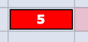
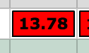

# Overview of the colors in the Resource Grid

>[!IMPORTANT]
>
>The information in this article refers to functionality that is currently deprecated and will be removed from Workfront. For information about the current functionality for managing resources in Workfront, see the [Resource Planning in Adobe Workfront](../../resource-mgmt/resource-planning/resource-planning-overview.md) section.

The Resource Grid is a resource planning tool that allows you to properly allocate your users to tasks and issues while being aware of the timeline of your projects. For more information about using the Resource Grid, see [Overview of the Resource Grid](../../resource-mgmt/legacy-res-planning/resource-grid-overview.md).

The colors and various font types in the Resource Grid point to information you should be aware of while planning your resources.

For more information about the icons inside the Resource Grid, see [Overview of the Resource Grid](../../resource-mgmt/legacy-res-planning/resource-grid-overview.md).

## Items highlighted in green, blue, or yellow

In the Resource Grid, work items and projects are highlighted in the following colors:

* Projects - green highlight.
* Tasks - blue highlight.
* Issues - yellow highlight.

## Allocation in red highlight

When you see a specific number of hours, for a certain date displayed in red, this indicates that the user is over-allocated that day.

## Over-allocation in bold white font

If the over-allocation occurs within the Planned Duration Dates (between the Planned Start and the Planned Completion Dates), the number of hours is displayed in white.  

## Over-allocation in bold black font

If the over-allocation occurs beyond the Planned Duration Dates (after the Planned Completion Date), the number of hours is displayed in black. This also indicates that the task is late as well as the user is over-allocated. This could affect the timeline of the project.  

## Pink task dates

If you enable the actual progress of tasks in the Resource Grid, task dates will show in pink after the Planned Completion Date of the task, when the task is still incomplete. This means that the task is running late and there is a potential that the project timeline might be delayed.   
For more information about enabling actual task progress, see [Overview of the Resource Grid](../../resource-mgmt/legacy-res-planning/resource-grid-overview.md).

