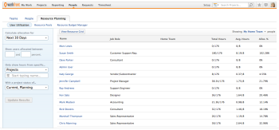

# Overview of Legacy Resource Planning

>[!IMPORTANT]
>
>The information in this article refers to functionality that is currently deprecated and will be removed from Workfront. For information about the current functionality for managing resources in Workfront, see the [Resource Planning in Adobe Workfront](../../resource-mgmt/resource-planning/resource-planning-overview.md) section.

You can plan your resource allocations by using the Legacy Resource Planning functionality in Workfront.

The Legacy Resource Planning tools allow you to manage your user as well as your job role allocations for your projects.

## Prerequisites for using Legacy Resource Planning

All of the following conditions must be met before you can start using the Legacy Resource Planning Tools:

* You must have users in the system who have active accounts. 
* Users who are assigned to work must have a Plan or a Worker license.

  >[!NOTE]
  >
  >Although you can assign work to a Reviewer or a Requestor, they cannot complete it.   
  >We recommend against assigning work to Reviewers or Requestors.

* You must have job roles configured in the system.  
  For more information about adding job roles to Workfront, see [Create and manage job roles](../../administration-and-setup/set-up-workfront/organizational-setup/create-manage-job-roles.md).

* Users must have at least one job role associated with their profile.   
  For more information about adding a job role to a user, see [Edit a user's profile](../../administration-and-setup/add-users/create-and-manage-users/edit-a-users-profile.md).

* Users must have a valid value for the FTE field.  
  For more information about adding a valid value for the FTE field, see [Edit a user's profile](../../administration-and-setup/add-users/create-and-manage-users/edit-a-users-profile.md) For more information about understanding FTE, see [Overview of FTE in the Legacy Resource Management tools](../../resource-mgmt/legacy-res-planning/legacy-fte.md).

* Users and projects must have accurate Schedules associated with them.  
  For more information about creating and editing schedules, see [Creating Schedules.](../../administration-and-setup/set-up-workfront/configure-timesheets-schedules/create-schedules.md)

* You must associate projects with Legacy Resource Pools.  
  For more information about creating Legacy Resource Pools, see [Work with Legacy Resource Pools](../../resource-mgmt/legacy-res-planning/work-with-legacy-resource-pools.md).

* The tasks and issues in your system should be assigned to job roles or users.
* The tasks and issues in your system should have a valid value for Planned Hours and Duration.  
  For more information about Planned Hours, see [Planned Hours overview](../../manage-work/tasks/task-information/planned-hours.md).  
  For more information about Duration, see [Overview of Task Duration and Duration Type](../../manage-work/tasks/taskdurtn/task-duration-and-duration-type.md).

* Your projects must include Resource Estimates in the Business Case.  
  For more information about using Resource Estimates in the Business Case, see [ [Estimating Project Resources by Applying Legacy Resource Pools to the Business Case](../../manage-work/projects/define-a-business-case/apply-legacy-pools-to-business-case.md)](../../manage-work/projects/define-a-business-case/apply-legacy-pools-to-business-case.md) [.](../../manage-work/projects/define-a-business-case/apply-legacy-pools-to-business-case.md)

## User Utilization

You can manage your user resources by using the User Utilization sub-tab in Legacy Resource Planning.

To access the User Utilization sub-tab:

1. Go to the **People** area in the Global Navigation bar.
1. Select the **Legacy** **Resource Planning** tab.

1. Click the **User Utilization** sub-tab.  
     
   For more information about how to use the information on the User Utilization sub-tab, see [Overview of the User Utilization report in the Legacy Resource Management area](../../resource-mgmt/legacy-res-planning/legacy-user-utilization-report.md).

## Legacy Resource Pools

You can organize the job roles in your system by placing them inside Legacy Resource Pools. You can assign one Legacy Resource Pools to a project. Then, you can use the Capacity Planner inside each Legacy Resource Pool to manage the allocations of those job roles and how they are assigned to projects. You can assign just one Legacy Resource Pool to one project.

To make the most out of the Legacy Resource Pools functionality, we recommend the following setup in your system:

* Associate each user in the system with one job role, as their Primary Role. You can assign multiple roles to the same user, but resource planning becomes more difficult and more manual if you choose this setup. 
* Have all job roles in the system placed in one Legacy Resource Pool. You can place your job roles in multiple Legacy Resource Pools only if the Legacy Resource Pools never share their job role resources for the same projects. If you choose to have more than one Legacy Resource Pool, each pool should work completely independent than all other pools for the setup to be efficient.

For more information about creating and using Legacy Resource Pools, see [Work with Legacy Resource Pools](../../resource-mgmt/legacy-res-planning/work-with-legacy-resource-pools.md).

## Resource Budget Manager

You can manage all the job role resources in your system by using the Resource Budget Manager. The Budget Manager allows you to manage your job roles resources across multiple Legacy Resource Pools.

For more information about using the Resource Budget Manager, see [Budget Legacy Resource Pools in the Resource Budget Manager](../../resource-mgmt/legacy-res-planning/budget-legacy-pools-in-budget-manager.md).
