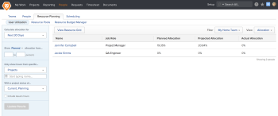
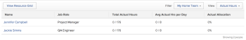
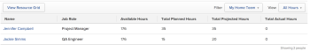
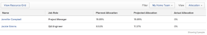
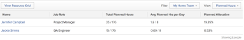
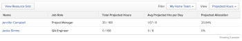

# Overview of the User Utilization report in the Legacy Resource Management area

>[!IMPORTANT]
>
>Adobe Workfront Classic is no longer supported. All Adobe Workfront Classic functionality, along with this documentation, will be removed in July 2022. Please transition to the new Workfront experience as soon as possible.

>[!IMPORTANT]
>
>The information in this article refers to functionality that is currently deprecated and will be removed from Workfront. For information about the current functionality for managing resources in Workfront, see the [Resource Planning in Adobe Workfront](../../resource-mgmt/resource-planning/resource-planning-overview.md) section. For information about viewing user utilization in the current resource management tools, see [View resource utilization information](../../resource-mgmt/resource-utilization/view-utilization-information.md).

## Overview of the User Utilization report

The User Utilization report allows you to assess how busy the users in your Workfront system are.

The User Utilization report does not show you job roles and their availability. The User Utilization report only shows the availability or allocation of users.

The allocation of users is the amount of hours that are associated with the tasks the users are assigned to. This allocation is represented in percentage format in the User Utilization report. The allocation percentage represents the amount of time the users are allocated to tasks reported against the schedule of each user.   
For example, if a user is scheduled to work 40 hours in a week and the total amount of Planned Hours from all their assignments during that week equals 20 hours, the Planned Allocation percentage is 50% for that user for one week.

All users should be associated with a schedule through their user profile. For more information about how to associate a user with a schedule, see [Add users](../../administration-and-setup/add-users/create-and-manage-users/add-users.md). If there is no schedule associated with the users, the default schedule for the system is used in the calculations of the User Utilization report. For more information about schedules, see [Create a schedule](../../administration-and-setup/set-up-workfront/configure-timesheets-schedules/create-schedules.md).

In addition to the Planned Allocation, you can also view the Projected and Actual Allocation of users in the User Utilization report.

The User Allocation report also shows the total number of hours the users are planned or projected to work, as well as the total number of hours the users log against the tasks they are assigned to.

>[!IMPORTANT]
>
>The User Utilization Report shows the overall allocation of users, without breaking it down by projects, tasks or issues. If you must see on what specific projects, tasks or issues the allocations occur, you must use the Resource Grid. For more information about using the resource grid, see [Overview of the Resource Grid](../../resource-mgmt/legacy-res-planning/resource-grid-overview.md).

## Access the User Utilization report {#access-the-user-utilization-report}

Only system administrators and users with a Plan license can access the User Utilization report.

To access the User Utilization report:

1. Go to the **People** area in the Global Navigation Bar.
1. Select the **Legacy** **Resource Planning** tab.

1. Select the **User Utilization** sub-tab to view the **User Utilization** report.  
   By default, when you navigate to this tab, you can see the utilization of all the users in your Home Team, for the next 30 days, on projects that are in Planning or Current statuses.  
   

## Overview of the allocations in the User Utilization Report when using filters and views

By default, the User Utilization report shows all users in your Home Team and their utilization for the next 30 days, for projects in the Planning and Current status. This information is displayed in the Allocation View, by default.

You can change what you see in the report by using user or project-specific filters to change the results in the report.

You can see various types of allocations (Planned, Projected, Actual Allocation) depending on what View you select for the User Utilization report.

* [Update filters in the User Utilization report](#update-filters-in-the-user-utilization-report) 
* [Change the view in the User Utilization report](#change-the-view-in-the-user-utilization-report)

### Update filters in the User Utilization report {#update-filters-in-the-user-utilization-report}

There are two sets of filters you can update to change the information in the User Utilization report.

* [Use project-specific filters in a User Utilization report](#use-project-specific-filters-in-a-user-utilization-report) 
* [Use user-specific filters in a User Utilization report](#use-user-specific-filters-in-a-user-utilization-report)

#### **Use project-specific filters in a User Utilization report** {#use-project-specific-filters-in-a-user-utilization-report}

You can filter the data you display in the User Utilization report by project-specific information.

To filter the User Utilization report by project-specific information:

1. Go to the **User Utilization** report. For more information about accessing the User Utilization report, see [Access the User Utilization report](#access-the-user-utilization-report).

1. On the left-side panel, select from the following options:

* **Calculate allocation for**: Select the time frame for when your resources are allocated to work. The time frame refers to the Planned Start Dates of the tasks assigned to the users in your report. Choose **Specific Dates** to enter a custom date range, or select from the following options:
  ```<blockquote>  <ul>   <li> <strong>Next 30 Days</strong> (this is the default): Includes dates between today and 30 days from today.</li>   <li><strong>This Week</strong>: Includes dates in the current week, where the week starts on Sunday and ends on Saturday.</li>   <li><strong>Next Week</strong>: Includes dates in the week following the current week, where the week starts on Sunday and ends on Saturday.</li>   <li><strong>Last Week</strong>: Includes dates in the week preceding the current week, where the week starts on Sunday and ends on Saturday.</li>   <li><strong>This Month</strong>: Includes dates in the current month.</li>   <li><strong>Next Month</strong>: Includes dates in the month following the current month.</li>   <li><strong>Last Month</strong>: Includes dates in the month preceding the current month.</li>   <li> <p><strong>This Quarter</strong>: Includes dates in the current quarter, where the standard quarters are defined as:</p> <p>-- First Quarter: January 1 - March 30.<br>-- Second Quarter: April 1 - June 30.<br>-- Third Quarter: July 1 - September 30.<br>-- Fourth Quarter: October 1 - December 30.</p> </li>   <li><strong>Next Quarter</strong>: Includes dates in the quarter following the current quarter, where the standard quarters are defined above.</li>   <li><strong>Last Quarter</strong>: Includes dates in the quarter preceding the current quarter, where the standard quarters are defined above.</li>   <li><strong>This Year</strong>: Includes dates in the current year, from January 1 to December 31.</li>   <li><strong>Past Year</strong>: Includes dates between a year ago today and today. </li>   <li><strong>Last Year</strong>: Includes dates in the year preceding the current year. </li>  </ul> </blockquote>``` 

* **Show Planned/Projected/Actual allocation from ... to ... percent**: Specify the percentage range for the allocation of the users you want to see in the report, where the Planned, Projected, and Actual allocations are defined as follows:

   * **Planned:** Shows what percentage of the work schedule of the user is already allocated to Planned Hours on the tasks the user is assigned to.  
     For example, if a user is scheduled to work 8 hours a day, and a task is assigned to the user for 8 hours, the Planned Allocation is 100%.
   
   * **Projected:** Shows what percentage of the work schedule of the user is already allocated to Projected Hours on the tasks the user is assigned to.  
     For example, if a user is scheduled to work 8 hours a day, and a task is assigned to the user with 8 Projected Hours, the Projected Allocation is 100%.
   
   * **Actual:** Shows what percentage of the work schedule of the user is already allocated to Actual Hours on the tasks the user is assigned to. The Actual Hours are the hours the user logged for the tasks they are assigned to.  
     For example, if a user is scheduled to work 5 days a week for 8 hours each day, the work schedule for the user is 40 hours a week. If the user logged 10 hours this week to several of the tasks assigned to them, the Actual Allocation is 25%.

* **Only show hours from specific Projects/ Programs/ Portfolios/ Legacy Resource Pools/ Groups:** Select whether you want to search the allocation of users for specific projects, using the name of the project, program, portfolio, or whether you want to search by projects that are associated with a specific Legacy Resource Pool or Group. Select the criteria you want to search by from the options outlined above, then begin typing the name of the object you selected in the available field. Click to select it, when it appears in the drop-down list.
* **With a project status of:** Select any project statuses that represent the projects that contain the allocation you want to review. You can select multiple project statuses in the checkbox list. 
* **Include issue's hours:** Select this option to have the report show allocations on issues in addition to tasks. The User Utilization report shows the allocation of users on tasks by default.

```<li>3. Click <strong>Update Results</strong>.<br> The results of the report should update according to the information you specified in your filters. </li>``` 

#### **Use user-specific filters in a User Utilization report** {#use-user-specific-filters-in-a-user-utilization-report}

In addition to the project-specific filters you can build to update the information in the User Utilization Report, you can also build a user-specific filter to search for specific users in this report.

To build a user-specific filter for the User Utilization report:

1. Go to the User Utilization report.   
   For more information about accessing the User Utilization report, see [Access the User Utilization report](#access-the-user-utilization-report).

1. Click to expand the **Filter**.  
   The default filter for this field is **My Home Team**. 

1. Click **Customize Filter**.   
   For more information about editing a filter, see [Filters overview in Adobe Workfront](../../reports-and-dashboards/reports/reporting-elements/filters-overview.md).

1. Apply the custom filter you created and the results in the report should update according to the fields you selected in your filter.

### Change the view in the User Utilization report {#change-the-view-in-the-user-utilization-report}

You can view various types of user allocations (Planned, Projected, or Actual) when you change the View in the User Utilization report.

You cannot modify or create a new View on the User Utilization report. You can only select from 5 preconfigured views. The preconfigured views combine user and project information in one report.

To change the view of the User Utilization report:

1. Go to the **User Utilization** report.   
   For more information about accessing the User Utilization report, see [Access the User Utilization report](#access-the-user-utilization-report).

1. Click to expand the**View**.   
   The default view for this report is **Allocation**.

1. Select from the following options to change the view of the report:

* [Actual Hours view in the User Utilization report](#actual-hours-view-in-the-user-utilization-report) 
* [All Hours view in the User Utilization report](#all-hours-view-in-the-user-utilization-report) 
* [Allocation view in the User Utilization report](#allocation-view-in-the-user-utilization-report) 
* [Planned Hours view in the User Utilization report](#planned-hours-view-in-the-user-utilization-report) 
* [Projected Hours view in the User Utilization report](#projected-hours-view-in-the-user-utilization-report)

#### **Actual Hours view in the User Utilization report** {#actual-hours-view-in-the-user-utilization-report}

The Actual Hours view is a preconfigured view which displays information about Actual Hours logged against tasks in relation to the available work hours as defined by the schedule of the user.  


The Actual Hours view displays the following utilization information when applied to the User Utilization report:

* **Name**: The name of the user for whom you are displaying the allocation.
* **Job Role**: The primary job role associated with the user. For more information about the primary roles of users, see [Add users](../../administration-and-setup/add-users/create-and-manage-users/add-users.md).

* **Total Actual Hours**: Displays as two numbers separated by a slash.   
  For example "0/176". This means that the user logged 0 hours during the timeframe selected in the User Utilization report out of the 176 hours available to work during the same time frame, as defined by the schedule associated with the user. 

* **Actual Hours per Day**: Displays as two numbers separated by a slash. The numbers represent the average number of daily hours the user logged against the number of daily average available hours as defined by the schedule associated with the user.  
  For example "0/8". This means the user logged 0 hours a day, and they are scheduled to work an average of 8 hours a day, during the time frame selected in the User Utilization report. 

* **Actual Allocation**: The actual time logged by the user in the time frame selected in the User Utilization report as a percentage of hours from the total hours available to work during the same time frame, as defined by the schedule associated with the user.

#### **All Hours view in the User Utilization report** {#all-hours-view-in-the-user-utilization-report}

The All Hours View is a preconfigured view which displays information about hour totals for various types of allocations (Actual, Planned, and Projected).  


The All Hours view displays the following fields when applied to the User Utilization report:

* **Name**: The name of the user for whom you are displaying the allocation.
* **Job Role**: The primary job role associated with the user. For more information about the primary roles of users, see [Add users](../../administration-and-setup/add-users/create-and-manage-users/add-users.md).

* **Available Hours**: The total number of hours that the user has available to work in the time frame selected for the User Utilization Report, according to the schedule associated with the user.
* **Total Planned Hours**: The total number of all Planned Hours associated with the tasks assigned to the user during the time frame selected for the User Utilization report. 
* **Total Projected Hours**: The total number of all Projected Hours associated with the tasks assigned to the user during the time frame selected for the User Utilization report. 
* **Total Actual Hours**: The total number of hours actually logged by the user against the tasks and the issues assigned to the user, during the time frame selected for the User Utilization report.

#### **Allocation view in the User Utilization report** {#allocation-view-in-the-user-utilization-report}

The Allocation View is a preconfigured view which is the default view for the User Utilization report. The view displays information about the Planned, Projected and Actual allocation of the user, as a percentage.  


The Allocation view displays the following fields when applied to the User Utilization report:

* **Name**: The name of the user for whom you are displaying the allocation.
* **Job Role**: The primary job role associated with the user. For more information about the primary roles of users, see [Add users](../../administration-and-setup/add-users/create-and-manage-users/add-users.md).

* **Planned Allocation**: The Planned Hours of all the tasks and issues assigned to the user as a percentage from the total work time available according to the schedule associated with the user during the time frame selected for the User Utilization report.
* **Projected Allocation**: The Projected Hours of all the tasks and issues assigned to the user as a percentage from the total work time available according to the schedule associated with the user during the time frame selected for the User Utilization report.
* **Actual Allocation**: The Actual Hours logged by the user against all the tasks and issues assigned to them as a percentage from the total work time available according to the schedule associated with the user during the time frame selected for the User Utilization report.

#### **Planned Hours view in the User Utilization report** {#planned-hours-view-in-the-user-utilization-report}

The Planned Hours view is a preconfigured view which displays information about the Planned Hours on the tasks assigned to the user in relation to the available work hours as defined by the schedule of the user.  


The Planned Hours view displays the following fields when applied to the User Utilization report:

* **Name**: The name of the user for whom you are displaying the allocation.
* **Job Role**: The primary job role associated with the user. For more information about the primary roles of users, see [Add users](../../administration-and-setup/add-users/create-and-manage-users/add-users.md).

* **Total Planned Hours**: Displays as two numbers separated by a slash.   
  For example "35/176". This means that there are a total of 35 Planned Hours on the tasks and issues assigned to the user during the timeframe selected in the User Utilization report out of the 176 hours available to work during the same time frame, as defined by the schedule associated with the user. 

* **Avg Planned Hrs per Day**: Displays as two numbers separated by a slash. The numbers represent the average number of Planned Hours associated with the tasks assigned to the user against the average number of available work hours per day as defined by the schedule associated with the user.  
  For example "1.6/8". This means the user is allocated an average number of 1.6 hours a day out of the average of 8 hours per day available to work, during the time frame selected in the User Utilization report, according to the schedule associated with the user. 

* **Planned Allocation**: The Planned Hours associated with the user in the time frame selected in the User Utilization report as a percentage of hours from the total hours available to work during the same time frame, as defined by the schedule associated with the user.  
  For example, if the user is allocated to 35 Planned Hours and they have 176 of total work hours available in the time frame selected in the User Utilization report, then their Planned Allocation is 19.89%.

#### **Projected Hours view in the User Utilization report** {#projected-hours-view-in-the-user-utilization-report}

The Projected Hours view is a preconfigured view which displays information about the Projected Hours on the tasks assigned to the user in relation to the available work hours as defined by the schedule of the user.  


The Projected Hours view displays the following fields when applied to the User Utilization report:

* **Name**: The name of the user for whom you are displaying the allocation.
* **Job Role**: The primary job role associated with the user. For more information about the primary roles of users, see [Add users](../../administration-and-setup/add-users/create-and-manage-users/add-users.md).

* **Total Projected Hours**: Displays as two numbers separated by a slash.   
  For example "35/168". This means that there are a total of 35 Projected Hours on the tasks and issues assigned to the user during the timeframe selected in the User Utilization report out of the 176 hours available to work during the same time frame, as defined by the schedule associated with the user.

* **Avg Projected Hrs per Day**: Displays as two numbers separated by a slash. The numbers represent the average number of Projected Hours associated with the tasks assigned to the user against the average number of available work hours per day as defined by the schedule associated with the user.  
  For example "1.67/8". This means the user is allocated an average number of 1.67 Projected Hours a day out of the average of 8 hours per day available to work, during the time frame selected in the User Utilization report, according to the schedule associated with the user. 

* **Projected Allocation**: The Projected Hours associated with the user in the time frame selected in the User Utilization report as a percentage of hours from the total hours available to work during the same time frame, as defined by the schedule associated with the user.   
  For example, if the user is allocated to 35 Projected Hours and they have 168 work hours available for the time frame selected in the User Utilization report, then their Projected Allocation is 20.84%.

