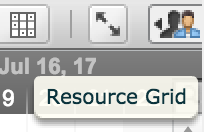
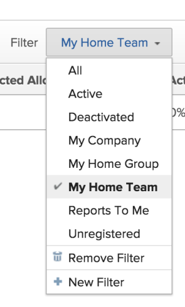
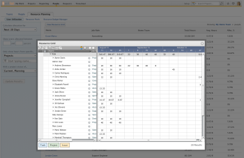
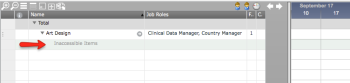
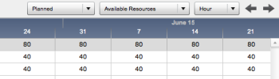
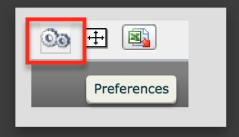
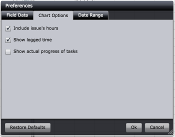
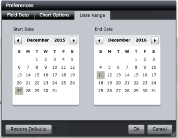
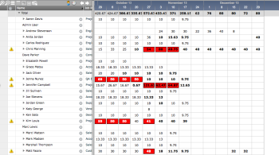

# Overview of the Resource Grid

&nbsp;

>[!IMPORTANT]
>
>The information in this article refers to functionality that is currently deprecated and will soon be removed from Workfront. For information about the current functionality for managing resources in Workfront, see the [Resource Planning in Adobe Workfront](../../resource-mgmt/resource-planning/resource-planning-overview.md) section.

As a project or resource manager, you can see the allocation of users in the Resource Grid, but you cannot edit this information. The Resource Grid is a view in which you can see the allocation of your users by projects and tasks, within a specific time frame.&nbsp;

The Resource Grid gives you visibility into specific users&nbsp;as a&nbsp;project&nbsp;progresses towards completion. For example, you can easily see when&nbsp;someone on your project team gets their work done early, and when&nbsp;someone falls behind, as well as whether they are over-allocated, or under-allocated for a specific time frame.

The Resource Grid shows user allocations according to&nbsp;their schedules, and not allocation of job roles. For job role allocation, you can use&nbsp;the following&nbsp;Resource Management tools:&nbsp;

* Resource Budget Manager
* Capacity Planner

When managing your resources around job role allocations you must use these tools instead.&nbsp;

For more information about the Resource Budget Manager, see&nbsp; [Budget Legacy Resource Pools in the Resource Budget Manager](../../resource-mgmt/legacy-res-planning/budget-legacy-pools-in-budget-manager.md).

For more information about managing job role resources in the Capacity Planner, see&nbsp; [Plan resources in the Capacity Planner](../../resource-mgmt/legacy-res-planning/plan-resources-in-capacity-planner.md).

## Access the Resource Grid

You can view the Resource Grid for individual Projects, Programs, Portfolios, Legacy Resource Pools, and Groups.

You can access the Resource Grid in the following locations:

* By going&nbsp;to the **Legacy Resource Planning** tab in the People area, then the **User Utilization** sub-tab.

* By applying the Resource Grid View to a user report.   
  For more information about applying the Resource Grid View to a user report, see [Create a custom report](../../reports-and-dashboards/reports/creating-and-managing-reports/create-custom-report.md).

* From the **Staffing** tab of a project, when you view&nbsp;the Resource Grid for a specific project.
* From the **Legacy Gantt** chart of a project, by clicking the **Resource Grid** icon.  
  

To view the Resource Grid for multiple users and projects using&nbsp;the Legacy Resource Planning tab:

1. Go to the **People**&nbsp;area in the Global Navigation Bar.
1. Select the&nbsp;**Legacy**&nbsp;**Resource Planning**tab.

1. Click&nbsp;**User Utilization.**
1. At the top of the user list, you can apply a user filter, to select only specific users in the system for whom you want to see the allocation. The default is to display the users in your **Home Team**.  
   

1. &nbsp;On the panel to the left of the user list, you can use a set of filters&nbsp;to select which projects you want to include in your user utilization report and the Resource Grid.  
   Specify the following information&nbsp;about the projects you want to filter by:  
   **Calculate allocation for:** Select the time period for which the allocation will be displayed.  
   **Show Planned/Projected/Actual allocation from xx to xx percent***:* Specify the allocation percentage based on&nbsp;planned, projected, or actual allocation. Users whose allocation does not match the percentage specified are not included. For example, maybe you want to see only users whose allocation is close to 0%, as these users could potentially be assigned more work. In this case, just select 0-1% in your allocation percentage.   
   **- Planned allocation**&nbsp;refers to the allocation of the user based on the Planned Hours associated with the tasks,&nbsp;and assigns those hours according to the Planned Start and Planned Completion dates of the tasks.  
   - **Projected allocation**&nbsp;refers to&nbsp;the allocation of the user based on the Projected Hours associated with the tasks,&nbsp;and assigns those hours according to the Projected&nbsp;Start and Projected&nbsp;Completion dates of the tasks.  
   - **Actual**&nbsp;**allocation**&nbsp;refers to the allocation of the user based on the Actual Hours logged for the tasks,&nbsp;and assigns those hours according to&nbsp;the Actual Date of when those hours were logged.  
   **Only show hours from specific**:*&nbsp;*Select **Projects, Programs, Portfolios, Legacy Resource Pools,**&nbsp;or**Groups**&nbsp;from the drop-down list, then, in the provided field, begin typing the name of the specific item you want to include in the Resource Grid. Click it when it appears in the list. You can type multiple values in this field.  
   **With a project status of:** Select the statuses that represent the type of projects that you want to include in the Resource Grid.  
   **Include issue's hours:** Select this option to show issues assigned to users as well as the hours associated with those issues.&nbsp;

1. Click **Update Results.**Now, you have updated the User Utilization list according to the specifications you have in all your user and project filters.&nbsp;
1. Click&nbsp;**View Resource Grid**to display this information in the Resource Grid. The selections you have made for the User Utilization list transfer to the Resource Grid.  
     
   The Resource Grid displays a list of users you selected to view. You can expand each use to display a list of projects they are allocated to, then you can expand each project to display a list of tasks or issues assigned to them.  
   If you do not have access to view items assigned to users, you see them listed as **Inaccessible Items** under the name of the user.  
   

## Filter content on the Resource Grid

You can modify how content is displayed in the Resource Grid, such as whether to show the following:

* Planned or projected work
* Used or available resources
* How user allocation is displayed.  
  Select from the following options:

   * Hour.
   * FTE.
   * Percent of the allocation.&nbsp;

* [View Planned or Projected work](#viewing-planned-or-projected-work) 
* [View work based on resource availability](#viewing-work-based-on-resource-availability) 
* [View resource allocation](#viewing-resource-allocation)

### View Planned or Projected work

Tasks, issues, and projects must have&nbsp;the following to show a timeline and an hour allocation on the Resource Grid:

* For displaying Planned Work:

   * Planned Duration greater than&nbsp;0.
   * Planned Start Date and Planned Completion Dates different from one another. (If they are the same, the Planned Duration is 0).
   * Planned Hours greater than&nbsp;0.

* For displaying Projected Work:

   * Projected Duration greater than&nbsp;0.
   * Projected Start Date and Projected Completion Dates different from one another. (If they are the same, the Projected Duration is 0).
   * Projected Hours greater than&nbsp;0.&nbsp;

When viewing the Resource Grid, select **Planned**&nbsp;or **Projected**&nbsp;from the drop-down menu.

**Planned:**&nbsp;The estimated amount of work required to complete the tasks. If you select to view the hours by the **Planned** allocations, you see hours distributed evenly on the days between the Planned Start and the Planned Completion dates. The start date takes into account the time stamp of the Planned Start Date&nbsp;of the task. For example, if a task is scheduled to start at 4 PM the day of the Planned Start Date of the task, and the work day of the user ends at 5 PM, according to their schedule, only 1 planned hour is allocated to that task in the first day of the task.   
The amount of hours allocated for each hour of every day is found by dividing the Duration of the task (in hours) by the Planned Hours value for the task. Keep in mind that this could be more than 1 hour.   
For example, if you have 16 Planned Hours for the task, and a 2 day duration, then you see 8 hours for each day of the duration, when you choose **Planned**&nbsp;in your drop-down menu. If you have 25 Planned Hours for the task, and a Duration of 2 days (16 work hours, based on the schedule), then, the amount of Planned Hours for each day is 12.5 Planned Hours for each day, according to this calculation:

Planned Hours/ Duration&#42;Available hours in the schedule = 25/16&#42;8=12.5 Hours (in this case, the user is over-allocated, as every user should only have 8 hours a day according to&nbsp;their schedule).&nbsp;

The 'Available hours in the schedule'&nbsp;comes from the schedule of the assignee. For more information about schedules and how they affect timelines, see [Create a schedule](../../administration-and-setup/set-up-workfront/configure-timesheets-schedules/create-schedules.md).

**Projected:** The estimated&nbsp;amount of remaining work required, taking into consideration the Projected Date, as well as the percent complete of the task. For more information about the Projected Dates and what can affect them, see [Overview of the Projected Completion Date for projects, tasks, and issues](../../manage-work/projects/planning-a-project/project-projected-completion-date.md).

If you select to view the hours by the **Projected**&nbsp;allocations, you see hours distributed evenly on the days between the Projected&nbsp;Start and the Projected&nbsp;Completion dates. The start date takes into account the time stamp of the Projected&nbsp;Start Date&nbsp;of the task. For example, if a task is projected&nbsp;to start at 4 PM the day of the Projected&nbsp;Start Date of the task, and the work day of the user ends at 5 PM, according to their schedule, only 1 projected&nbsp;hour is allocated to that task in the first day of the task.   
The amount of projected hours allocated for each work hour of every day is found by dividing the Planned&nbsp;Duration of the task by&nbsp;the Planned Hours value for the task. Keep in mind that this could be more than 1 hour.   
To find out how many projected hours are allocated for a day, you want to find out the number of Planned Hours per day allocation first, as described in the [Planned: The estimated amount of work required to complete the tasks. If you select to view the hours by the Planned allocations, you see hours distributed evenly on the days between the Planned Start and the Planned Completion dates. The start date takes into account the time stamp of the Planned Start Date of the task. For example, if a task is scheduled to start at 4 PM the day of the Planned Start Date of the task, and the work day of the user ends at 5 PM, according to their schedule, only 1 planned hour is allocated to that task in the first day of the task. The amount of hours allocated for each hour of every day is found by dividing the Duration of the task (in hours) by the Planned Hours value for the task. Keep in mind that this could be more than 1 hour. For example, if you have 16 Planned Hours for the task, and a 2 day duration, then you see 8 hours for each day of the duration, when you choose Planned in your drop-down menu. If you have 25 Planned Hours for the task, and a Duration of 2 days (16 work hours, based on the schedule), then, the amount of Planned Hours for each day is 12.5 Planned Hours for each day, according to this calculation:](#planned) section above, then, multiply that number by the number of projected hours available to work on each day of the Projected Duration. For example, your Planned Hours might be 25 hours, and the Planned Duration is 2 days (16 hours). The Projected Duration is given by the difference between the&nbsp;Projected Completion&nbsp;and Projected Start&nbsp;dates. If the assignee committed to have the task done two days after the Planned Completion date, this makes the&nbsp;Projected Completion Date&nbsp;have a Projected Duration of 4 days (32 hours).&nbsp;

To calculate the Projected Hours of every day, you follow this calculation:&nbsp;

Planned Hours/ Planned Duration&#42;Available hours in the schedule = 25/16&#42;8=12.5 Hours&nbsp;(in this case, the user is over-allocated, as every user should only have 8 hours a day in their schedule).&nbsp;

To calculate the Projected Hours for the whole Projected Duration, you follow this calculation:

Average Planned Hours required per day &#42; Amount of days in the Projected Duration = 12.5&#42;4 = 50 Hours

>[!NOTE]
>
>The project timeline is based off of the Planned Start and Planned Condition Dates of the tasks. The Projected Dates can affect the Condition and the Progress Status of the tasks and of the project, and they might show as Late, At Risk, or In Trouble.&nbsp;

### View work based on resource availability

When viewing the Resource Grid, select **Used Resources**&nbsp;or **Available Resources**&nbsp;from the drop-down list.

**Used Resources:**&nbsp;The numbers display the&nbsp;time allocated for work to the users in the Resource Grid.

**Available Resources:**&nbsp;The numbers display the&nbsp;time that is available to be allocated for work for the users in the Resource Grid, assuming they work 8 hour days.  
The available time is calculated according to this formula:

8 hours - Time a resource is allocated to work = Available Time

The available time has a negative value when a resource is over-allocated.&nbsp;

### View resource allocation

When viewing the Resource Grid, select **Hour, FTE,**&nbsp;or **Percent**&nbsp;from the drop-down list.

**Hour:** Displays the allocation of users in hours.

**FTE***&nbsp;*(Full-Time Equivalent)*:* Displays user allocation by&nbsp;Full-Time Equivalent.  
1 FTE represents the **Typical Hours per Work Day**&nbsp;multiplied by the **Typical Work Days per Week**, as described in your Project Preferences. The default is 40 hours a week, or 8 hours a day and 5 days a week.  
For more information about project preferences, see [Configure system-wide project preferences](../../administration-and-setup/set-up-workfront/configure-system-defaults/set-project-preferences.md).  
Each user has the FTE defined for them by the system administrator in their user profile. Typically, each user has an FTE of 1, unless they work part time, in which case the FTE can be less than 1. 
For more information about setting the FTE for a user, see [Add users](../../administration-and-setup/add-users/create-and-manage-users/add-users.md).

>[!NOTE]
>
>&nbsp;The FTE value is taken from the amount of hours the user is scheduled to work, according to the schedule associated with their profile. This is not the FTE value associated with their user profile. If the amount of hours in their schedule matches the Project Preferences for what 1 FTE means, then they are shown as working 1 FTE.&nbsp;

**Percent:** Displays user allocation by percent. If you are using the system default that defines the **Typical Hours** per Work Day as 8, an allocation of 100% would mean that the user is allocated for 8 hours in one&nbsp;day. Anything more than 8 hours would show an over-allocation and a percentage higher than 100%.&nbsp;

## Resource Grid preferences

You can modify the information visible in the Resource Grid further, by using the **Preferences** icon.  

* [Field Data](#field-data) 
* [Chart Options](#chart-options) 
* [Data Range](#data-range)

#### **Field Data**

Editing the **Field Data** tab in the **Resource Grid Preferences** allows you to customize the columns of the **Resource Grid**.&nbsp;

To access the **Field Data** tab in Resource Grid Preferences:

1. Go to the **People** area in the Global Navigation Bar.
1. Select the **Legacy**&nbsp;**Resource Planning**tab.&nbsp;

1. Click **View Resource Grid**.
1. Click the **Preferences** icon.
1. The default tab is the **Field Data** tab. Choose the fields you want displayed in the Resource Grid, by highlighting the field in the **Unused** column&nbsp;and clicking the arrow to move it to the **Used** column. The fields in the **Used** column display in the Resource Grid.  
   

1. Click **OK**. &nbsp;

#### **Chart Options**

Editing the **Chart Options**&nbsp;tab in the **Resource Grid Preferences** allows you to customize&nbsp;what allocation information you are displaying in the Resource Grid.&nbsp;

To access the **Chart Options**&nbsp;tab in the Resource Grid:&nbsp;

1. Go to the **People** area in the Global Navigation Bar.
1. Select the **Legacy**&nbsp;**Resource Planning** tab.

1. Click **View Resource Grid**.
1. Click the **Preferences** icon.
1. Select the **Chart Options** tab.  
     
   Select from the following options;  
   - **Include issue's hours**: You can include issues assigned to users, as well as the planned hours associated with those issues in the **Resource Grid**.  
   - **Show logged time**: You can display the Actual Hours logged against tasks and projects in the **Resource Grid** by selecting this option.  
   - **Show actual progress of tasks**: Any dates beyond the Planned Completion Date of the task where the task is not yet completed display in pink in the Resource Grid, by enabling this option.&nbsp;

1. Click **OK**.&nbsp;

#### **Data Range**

You can change the date range for the Resource Grid by using the Preferences icon inside the Resource Grid.&nbsp;

To change the date range:&nbsp;

1. Go to the **People** area in the Global Navigation Bar.
1. Select the **Legacy**&nbsp;**Resource Planning** tab.

1. Click **View Resource Grid**.
1. Click the **Preferences** icon.
1. Select the **Date Range** tab.  
     
   Modify the date range according to what data sample for your user allocation &nbsp;you want to display in the Resource Grid. The default is 30 days starting today.&nbsp;

1. Click **OK**.&nbsp;

## View users who are over-allocated (red allocation)

When you see a specific number of hours, for a certain date displayed in red, this indicates that the user is over-allocated that day.&nbsp;

The following indicate the various over-allocations of the users:

* If the over-allocation occurs within the Planned Duration Dates (between the Planned Start and the Planned Completion Dates),&nbsp;the number of hours is displayed in white.
* If the over-allocation occurs beyond the Planned Duration Dates (after the Planned Completion Date), the number of hours is displayed in black.
* If the over-allocation occurs after the Planned Completion Date, the task is late as well as the user is over-allocated. This could affect the timeline of the project.&nbsp;

