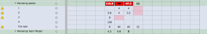
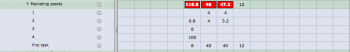
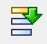
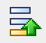

# Display task progress on the Resource Grid

>[!IMPORTANT]
>
>The information in this article refers to functionality that is currently deprecated and will soon be removed from Workfront. For information about the current functionality for managing resources in Workfront, see the [Resource Planning in Adobe Workfront](../../resource-mgmt/resource-planning/resource-planning-overview.md) section.

## Overview of task progress

You can configure the Resource Grid to display the following visual indicators related to task progress:

* Hide planned work when tasks complete early.
* Highlight week blocks in pink when the task is going beyond its scheduled planned completion date.  
  The days after the Planned Completion Date are displayed in pink, and the pink continues to display through the projected completion date of the task. (While no hours are displayed for these days, the range will show.)  
    
  Without this option selected, users see the Resource Grid in its standard view:  
  

* Bold the hours of any user who has a task with potential impact on the project.  
  Either the user has not recorded hours to the task, or the user has taken longer than was planned. The project manager can assess the schedule and make adjustments.

To configure the `Resource Grid` to display visual indicators related to task progress, see [Chart Options](../../resource-mgmt/legacy-res-planning/resource-grid-overview.md#chart-options).

## Overview of the icons in the Resource Grid

You can access the Resource Grid in the following locations:

* By going to the Legacy Resource Planning tab in the People area.
* By applying the Resource Grid View to a user report.  
  For more information about applying the Resource Grid View to a user report, see [Create a custom report](../../reports-and-dashboards/reports/creating-and-managing-reports/create-custom-report.md).

* From the Staffing tab of a project, when you view the Resource Grid for a specific project.

Depending where you are viewing the Resource Grid from, the icons may be slightly different.

The following icons are visible on both the Resource Grid accessible from the Legacy Resource Planning tab as well as on the Resource Grid View when applied to a user report:

| `Icon`  | `Name`  | `Function`  |
|---|---|---|
|  , 

|Zoom In |Changes the grid display by zooming in one level. |
|  , 

|Zoom Out |Changes the grid display by zooming out one level. |
|  , 

|Open (Expand) All |Opens the interface to display all users, their projects, and tasks. |
|  , 

|Close (Collapse) All | Closes or hides any user's open projects and tasks data.  |
|  , 

|Preferences |Provides an interface to update the columns to be displayed in the user list, the Chart Options and the Date Range. |
|  , 

|Full Screen |Expands the Resource Grid to occupy the full width and height of the browser window.  |
|  , 

|Export to Excel |Exports the data displayed in the Resource Grid to a Microsoft Excel file.  |
|  

|View Mode |Allows you to select whether all planned work should be displayed, or if remaining availability should be displayed in the grid view. |
|  

|Data Type  |Allows you to select whether the data should display in Hours, FTE or Percent Allocation.  |
|  

|Previous three months |Expands the Resource Grid data to include the previous three months of assignments. |
|  

|Next three months |Expands the Resource Grid data to include the next three months of assignments. |
|  

|Overage |Indicates that the user has at least one overage: they are allocated to more planned work than their schedule allows for.  |

## Overview of the Resource Grid colors

For more information about the Resource Grid colors, see [Overview of the colors in the Resource Grid](../../resource-mgmt/legacy-res-planning/colors-of-resource-grid.md).

## Overview of the Resource Grid timelines

The timeline shows the dates during which the user is allocated to a task or an issue. You can choose to see the Planned timeline, or the Projected timeline. For more information about choosing Planned vs Projected dates to display in the Resource Grid, see [View Planned or Projected work](../../resource-mgmt/legacy-res-planning/resource-grid-overview.md#viewing-planned-or-projected-work).

When there is an over allocation, the day of the allocation for that task or issue is displayed in red. Toggle between `Used Resources` and `Available Resources`. Using `Available Resources` displays over-allocations in red negative numbers.

The Resource Grid truncates Planned Hours if a task is completed early. The user utilization page then displays the availability of the user for additional tasks or assignments. But keep in mind this does not change the timeline within a project or adjust your Work Breakdown Structure. You will have to make additional adjustments to your project schedule manually to indicate that tasks have completed earlier than planned.

## Timeline limitations for user allocation

There is a limitation of how many days display user allocation for the timeline of a task, issue, or project in the Resource Grid.  
If a task, issue, or project span more than 1,000 days, the `Resource Grid` shows allocation information only for 1,000 days starting from the planned start date of the task, issue, or project .  
All other days included in the timeline of the task, issue, or project in the `Resource Grid` appear as non-working days and therefore no allocation is calculated for those. 
