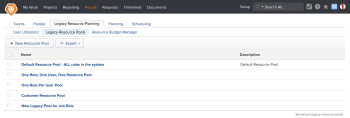

# Work with Legacy Resource Pools

>[!IMPORTANT]
>
>The information in this article refers to functionality that is currently deprecated and will be removed from Workfront. For information about the current functionality for managing resources in Workfront, see the [Resource Planning in Adobe Workfront](../../resource-mgmt/resource-planning/resource-planning-overview.md) section. For information about working with resource pools, see [Resource pools overview in Adobe Workfront](../../resource-mgmt/resource-planning/resource-pools/work-with-resource-pools.md).

## Overview of Legacy Resource Pools

A Legacy Resource Pool is a group or collection of job roles that are needed at the same time for the completion of a project. For example, you might need the following job roles to complete a project: a Designer, a Copy Writer, an Editor, a Project Manager, a System Administrator, and a Graphics Artist. You can create these skills as individual job roles in Workfront, and then place them inside the same Legacy Resource Pool. For more information about creating job roles, see [Create and manage job roles](../../administration-and-setup/set-up-workfront/organizational-setup/create-manage-job-roles.md). After you create the Legacy Resource Pool, you can associate it with the project so you can assess the resource budget on the project.

If you want to schedule your resources in advance, and manage their allocation in the Capacity Planner, you must have your job roles organized in Legacy Resource Pools. You cannot use the Capacity Planner outside a Legacy Resource Pool.

We recommend that the projects that share the same Legacy Resource Pool should be placed within the same Portfolio. This way, you can manage your resource budgets across all the projects that share those resources. Comparing budgeted labor costs also allows you to prioritize projects in the Portfolio Optimizer.  
For more information about the Portfolio Optimizer, see [Portfolio Optimizer overview](../../manage-work/portfolios/portfolio-optimizer/portfolio-optimizer-overview.md).

We recommend against creating too many Legacy Resource Pools unless you have several groups in your organization that work completely independent of each other and never share resources. If your organization shares all resources in all the projects, we recommend that you create just one Legacy Resource Pools that includes all the job roles in the system.

>[!NOTE]
>
>In order for Legacy Resource Pools to provide value and be an active part of your resource budgeting, ensure that all your users are associated with at least one job role.   
>For more information about associating users with job roles, see [Add users](../../administration-and-setup/add-users/create-and-manage-users/add-users.md)For more information about all the prerequisites necessary for managing your resources with Legacy Resource Planning, see the [Prerequisites for Using Legacy Resource Planning](../../resource-mgmt/legacy-res-planning/legacy-resource-planning.md#prerequisites-for-resource-planning) section in [Understanding Legacy Resource Planning](../../resource-mgmt/legacy-res-planning/legacy-resource-planning.md).* *

## Create a Legacy Resource Pool

1. Go to the **People** area in the Global Navigation Bar.
1. Select the **Legacy** **Resource Planning** tab.

1. Select the **Legacy** **Resource Pools** sub-tab.  
   

1. Click **New Resource Pool**.
1. Specify a name for the **Resource Pool** in inline edit.
1. Select the **Resource Estimates** tab.
1. Click **Add Job Roles**.
1. Select job roles to add. If you want to add several job roles at a time, press the Shift key on your keyboard and click several job roles to select. 
1. Click **OK**.
1. In the grid portion of the Resource Estimates tab, budget your job roles in the Legacy Resource Pool. You can budget your job roles by hours, cost, or FTE, and you can view the grid by week or by month.  
   Manually enter the amount of time or cost for each job role for each unit of time, in the Resource Estimates grid. This is an estimation of how much available time one job role would have to complete work in a given time frame (week of month).  
   

1. Click **Save**.

## Add job roles to a Legacy Resource Pool

You can add job roles to a Legacy Resource Pool as you are creating the Legacy Resource Pool.   
For more information about creating a Resource Pool, see the section [Create a Legacy Resource Pool](#creating-a-resource-pool) in this article.

You can also add job roles to a Legacy Resource Pool in the Resource Pools section of the Resource Budget Manager.   
For more information about the Resource Budget Manager, see [Budget Legacy Resource Pools in the Resource Budget Manager](../../resource-mgmt/legacy-res-planning/budget-legacy-pools-in-budget-manager.md).

## Associate a Legacy Resource Pool with users

You can associate a Legacy Resource Pool with users, when you create or edit users.   
For more information about creating users, see [Add users](../../administration-and-setup/add-users/create-and-manage-users/add-users.md). For more information about editing new users and adding a Legacy Resource Pool to the user, see [Edit a user's profile](../../administration-and-setup/add-users/create-and-manage-users/edit-a-users-profile.md).

You must have administrative rights to editing users in order to edit or create users. For more information about the access needed to edit or create users, see [Grant access to users](../../administration-and-setup/add-users/configure-and-grant-access/grant-access-other-users.md).

Associating Legacy Resource Pools with users is done for reporting purposes. You can keep track of what Legacy Resource Pool the job roles of a user should belong to by associating a user with a Legacy Resource Pool.

For managing your resources in the Capacity Planner, you must add job roles (not users) to the Legacy Resource Pools.   
For more information about adding job roles to Legacy Resource Pools, see [Add job roles to a Legacy Resource Pool](#adding-job-roles-to-a-resource-pool).

## Associate a Legacy Resource Pool with projects

To manage the job role resources on your projects, you must associate a project with a Legacy Resource Pool.

You can associate a project with a Legacy Resource Pool in the following ways:

* By adding the project to the Capacity Planner.  
  For more information about adding projects to the Capacity Planner, see [Allocate resources in the Capacity Planner](../../resource-mgmt/legacy-res-planning/allocate-resources-in-capacity-planner.md).

* When you create or edit a project.   
  You must have Manage permissions on the project to be able to edit the project.  
  For more information about creating projects, see [Create a project](../../manage-work/projects/create-projects/create-project.md)For more information about editing projects, see [Edit projects](../../manage-work/projects/manage-projects/edit-projects.md).

* When you create a project, when completing the Resource Estimates section of the Business Case.  
  For more information about adding a Legacy Resource Pool to a project using the Business Case, see [Estimate project resources by applying Legacy Resource Pools to the Business Case](../../manage-work/projects/define-a-business-case/apply-legacy-pools-to-business-case.md).

