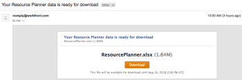

# Export information from the Resource Planner

You can export information from any view of the Resource Planner to an Excel (.xlsx) file which is saved on your computer.

>[!IMPORTANT]
>
>There are limitations in what information displays and what information you can export from the Resource Planner. For information on these limitations, see [Resource Planner display limitations](../../resource-mgmt/resource-planning/resource-planner-display-limitations.md)

## Access requirements

You must have the following:

<table cellspacing="0"> 
 <col> 
 <col> 
 <tbody> 
  <tr> 
   <td role="rowheader">Adobe Workfront plan*</td> 
   <td> 
Pro and higher
 </td> 
  </tr> 
  <tr> 
   <td role="rowheader">Adobe Workfront license*</td> 
   <td> 
Review or higher
 </td> 
  </tr> 
  <tr> 
   <td role="rowheader">Access level configurations*</td> 
   <td> 
View or higher access to&nbsp;Projects, Users, and Resource Management
 
Note: If you still don't have access, ask your Workfront administrator if they set additional restrictions in your access level. For information on how a Workfront administrator can change your access level, see <a href="../../administration-and-setup/add-users/configure-and-grant-access/create-modify-access-levels.md" class="MCXref xref">Create or modify custom access levels</a>.
 </td> 
  </tr> 
  <tr> 
   <td role="rowheader">Object permissions</td> 
   <td> 
View permissions or higher for projects
 
For information on requesting additional access, see <a href="../../workfront-basics/grant-and-request-access-to-objects/request-access.md" class="MCXref xref">Request access to objects in Adobe Workfront</a>.
 </td> 
  </tr> 
 </tbody> 
</table>

&#42;To find out what plan, license type, or access you have, contact your Workfront administrator.

## Export information from the Resource Planner<![CDATA[		]]>

1. <![CDATA[				]]>Go to the People area in the Global Navigation Bar.<![CDATA[			]]>
1. <![CDATA[			]]>Select the Planning tab, then the Resource Planner subtab. 
1. Select the view for the Resource Planner. You can select one of the following options:

  * View by User 
  * View by Project 
  * View by Role

1. Click `Export`. 
   The Export Options dialog box displays. `  
   

   `  

1. Specify the following information:  
   `Start Date`: The start date of your export. The exported file contains allocation and availability information starting with the first day of the week which contains the day you specify here.   
   `Number of Periods`: The number of time periods you want to include in your file. The default is 4 periods.  
   `Type`: The type of time periods by which you want to display the information in the exported file (weeks, months, or quarters.)   
   The following are the maximum time periods that you can export:

  * 52 weeks 
  * 36 months 
  * 12 quarters

   `Select to Export`: Depending on which view you selected, you can select to export the availability and budgeting information for either all the objects listed on the screen or for specific ones.
   You can select to export the following information:

  * In the Project View, select to export:

    * Projects
    * Projects and Roles
    * Everything (this is the default option)

  * In the User View, select to export:

    * Users
    * Users and Projects
    * Everything (this is the default option)

  * In the Role View, select to export:

    * Roles
    * Roles and Projects
    * Everything (this is the default option)

   `Data Formatting`: Depending on how you want your Excel file to be displayed, select the following options:

  * `Raw`: Select to display the availability and allocation information ungrouped by the objects it belongs to in the Excel file. (this is the default option)
  * `Grouped`: Select to display the availability and allocation information grouped by the objects it belongs to. This displays the exported information as it appears on the screen.

   A sample of how the information looks in the exported file is shown in the Export Options dialog box.

1. Click `Export` to export the information from the Resource Planner.  
   Only the information that you saved is exported.  

1. (Conditional) If you have unsaved Budgeted Hours in the Role or Project views, click `Save and Continue.`   
   An Excel (.xlsx) file is downloaded to your computer.  
   Exporting from the Resource Planner is unavailable while the file is prepared for downloading.  
   (Conditional) If you export a large amount of data, you receive an email with a link where you can download the file.  
   

1. (Conditional) When you receive the email with the exported file, click `Download` to download the file.  
   This takes you back to Workfront where you can download the file.   
   You must be logged into Workfront for the download to complete.  
   If you do not download the file when it is delivered, the Download link remains active for 7 days after you initiate the export.

