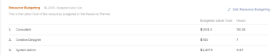

# Locate the Resource Planner

>[!IMPORTANT]
>
>You're currently viewing the Adobe Workfront Classic version of this document. Adobe Workfront Classic is no longer supported. All Adobe Workfront Classic functionality, along with this documentation, will be removed in July 2022. Please transition to the the new Adobe Workfront experienceas soon as possible, and switch to the new Adobe Workfront experience version of this document.

<!--

(This came off this article: draft that content in the article when this comes live: /Content/Resource Mgmt/Resource Planning/get-started-resource-planner.html)

-->

You can use the Resource Planner to manage the allocation of your resources to projects. You can access the Resource Planner for multiple projects at the same time or for one project, from the project's Business Case area.

## Access requirements

You must have the following:

<table cellspacing="0"> 
 <col> 
 <col> 
 <tbody> 
  <tr> 
   <td role="rowheader">Adobe Workfront plan*</td> 
   <td> 
Pro and higher
 </td> 
  </tr> 
  <tr> 
   <td role="rowheader">Adobe Workfront license*</td> 
   <td> 
Review or higher<!--
      <MadCap:conditionalText data-mc-conditions="QuicksilverOrClassic.Draft mode">
        (this seems to be the case in NWE only, not classic. Waiting on Vazgen's response for this)
      </MadCap:conditionalText>
     -->
 
Plan or higher to locate the Resource Planner in the global area
 </td> 
  </tr> 
  <tr> 
   <td role="rowheader">Access level configurations*</td> 
   <td> 
View access or higher to&nbsp;Resource Management
 
Note: If you still don't have access, ask your Workfront administrator if they set additional restrictions in your access level. For information on how a Workfront administrator can modify your access level, see <a href="../../administration-and-setup/add-users/configure-and-grant-access/create-modify-access-levels.md" class="MCXref xref">Create or modify custom access levels</a>.
 </td> 
  </tr> 
  <tr> 
   <td role="rowheader">Object permissions</td> 
   <td> 
View permissions to projects and users 
 
For information on requesting additional access, see <a href="../../workfront-basics/grant-and-request-access-to-objects/request-access.md" class="MCXref xref">Request access to objects </a>.
 </td> 
  </tr> 
 </tbody> 
</table>

&#42;To find out what plan, license type, or access you have, contact your Workfront administrator.

## Prerequisites

Ensure that all prerequisites for accessing and working with the Resource Planner are met before starting to use it. This way, you ensure that the Resource Planner displays the correct information before you start budgeting your resources.

For information about Resource Planner prerequisites, see [Get started with Resource Planning](../../resource-mgmt/resource-planning/get-started-resource-planning.md).

## Locate the Resource Planner

<!--

(this was moved from the get-started-resource-planner article)

-->

You can locate the Resource Planner in two areas of Workfront, depending on whether you want to budget your resources for multiple projects, or for just one project.

* [Use the Resource Planner for multiple projects](#use-the-resource-planner-for-multiple-projects) 
* [Use the Resource Planner for one project](#use-the-resource-planner-for-one-project)

### Use the Resource Planner for multiple projects {#use-the-resource-planner-for-multiple-projects}

When using the Resource Planner for multiple projects, the allocation numbers for your resources represent numbers across multiple projects.

To access the Resource Planner subtab in the People area:

1. Go to the **People** area in the Global Navigation Bar. 
1. Click **Planning**, then click **Resource Planner**. For information about budgeting resources in the Resource Planner, see the article [Budget resources in the Resource Planner using the Project and Role views](../../resource-mgmt/resource-planning/budget-resources-project-role-views-resource-planner.md).

   

1. Click **Resource Pools** to review existing resource pools and create new ones.   
   For information about creating resource pools, see [Create resource pools](../../resource-mgmt/resource-planning/resource-pools/create-resource-pools.md).

1. Click **Resource Planner** to open the Resource Planner and review the budgeting of your resources.  
   For information about budgeting in the Resource Planner, see the article [Budget resources in the Resource Planner using the Project and Role views](../../resource-mgmt/resource-planning/budget-resources-project-role-views-resource-planner.md).

### Use the Resource Planner for one project {#use-the-resource-planner-for-one-project}

When using the Resource Planner for one project, the allocation numbers for your resources represent numbers for the selected project.

1. Go to a project you want to budget resources for.
1. Click **Project Details** > **Business Case**.
1. Scroll to the **Resource Budgeting** section of the Business Case.
1. Click **Edit Resource Budgeting** to add resource pools to your project and start budgeting your resources.

   >[!TIP]
   >
   >You can only add a resource pool in the Resource Budgeting area of the Business Case when the project has no resource pools associated with it. When the project already has a Resource Pool, the users in the pool and their job roles display in the Resource Budgeting area by default.

   

   For information about budgeting resources for one project, see the article [Budget resources in the Business Case](../../manage-work/projects/define-a-business-case/budget-resources-in-business-case.md).

