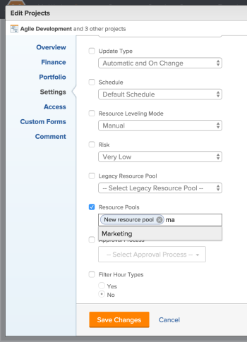

# Associate resource pools with projects and templates in Adobe Workfront

Resource pools are collections of users what help you manage resources in Adobe Workfront.

After you create resource pools, you can associate them with projects or templates so you can later budget your resources on the projects.

We recommend that you create your resource pools in advance, associate them with projects, and budget your resources before the project starts.

For information about resource pools, see [Resource pools overview in Adobe Workfront](../../../resource-mgmt/resource-planning/resource-pools/work-with-resource-pools.md).

For information about creating resource pools, see [Create resource pools in Adobe Workfront](../../../resource-mgmt/resource-planning/resource-pools/create-resource-pools.md).

## Access requirements

You must have the following:

<table cellspacing="0"> 
 <col> 
 <col> 
 <tbody> 
  <tr> 
   <td role="rowheader">Adobe Workfront plan*</td> 
   <td> 
Pro and higher
 </td> 
  </tr> 
  <tr> 
   <td role="rowheader">Adobe Workfront license*</td> 
   <td> 
Plan 
 </td> 
  </tr> 
  <tr> 
   <td role="rowheader">Access level configurations*</td> 
   <td> 
Edit access to&nbsp;Resource Management that includes access to Manage Resource Pools
 
Edit access to Projects, Templates, and Users
 
Note: If you still don't have access, ask your Workfront administrator if they set additional restrictions in your access level. For information on how a Workfront administrator can change your access level, see <a href="../../../administration-and-setup/add-users/configure-and-grant-access/create-modify-access-levels.md" class="MCXref xref">Create or modify custom access levels</a>.
 </td> 
  </tr> 
  <tr data-mc-conditions=""> 
   <td role="rowheader">Object permissions</td> 
   <td> 
Manage permissions for the projects, templates, and users you associate the resource pools with
 
For information on requesting additional access, see <a href="../../../workfront-basics/grant-and-request-access-to-objects/request-access.md" class="MCXref xref">Request access to objects in Adobe Workfront</a>.
 </td> 
  </tr> 
 </tbody> 
</table>

&#42;To find out what plan, license type, or access you have, contact your Workfront administrator.

## Associate resource pools with one project or template

You can associate resource pools with a template in the same manner you associate resource pools with a project. This article describes how you can associate resource pools with projects.

1. <![CDATA[				]]>Go to a project, and click **Edit Project**.<![CDATA[			]]>
1. Click **Settings**. 
1. Start typing the name of a resource pool in the **Resource Pools** field, then select it from the list when it appears.  
   You can associate multiple resource pools with one project or template.

1. Click **Save** **Changes**.

For more information about how to edit a project and associate it with resource pools, see [Edit projects](../../../manage-work/projects/manage-projects/edit-projects.md).

For more information about how to edit a template and associate it with resource pools, see [Edit project templates](../../../manage-work/projects/create-and-manage-templates/edit-templates.md).

## Associate resource pools with several projects or templates in bulk

You can edit multiple projects or templates in bulk and associate the same resource pools with all of them at the same time.

You can associate resource pools with templates in the same manner you associate resource pools with projects.

To associate resource pools with several projects in bulk:

1. Go to a list of projects.
1. Select multiple projects, then click **Edit** at the top of the list. 
1. Click **Settings**.
1. Start typing the name of a resource pool in the **Resource Pools** field, then select it from the list when it appears.  
   You can associate multiple resource pools with the projects or templates.

   >[!NOTE]
   >
   >When you edit projects or templates in bulk, only the resource pools that are common to all the projects or templates selected appear in this field. If the projects selected have no shared resource pools, this field will be empty. The resource pools you specify here will overwrite the individual resource pools of the projects or templates.

   

1. Click **Save Changes**.   
   When your resource pools are associated with your projects or your templates, you can budget user allocations for your projects inside the Resource Planner.   
   For more information about the Resource Planner, see [Resource Planner overview](../../../resource-mgmt/resource-planning/get-started-resource-planner.md).

For more information about how to edit projects in bulk, see the "Edit projects in bulk" section in [Edit projects](../../../manage-work/projects/manage-projects/edit-projects.md).

For more information about how to edit templates in bulk, see the "Edit templates in bulk" section in [Edit project templates](../../../manage-work/projects/create-and-manage-templates/edit-templates.md).
